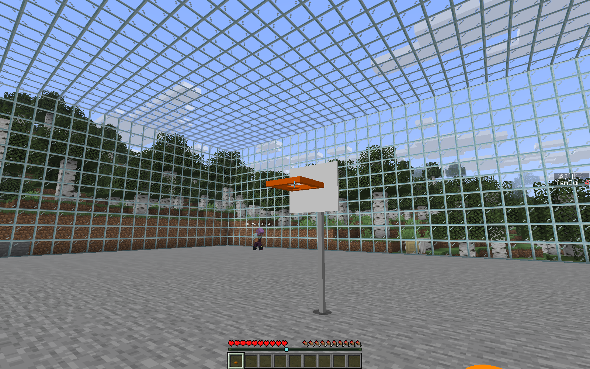

# 除零 · DivZero

> 不是计算错误，是世界尚未定义。**世界未定义，创造不设限。**

DivZero 是一个让你**通过对话在 Minecraft 中行动与创造**的 AI Mod：和 AI 聊天、建造建筑、现场制作新物品和新生物，也可以让它理解现有世界并与你互动。

**[下载 JAR](https://github.com/gaoshanliuni/divzero/releases) · [全部功能与限制](docs/FEATURES.md) · [安装与版本说明](docs/BUILD_JAR.md) · [问题反馈](https://github.com/gaoshanliuni/divzero/issues/new/choose)**

当前是开发测试版，不是完整 V1 正式版。目标环境：**Minecraft 26.1.2 · NeoForge 26.1.2.106 · Java 25**。客户端与服务端使用同版；建议先在备份过的测试存档体验。截图均来自已有游戏实测，不是概念图。

## 开始玩

1. 安装 Release 中的 DivZero、WebGUI，以及**与你系统匹配的一个** MCEF JAR。
2. 开启作弊／具备服务器管理权限，进入世界后输入 `/ai accept`。
3. 按 **F2**，在“更多 → API 设置”填写 Provider、API URL 和 Key；获取模型列表后点击选择，也可选择自定义模型。DeepSeek 默认 `deepseek-flash`。
4. 创建并命名 AI，在原生聊天栏输入 **`@AI名字`**，用 **Tab** 自动补全，然后直接说出需求；F2 对话窗口也可聊天。

不需要记住工具名、内部 UUID 或命令参数。AI 会读取需要的信息、提出操作，并根据实际结果回答。API Key 只在游戏设置填写，不要发到聊天、Issues 或截图中。

## 主要玩法

以下例子把 `星河` 换成你创建的 AI 名字，也可以直接用 Tab 选择。

| 想怎么玩 | 可以这样说 |
|---|---|
| **和 AI 沟通** | `@星河 看看我现在的装备，给我一些探索建议。` 流式回复，可打断；F2 保留历史，思考内容默认折叠。 |
| **让 AI 建造** | `@星河 帮我做一个刷石机，并检查它能不能工作。` 也能组合墙体、圆顶、曲面、阵列等几何结构。 |
| **实时创建新物品** | `@星河 做一个篮球和篮球架，让篮球能蓄力投篮，投进后加分。` 模型与交互一起生成，不只是把旧物品改名。 |
| **创造新生物并互动** | `@星河 做一个会跟随我的星球伙伴，可以喂食、骑乘，还能和我交易。` 可选择友好、中立、敌对和不同交互方式。 |
| **修改原版内容** | `@星河 给我手里的剑附魔锋利五级，再给我一分钟速度二级。` 无需先丢出物品；还可调整游戏规则、计分板和使用原生命令。 |
| **搜索与探索** | `@星河 帮我找附近的钻石，没有就扩大范围。` 或询问 Mod 攻略、搜索公开建筑资源；联网回答使用真实来源。 |
| **角色扮演** | `@星河 以后你是一位简洁友善的星际向导，记住我喜欢石英建筑。` 人设、事实／偏好记忆、PNG／内置／YSM 外观，让伙伴保持自己的身份。 |
| **导入建筑** | `@星河 把这个投影导入到前方，正门朝北。` 在“文件／附件”选择文件并交给 AI，读取、预览、旋转／镜像后放置。 |

### 篮球不是一张模型图

已有实测完成球架、可穿过的篮圈、蓄力投掷、原件拾回和实际入框计分。截图右侧是原生计分板。

### 新物种可以进入世界与你互动

“星球伙伴”是热物种载体上的新几何与行为。已有交易、丢物交换、靠近事件、战斗、繁殖、骑乘和跟随／巡逻实测。

### 把建筑文件真正放进世界

这是上传投影后实际导入的 177 方块房屋。图中红色标记来自源文件；该图是早期仅方块导入测试，当前默认内容保留规则见完整功能文档。

**[查看全部功能、更多实测截图和当前边界 →](docs/FEATURES.md)**

## 还有哪些能力？

- 独立半透明 F2 窗口、悬浮 HUD、可自由旋转缩放的结构／模型预览。
- AI 自己移动、跟随、停止跟随；也可应你的明确要求接管本人身体与视角，**Esc 停止**。
- 生成持续更新坐标、附近方块统计等内容的 WebUI。
- 通用文件上传／下载，PNG 生成、编辑与局内热换肤。
- Java 管理的专用 Python：执行本机任务、安装第三方库，**在原生聊天中点击确认**，不再使用旧 PowerShell 执行器。

这些能力的权限、平台和兼容范围，集中列在 [全部功能](docs/FEATURES.md)，不把“能提出请求”当作“任意任务都已验证”。

## 版本与下载

公开 `main` 的新构建采用**日期＋公开提交序号**的版本号，例如 `2026.9.24-dev.42`；该版本同时写入主 JAR 元数据、文件名与 Release 标题，不再一直显示 `0.1.0`。

Release 附件只提供**可安装的运行 JAR**：主模组、WebGUI，以及各平台 MCEF 备选包。安装时只取三份，不要把所有 MCEF 平台一起装。校验值、来源与许可入口在 Release 正文和 [构建说明](docs/BUILD_JAR.md)；GitHub 自动显示的 Source code ZIP/tar.gz 不是安装包。

## 关于本仓库

DivZero 来自 **Division by Zero**。在这里，“未定义”意味着还有等待被创造的玩法。

这是独立维护的公开源码快照仓库，不包含私密开发历史、Key、存档或日志。[公开发布原则](docs/PUBLISHING.md) · [技术快照说明](docs/SOURCE_SNAPSHOT.md) · [第三方声明](docs/THIRD_PARTY_NOTICES.md)。

欢迎通过 [Issues](https://github.com/gaoshanliuni/divzero/issues/new/choose) 反馈版本、环境、复现步骤和必要日志。提交前请检查隐私信息。
