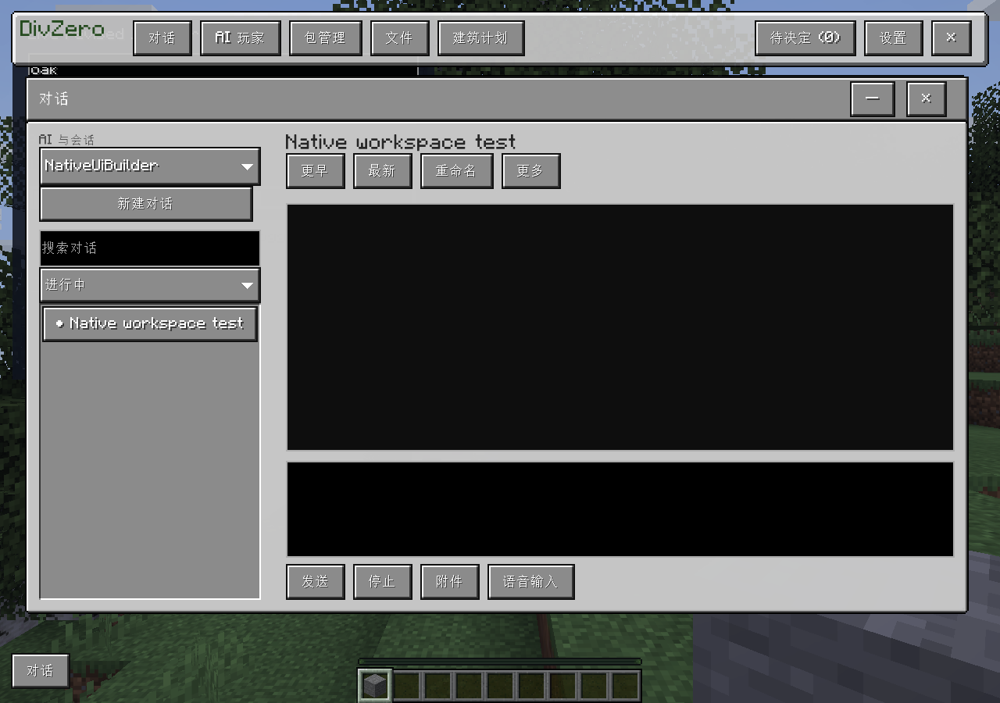
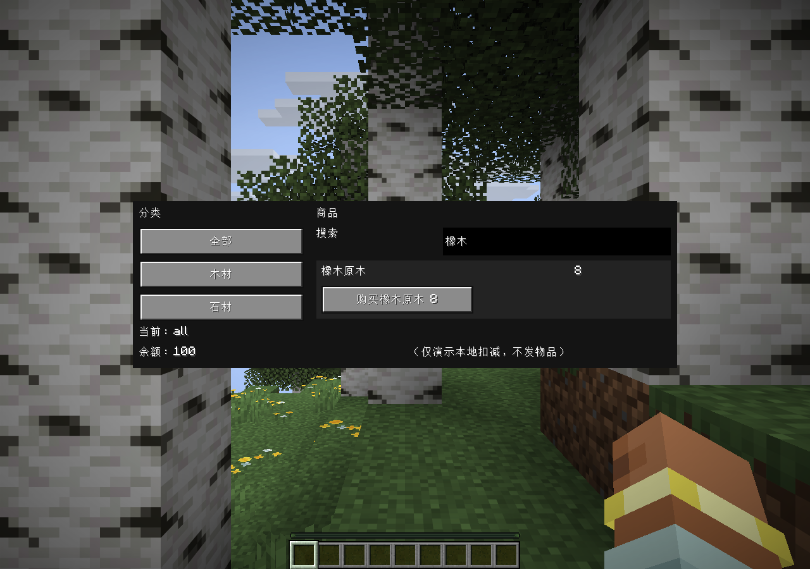
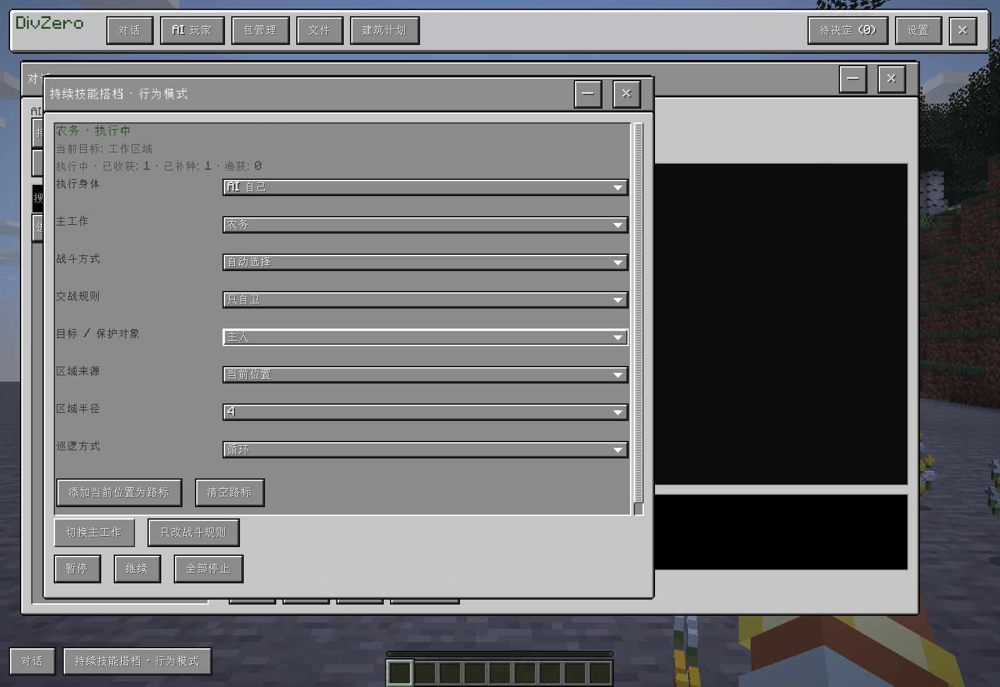
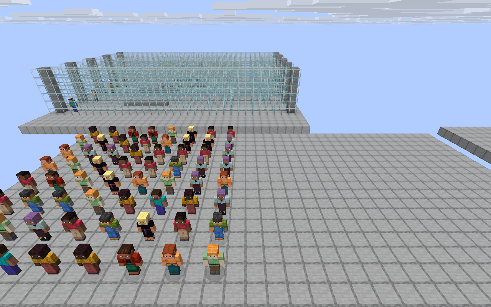
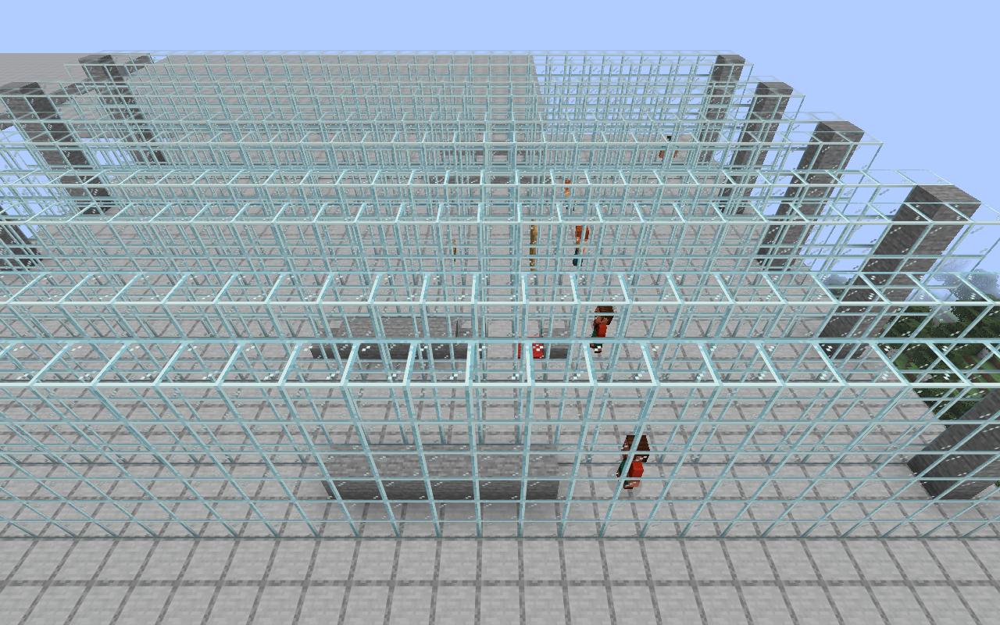
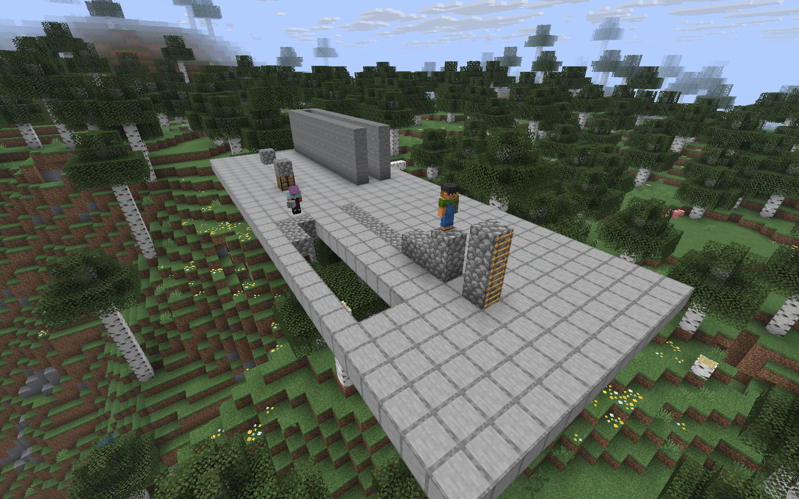
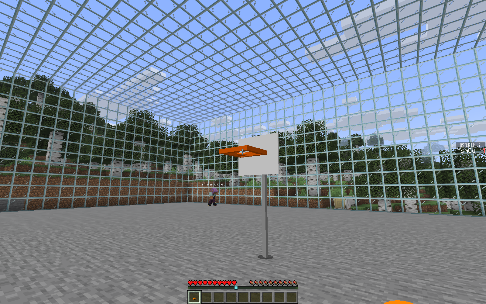
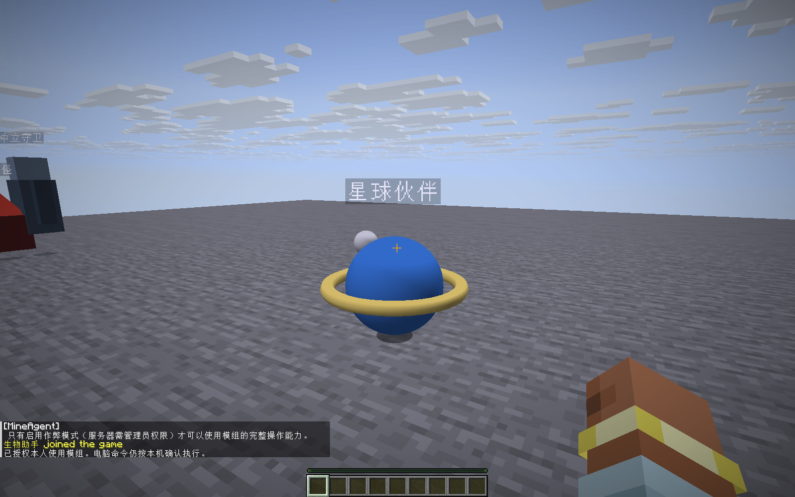
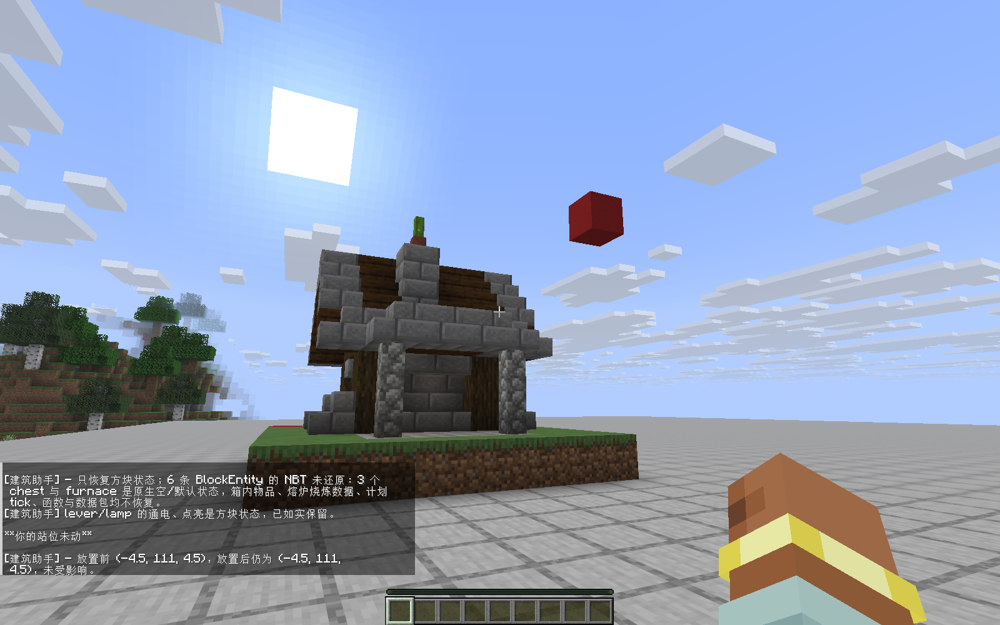
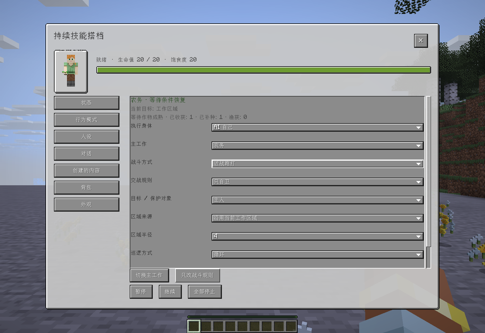

[简体中文](#chinese) · [English](#english)

# 除零 · DivZero AI Runtime

> **世界未定义，创造不设限。**

DivZero AI Runtime 是一个面向 Minecraft 的智能 AI 运行框架，让 AI 真正参与游戏世界，而不仅仅作为聊天助手存在。

通过自然语言交互、世界感知、长期记忆与动态内容生成，你可以创建能够探索、建造和互动的 AI 角色：搭桥建房、制作新物品与新生物，以及为世界设置交互规则。

**[下载 JAR](https://github.com/gaoshanliuni/divzero/releases) · [全部功能](docs/FEATURES.md) · [安装说明](docs/BUILD_JAR.md) · [问题反馈](https://github.com/gaoshanliuni/divzero/issues/new/choose)**

当前为 **1.0.21 开发测试版**，支持 **Minecraft 26.1.2 · NeoForge 26.1.2.106 · Java 25**，采用网络协议 **11**。客户端与服务端请同步更新；旧版 1.0.20 使用协议 10。建议使用已备份的测试存档。[下载 1.0.21](https://github.com/gaoshanliuni/divzero/releases/tag/1.0.21)。

## LDLib2 原生工作区与持续技能

**1.0.20** 统一采用 LDLib2，默认 MC 主题。F2 内置工作区直接由 DivZero 构建，不要求 KubeJS。AI 动态界面由 KubeJS 构建，支持实时创建、结构更新失败回滚和输入保持；HUD 默认不抢鼠标。HTML/CSS/DOM 内容需显式迁移。

对 AI 说“创建商店，增加搜索框，再改成深色”，可以修改同一个已打开界面。以下实机图展示模型生成并修改后的原生商店；该示例按钮只演示本地余额，不发物品。

AI 与真人托管共用跟随、巡逻、警戒、漫步、战斗、农务和钓鱼技能。常规工作由本地循环执行，支持防御打断、重新核对后恢复，以及多 AI 工作点预约。

[本地战斗与独立工作模式](docs/TACTICAL_PLAYER_BEHAVIOR.md) · [原生界面与建筑升级](docs/NATIVE_UI_MIGRATION_STATUS.md) · [持续技能验收](docs/PERSISTENT_PLAYER_SKILLS.md) · [十项动态能力](docs/NATIVE_TEN_SCENARIOS.md)

**1.0.21** 把主工作、战斗方式和交战规则分开。可以说“继续种田，遇怪跑打，打完接着种”，或在 F2 / 右键 AI 的行为模式页只改战斗规则。模型理解目标，本地执行移动、选敌、攻击和工作循环。

## 模型选择会显著影响效果

**最终效果很大程度取决于所选模型的能力。** 复杂建造、实体设计、多步骤规划与工具调用，不同模型的表现可能差异很大。追求更好的效果时，建议尝试 Claude、Grok、GPT 等系列中较新、能力更强的模型，并通过模组支持的兼容 API 接入；具体兼容性、费用与实际表现以所用服务为准。

本项目现有演示均使用价格更亲民的 **DeepSeek 4 Flash**（游戏内模型 ID：`deepseek-flash`）。演示效果不代表模组能力上限，换用更强模型通常更有利于完成复杂需求，但不保证每次生成都更好。

## 快速开始

1. 从新 Release 的 **Assets** 下载主模组与 **LDLib2**；需要 AI 动态界面时再安装 **KubeJS + Better Advanced Tooltips**，放入 `mods`。
2. 首次进入世界，在聊天中点击 **启用**，立即可用，无需退出重进。涉及世界修改的操作仍遵循服务器权限。
3. 打开 **F2 → 设置 → Provider**（Ctrl+M 也打开同一工作区）。配置 API URL、Key 和模型；DeepSeek 默认 `deepseek-flash`。
4. 输入 **`/ai create "星河"`** 创建 AI。也可用 F2 → AI 玩家 → 创建。
5. 在原生聊天输入 `@星河 你好` 开始对话；`@` 后按 Tab 选择名字。F2 → 对话也可聊天。
6. 输入 `/ai default` 选择默认响应 AI，之后直接发消息即可。该设置只对当前玩家生效。

## 常用入口

| 操作 | 入口 |
|---|---|
| 启用当前世界 | 首次聊天中的“启用”；F2 → 设置 → 此世界启用设置可更改 |
| 创建 / 查看 AI | `/ai create "星河"`、`/ai list`；F2 → AI 玩家 |
| API URL、Key、模型 | F2 → 设置 → Provider；Key 使用本机保密输入 |
| 对话 / 默认 AI | 原生聊天 `@星河 …`；`/ai default`；F2 → 对话 |
| 思考显示 / 深度 | `/ai thinking see`、`/ai thinking deep`；F2 对话中按需展开 |
| 人设、会话、血量、背包与内容 | 右键该 AI，打开专属面板 |
| 删除 / 重命名对话 | `/ai chat delete`；F2 → 对话 → 更多 / 重命名 |

F2 与 Ctrl+M 打开同一 LDLib2 MC 工作区。右键 AI 的专属面板绑定被点击的 AI。保存 URL / Key 后可获取模型列表，也可输入自定义模型名；不要把 Key 发到聊天中。

## 可以这样玩

| 想做什么 | 对 AI 说 |
|---|---|
| 看装备、聊探索 | `@星河 看看我的装备，给我一些探索建议。` |
| 潜行与搭路 | `@星河 潜行进来，再从这里搭路到对岸，留给我走。` |
| 原地向上搭高 | `@星河 向上垫高三格，留梯子让我能上去。` |
| 做一台机器 | `@星河 帮我做一个刷石机，并检查它能否运行。` |
| 创造物品与玩法 | `@星河 做一个篮球和篮球架，能蓄力投篮，进球后加分。` |
| 创造伙伴 | `@星河 做一个友好的星球伙伴，能跟随、交易和骑乘。` |
| 改装备与 Buff | `@星河 给我手里的剑附魔锋利五级，再给我一分钟速度二级。` |
| 设置交互规则 | `@星河 这扇门只有拿木棍时才能打开，旁边仍然能放方块。` |
| 联网查询 | `@星河 查一下巫妖王怎么打，给我来源。` |
| 导入建筑 | `@星河 把这个投影放到前方，正门朝北。` |
| 人设与记忆 | `@星河 以后你是简洁友善的星际向导，记住我喜欢石英建筑。` |

### 多 AI 并行行动

不同 AI 可同时移动、处理对话和执行独立任务；同一会话保持有序，取消一个请求不影响其他 AI。已完成64实体同场、63次独立放置、16份并行计划，以及8个真实 DeepSeek 请求并发的对应验收。这些是测试样本，不是数量上限。

多个 AI 还可分别穿行高低差、半砖／楼梯／地毯、门和栅栏门；低净空时自动潜行，无法通过时报告受阻，不穿墙。

[查看并行、取消隔离和地形验收详情 →](docs/MULTI_AI_PARALLEL.md)

### 搭好的路，玩家也能走

AI 亲自放置方块并沿新路移动；支持搭桥、连续台阶、跳跃垫高和附梯子。方块保留在世界中，玩家与其他 AI 可复用。生存消耗 AI 背包材料，垂直搭高还需要梯子。

### 篮球可以投，也可以计分

从球和球架建模，到蓄力投掷、原件拾回和实际入框记分，AI 可以把物品与玩法一起做出来。

### 创建生物伙伴

友好、中立、敌对三类阵营，结合交易、丢物交换、靠近事件、攻击、繁殖、骑乘、跟随和巡逻；还可设置待机、随机、受击等整体网格动画。

### 导入你选择的建筑

F2 → 文件，或对话 → 附件，选择建筑文件交给 AI。支持结构蓝图、投影、Schematic 与 Java 世界选区，提供预览、朝向、旋转、镜像和内容保留选项。

## 对话与权限

忙时消息自动排队，可选择“打断并发送”或“取消发送这条消息”。F2 保存对话记录和默认折叠的思考过程；删除对话后重新建立上下文。

你创建的 AI 默认响应你本人。其他玩家 @ 它时，你会收到“响应一次、始终允许、拒绝一次、始终拒绝”四个选项；F2 → AI 设置可管理全部允许、全部拒绝或允许名单。

玩家明确要求接管本人后，AI 使用原生客户端输入持续执行。进入托管释放鼠标；**T、F2、切换电脑窗口及最小化均不中断**。MC 面板提供“暂停 / 继续、退出、追加命令”，按钮松开时触发；聊天栏 / F2 的 Esc 只处理界面；**回到游戏画面后双击 Esc 结束托管**。退出恢复原失焦暂停设置，死亡、断线、世界或权限变化仍释放控制。

Java 管理的专用 Python 可执行本机任务、安装第三方库，每次在原生聊天中查看并确认。

**[全部功能、适用范围与更多截图 →](docs/FEATURES.md)**

## 脚本与扩展

支持通过 **JavaScript** 和运行时内容包编写自定义交互、回调与 AI 行为。在对应权限与执行生命周期内使用模组开放的游戏 API 和对象；本机任务则使用 Java 管理的专用 Python，并逐次在原生聊天确认。

## 许可证与免责声明

DivZero 使用 [Apache License 2.0](https://github.com/gaoshanliuni/divzero/blob/main/LICENSE) 开源许可。

Copyright 2026 gaoshanliuni and DivZero contributors。项目版权与许可声明见 [NOTICE](NOTICE)；第三方组件遵循各自的许可证，详见[第三方声明](docs/THIRD_PARTY_NOTICES.md)。

**本项目不包含任何第三方 AI 服务密钥。** 玩家需要自行配置服务提供商、API URL、Key 和模型，并承担相关 AI 服务产生的费用。模型的可用性、能力与价格以对应服务提供商为准。

## 下载与项目

新 Release 提供四个独立运行 JAR 附件：DivZero、LDLib2、KubeJS、Better Advanced Tooltips。内置 F2 仅需前两者；完整 AI 动态界面安装全部四个。Rhino 已内嵌。新版本不打包、不发行 MCEF / WebGUI，校验值列在 Release 正文。

[源码与技术说明](docs/SOURCE_SNAPSHOT.md) · [发布流程](docs/PUBLISHING.md) · [第三方声明](docs/THIRD_PARTY_NOTICES.md) · [截图来源](docs/images/README.md)

---

# DivZero AI Runtime

> **An undefined world. Unlimited creativity.**

DivZero AI Runtime is an intelligent AI framework for Minecraft that lets AI agents actively participate in the world, rather than only act as chatbots.

Through natural language interaction, world awareness, persistent memory, and dynamic content generation, you can create AI characters that explore, build, and interact: construct bridges and houses, make new items and creatures, and define interaction rules.

**[Download JARs](https://github.com/gaoshanliuni/divzero/releases) · [All features](docs/FEATURES.md#english) · [Installation](docs/BUILD_JAR.md) · [Report an issue](https://github.com/gaoshanliuni/divzero/issues/new/choose)**

**1.0.21 is a development/test release** for **Minecraft 26.1.2 · NeoForge 26.1.2.106 · Java 25**, using **protocol 11**. The older 1.0.20 release uses protocol 10. Keep the main mod version in sync on clients and servers. Back up your world before testing. [Download 1.0.21](https://github.com/gaoshanliuni/divzero/releases/tag/1.0.21).

## Native LDLib2 workspace and persistent skills

**1.0.20** uses LDLib2 with the MC theme. DivZero builds the built-in F2 workspace directly, without requiring KubeJS. KubeJS builds AI-created interfaces with live updates, rollback on invalid structure changes and retained input. Passive HUDs leave game input available. HTML/CSS/DOM packages require explicit migration.

Ask for a shop, add a search field, then change its style while keeping input. This actual screenshot shows the model-created native shop after editing; its demonstration purchase button changes only a local balance and does not grant items.

AI bodies and player takeover share follow, patrol, guard, wander, combat, farming and fishing skills. Local loops handle routine work, defense interruptions, verified recovery and work reservations between AIs.

[Local tactics and independent work modes](docs/TACTICAL_PLAYER_BEHAVIOR.md) · [Native UI and building migration](docs/NATIVE_UI_MIGRATION_STATUS.md) · [Persistent skills](docs/PERSISTENT_PLAYER_SKILLS.md) · [Ten dynamic scenarios](docs/NATIVE_TEN_SCENARIOS.md)

**1.0.21** separates work, combat style and engagement rules. Say “keep farming, kite monsters, then resume farming”, or edit combat rules in F2 / the AI profile. The model interprets goals; local code handles movement, targeting, attacks and repeated work.

## Your model makes a major difference

**The final results depend heavily on the capabilities of your chosen model.** Complex construction, creature design, multi-step planning, and tool use can vary substantially between models. For better results, consider newer, more capable models from the Claude, Grok, or GPT families, connected through an API compatible with the mod. Compatibility, pricing, and actual performance depend on your chosen service.

All existing project demos use the more budget-friendly **DeepSeek 4 Flash** (in-game model ID: `deepseek-flash`). These demos do not represent the mod's maximum potential. Stronger models can help with complex tasks, but do not guarantee a better result on every attempt.

## Quick start

1. Download the main mod and **LDLib2** from the new Release **Assets**. Add **KubeJS + Better Advanced Tooltips** for AI-created interfaces. Put the JARs in `mods`.
2. Click **Enable** in chat on first entry. It takes effect immediately without rejoining; world modifications still require the relevant server permissions.
3. Open **F2 → Settings → Provider**; Ctrl+M opens the same workspace. Configure the API URL, key, and model. DeepSeek defaults to `deepseek-flash`.
4. Run **`/ai create "Nova"`** to create a companion. You can also use F2 → AI Players → Create.
5. Type `@Nova Hello` in Minecraft chat. Press Tab after `@` to complete an AI name. You can also chat through F2 → Chat.
6. Run `/ai default` to select your default responding AI, then send messages without mentioning it each time. This setting applies only to you.

## Common controls

| Action | Entry |
|---|---|
| Enable this world | Click Enable in the first-entry chat prompt; change it in F2 → Settings → World activation |
| Create / list AIs | `/ai create "Nova"`, `/ai list`; F2 → AI Players |
| API URL, key and model | F2 → Settings → Provider; keys use local confidential input |
| Chat / default AI | `@Nova …`, `/ai default`; F2 → Chat |
| Thinking display / depth | `/ai thinking see`, `/ai thinking deep`; expand thinking in F2 |
| Personality, conversations, health, inventory and creations | Right-click the relevant AI for its own panel |
| Delete / rename a conversation | `/ai chat delete`; F2 → Chat → More / Rename |

F2 and Ctrl+M open the same LDLib2 MC workspace. Right-clicking an AI opens a panel bound to that AI. Fetch models after saving the URL/key, or enter a custom model ID. Never post API keys in chat.

## Things to try

| Goal | Tell your AI |
|---|---|
| Equipment and exploration advice | `@Nova Check my equipment and suggest how I should prepare for exploring.` |
| Sneaking and building a bridge | `@Nova Sneak through here, then build a bridge to the other side that I can use too.` |
| Building upward | `@Nova Pillar up three blocks and leave a ladder so I can climb up.` |
| Build a machine | `@Nova Build a cobblestone generator and check that it works.` |
| Create items and gameplay | `@Nova Make a basketball and hoop, with charged throws and points for scoring.` |
| Create a companion | `@Nova Make a friendly planet companion that can follow, trade, and be ridden.` |
| Equipment and effects | `@Nova Give my held sword Sharpness V and give me Speed II for one minute.` |
| Interaction rules | `@Nova Make this door open only when I hold a stick, without blocking placement beside it.` |
| Web research | `@Nova Look up how to defeat the Lich King and give me the sources.` |
| Import a build | `@Nova Place this schematic in front of me with its entrance facing north.` |
| Personality and memory | `@Nova Be a concise, friendly space guide, and remember that I like quartz buildings.` |

### Multiple AIs working in parallel

Different AIs can move, handle conversations, and perform independent tasks concurrently. Each conversation stays ordered, and cancelling one request does not stop the others. Verified samples include 64 entities, 63 independent placements, 16 parallel plans, and eight overlapping real DeepSeek requests. These are test sizes, not limits.

AIs navigate height changes, slabs, stairs, carpets, doors, and fence gates independently. They crouch for low clearance and report impassable routes rather than clipping through blocks.

[Parallelism, cancellation isolation, and terrain test details →](docs/MULTI_AI_PARALLEL.md#english)

### Roads that players can use too

The AI places real blocks and moves along the new route. It can build bridges, continuous steps, jump-and-place pillars, and ladders. Blocks stay in the world for players and other AIs to use. Survival building consumes materials from the AI's inventory; vertical routes also need ladders.

### A basketball you can throw and score with

From modeling the ball and hoop to charged throws, recovering the original ball, and scoring real baskets, the AI can create both the item and its gameplay.

### Create creature companions

Choose friendly, neutral, or hostile creatures and combine trading, dropped-item exchanges, proximity events, attacks, breeding, riding, following, and patrols. Idle, random, hit-reaction, and other whole-mesh animations are also configurable.

### Import a build you choose

Use F2 → Files, or Chat → Attachments, to select a building file for your AI. Supported inputs include structure blueprints, Litematica schematics, Schematic files, and Java world selections, with preview, orientation, rotation, mirroring, and content-preservation options.

## Conversations and permissions

Messages queue while the AI is busy. You can choose “Interrupt and Send” or cancel the queued message. F2 keeps conversation history and a thinking section that is collapsed by default. Deleting a conversation starts fresh context.

An AI you create responds directly to you by default. When another player mentions it, you can allow once, always allow, deny once, or always deny. F2 → AI Settings provides allow-all, deny-all, and allow-list controls.

Explicitly requested player takeover uses native client input and releases the mouse cursor. **T, F2, switching windows and minimizing do not interrupt it.** The MC panel provides Pause/Continue, Exit and Add command, triggered on release. **Double-tap Esc in the game surface to exit; Esc in chat/F2 only handles the open UI.** Exiting restores your original focus-pause setting; death, disconnects, world and permission changes still release control.

A dedicated Python runtime managed by Java can perform local tasks and install third-party libraries. Review and approve each request in Minecraft chat.

**[All features, supported scope, and more screenshots →](docs/FEATURES.md#english)**

## Scripts and extensions

Use **JavaScript** and runtime content packages to define custom interactions, callbacks, and AI behavior. Access the game's exposed APIs and objects within the relevant permissions and execution lifecycle. Local computer tasks use a dedicated Python runtime managed by Java, with per-request confirmation in native chat.

## License and Disclaimer

DivZero is open source under the [Apache License 2.0](https://github.com/gaoshanliuni/divzero/blob/main/LICENSE).

Copyright 2026 gaoshanliuni and DivZero contributors. See [NOTICE](NOTICE) for the project copyright and license notice. Third-party components retain their respective licenses; see [Third-party notices](docs/THIRD_PARTY_NOTICES.md).

**No third-party AI service keys are included.** Configure your own provider, API URL, key, and model. You are responsible for any charges from your chosen AI service. Model availability, capabilities, and pricing are determined by the provider.

## Downloads and project information

New Releases provide four separate runtime JAR attachments: DivZero, LDLib2, KubeJS and Better Advanced Tooltips. Built-in F2 requires the first two; install all four for AI-created interfaces. Rhino is embedded. New releases do not package or distribute MCEF / WebGUI. Checksums are in the release notes.

[Source and technical notes](docs/SOURCE_SNAPSHOT.md) · [Publishing](docs/PUBLISHING.md) · [Third-party notices](docs/THIRD_PARTY_NOTICES.md) · [Screenshot sources](docs/images/README.md)
