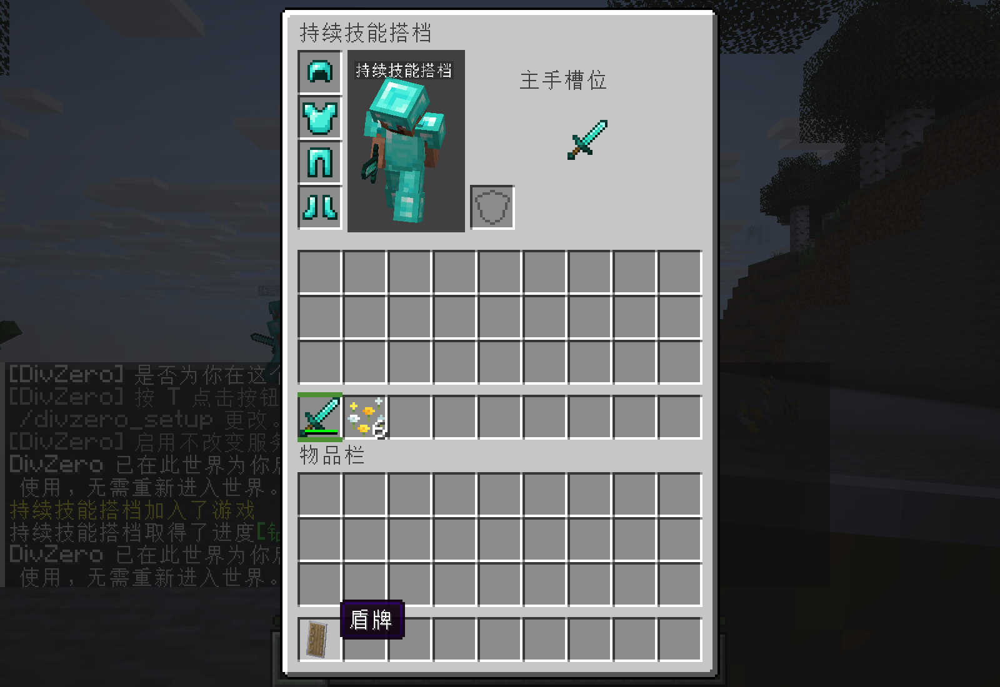
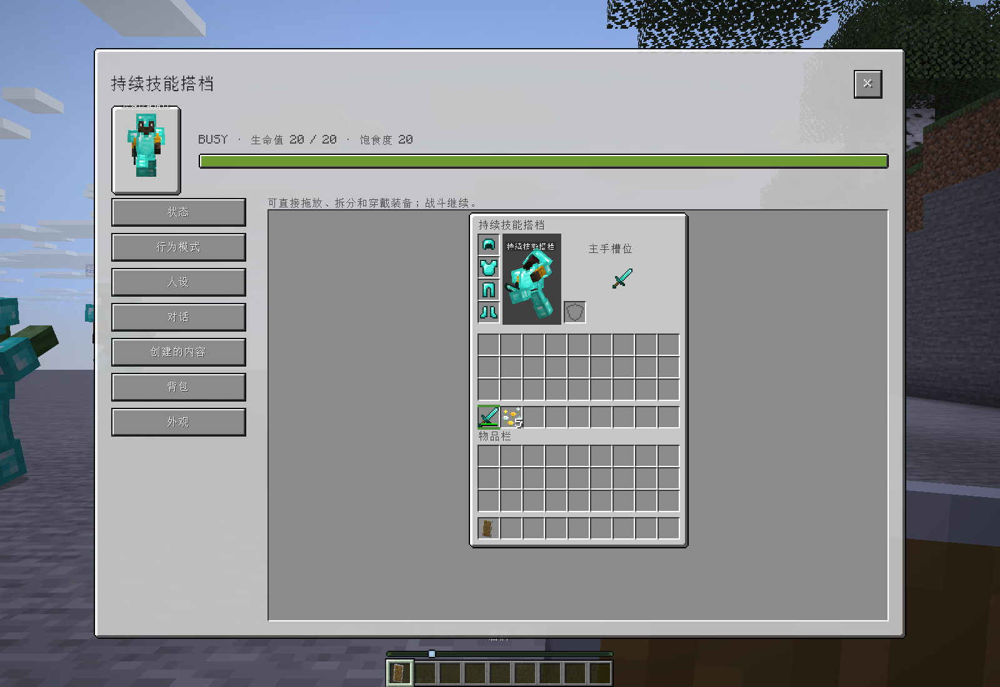
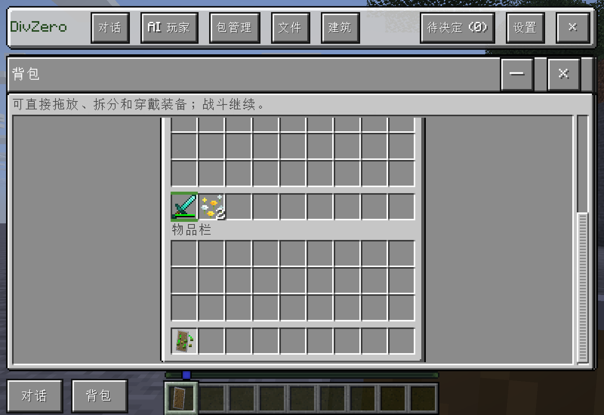

# 自主执行、脱困与战斗学习升级

本轮需求（2026-09-30）：候选版本诊断修复闭环、稳定对象局部编辑与资源锁、执行钩子/规则来源/角色模型/结构化提问，独立真实背包及战斗中操作（按最新指示），主人遇袭支援，共享挖掘/放置组合脱困，空中威胁/拦截/弹道预测，普通暴击时机/盾牌装备协调，持久 Boost，预训练小模型与可选局内权重学习，旧版规则 AI 对战评测。

## 完成判定

- 新生成/局部修改先成为候选；诊断包含对象、版本、文件/字段、位置、API/条件、执行状态和下一步。失败保留运行版本；未知写入先核对，不重放。模型能依据诊断继续修复。
- 同一对象修改按版本 CAS 和独立资源锁执行；外部说明不是授权，扩展钩子不能覆盖服务器权限。
- 真实背包槽位与原生协议保留，战斗时可打开；使用中物品的转移必须与原生使用结束协调，不能复制/丢失。
- 主人受伤在指定持续模式内触发本地支援；显式不攻击/停止、友军排除、PvP授权继续有效。
- 共用通行规划器支持绕行、挖、搭及组合，每一步确认世界变化和身体站位后重新评估；成功需恢复原任务可通行性。来源未知地形按区域规则处理，不当作自然生成。
- Java 执行与预测先独立可运行；学习模型只选择已经通过权限、碰撞、材料与风险检查的候选，不能绕过执行边界。
- Boost 配置按世界和 AI/真人身体持久化；无倒计时，退出/死亡只清理动作，关闭不取消原工作。服务端决定是否允许增强路径。
- 默认权重必须附训练来源、版本、哈希和评测结果；局内学习默认开启、可手动关闭，后台更新，候选模型评测后替换，支持回退。
- 同装备旧规则 AI 基准记录实际战斗结果；真实玩家胜负只能通过用户后续对练验证，不提前宣称。

## 最新用户调整

2026-09-30 后续指示覆盖此前布局：背包恢复独立原生容器界面，保留战斗中打开及真实物品操作；局内学习默认为开启，仍保留玩家手动关闭的偏好。新增训练验收目标：与冻结的旧规则控制器同装备、关闭 Boost，独立十场至少九胜。此前一次五组的三胜两负尚未达到该目标，不能当作达标结果。以下嵌入背包截图与测试属于调整前的历史证据。

## 当前进展

仍在实现和验收，尚未宣布完整交付或真人对练就绪。此次未创建 Release。

### 最新独立背包与学习默认值

当前背包已恢复独立的原生 `AgentInventoryScreen`。F2 与 AI 专属面板共用这个入口；支持真实槽位、盔甲、左右手和原版容器点击协议。UI 尺寸 4 的战斗中打开、拖放、副手盾牌转移与关闭均通过，验收编号 `0bc18f66`。尚未保存开关偏好的角色默认 `learning=true`；玩家手动关闭的记录继续保留。

### 神经模型九胜目标：尚未达标

- 十场训练赛：新版 **4 胜 6 负**，收集 **546 条实际执行样本**、8 份非空角色轨迹。
- 首个候选按完整角色划分留出集，用 97 条未参加训练的样本检查代价预测；均方误差由 `0.02247` 降至 `0.01934`。这是代价拟合结果，不能替代对战验收。
- 首个候选冻结权重后进行独立十场：**6 胜 4 负**。
- 修正远程蓄力与躲避后再次完成十场：**7 胜 3 负**。仍未达到至少九胜要求。
- 所有上述对战双方装备一致、Boost 关闭。最终验收冻结权重，五种装备／场地各两场，交换站位；超时、双杀均不算胜利，死亡后继续观察飞行中的攻击。

候选权重 SHA-256：`21b32e841a351e22f62046ed0953f9146e927211e865904d3b3f8a7cf856a0ec`。候选没有替换正式内置权重；继续优化和验收。训练脚本 `scripts/local-policy/finetune.py` 读取隔离实战轨迹，保留旧结果，不从失败比赛中挑选部分胜局拼接成绩。

### 已验证的链路

- 调整前的嵌入背包方案曾继续使用原生 `AbstractContainerMenu`、真实槽位、原生点击包和装备槽规则。F2 与 AI 专属面板保留当前页面；战斗中可将 AI 的副手盾牌转移到玩家快捷栏。尺寸 2、尺寸 4（滚动视口后操作）均通过真实鼠标回调测试。旧视图关闭携带独立 token，不能误关新菜单；服务端关闭背包不会关闭宿主工作区。
- 本体与真人托管均通过土坑、顶棚阻挡下的侧面挖掘与搭建组合脱困。测试检查原生破坏/放置/消耗回执、禁止破坏的屋顶和玩家放置方块，并确认脱困后继续原跟随任务，不继续搭柱。
- 跟随、巡逻、自由活动与战斗模式下，主人受到原生僵尸伤害后均发生实际支援攻击。停止/不攻击与玩家 PvP 授权仍为独立规则。
- 增强开关默认关闭，原生击退不被修改；开启后只按配置缩放实际击退冲量，关闭后恢复原生行为。偏好变更和权重重置不取消跟随，停止任务不清除 Boost 偏好。临时攻击与微跳在动作停止、失效或跨维度时清理。
- 权重恢复按钮读取模型版本并校验；旧异步读盘/训练结果不能覆盖后来的重置。当前默认网络来源为合成 Java 候选动作代价预训练，**不是移植的竞技 PvP 权重**。确定性样本已通过真实退出／重进同一世界后的权重、学习和 Boost 偏好恢复；该样本只验证生命周期，不是竞技能力证明。实战轨迹现在随检查点持久化，长期质量仍需继续验证。

### 对战结果与适用范围

同一隔离世界内五组同时开打，统一生存模式与同组相同装备，双方关闭 Boost，新版开启默认神经评分；冻结旧控制器取自本项目旧提交 `b26680f1`，只允许隔离评测开关使用。上限十分钟，所有比赛在约 89 秒内结束：

| 组 | 同组装备/环境 | 新版结果 | 新版结束生命值 |
| --- | --- | --- | --- |
| 1 | 铁剑、铁甲、盾牌、4 个熟牛肉 | 胜 | 6.40 |
| 2 | 铁剑、铁甲、无盾、4 个熟牛肉 | 负 | 0 |
| 3 | 铁斧、铁甲、盾牌、4 个熟牛肉 | 胜 | 12.73 |
| 4 | 铁剑、铁甲、盾牌、弓、48 支箭、4 个熟牛肉 | 胜 | 17.99 |
| 5 | 铁剑、铁甲、盾牌、4 个熟牛肉、场内障碍 | 负 | 0 |

本次为 **3 胜 2 负的一次五组评测**，不能当成统计胜率或对真人必胜的证明。斧战观察到实际盾牌禁用和原生暴击；弓战新版射出 6 支箭并记录 6 次重力弹体命中。失败组显示恢复机会与近战走位仍有改进空间。

普通难度下，AI 使用无附魔钻石剑/甲、盾牌、16 个熟牛肉，在带围墙的平地击败 5 只及 10 只原生僵尸并存活。没有给 AI 增加血量或攻击距离。这两项通过只覆盖这些实际装备、敌人和地形；不是任意 1v10 生物组合的承诺。

### 请求与候选诊断

- HTTP 429/503 且服务端明确拒绝、零输出时，使用新计量请求 ID、遵守 Retry-After 并非阻塞退避；连续三次仍失败则保留失败状态。部分输出、网络结果未知与世界写入未知均不自动重放。
- 明确的上下文容量错误先减少旧聊天或压缩完整工具组，保留当前输入、规则、来源标签、未核验操作和对象版本；不能缩减时返回具体容量错误，不原样循环重试。
- OpenCode 的 MIT 精确编辑实现用于候选源码与动态界面片段修改。流式重组、聊天入站和执行校验共用参数长度定义。
- 修正 `UNKNOWN_PROPERTY` 被字符串匹配误判成未知写入的问题：`CANDIDATE_ONLY` 继续作为候选校验失败反馈，可按保留源码和诊断修复；真正 `UNKNOWN` 仍须先核对。
- 五种显式角色模型通过配置绑定和受控 HTTP 请求检查；没有额外调用真实付费模型。角色为空时继承 AI 当前配置，不修改全局默认、不跨 API 来源。

### 构建与证据

已通过 Actions：`36714704514`（`6abc38b`）、`36715951333`（`cb46af8`）、`36716362716`（`6689263`）。后续源码继续通过公开 Actions 构建，当前最后一次变更需要等待构建和对应原生复验。

隔离验收编号：背包尺寸 2 `04d9f26e`、尺寸 4 `b7022a67`；真人脱困 `cccd323e`、AI 脱困 `382efdc0`；五组对战 `0305a81a`；1v5 `fc588745`、1v10 `e6eacdc3`；增强生命周期 `d999a6d4`；主人支援 `905680eb`。所有上述新测试为零模型调用，使用下载的公开 Actions 产物，未改生产世界。

保留失败证据：首次尺寸 4 测试在未滚动到玩家快捷栏时尝试点击不可见槽位；首次候选修复原生测试发现诊断分类错误。前者已按真实滚动路径复验，后者修复后待复验。不得把失败记录删除后宣称无失败。

### 仍需完成

- 候选界面失败、具体诊断、OpenCode 局部修复、激活和输入保留已经通过原生复验（`b56cdf84`）；已发布包的脚本局部修复与新激活实例生效通过（`1316c8c8`）。运行中旧实例的原地版本迁移仍需单独完善。
- 弓、弩、三叉戟、雪球、鸡蛋和喷溅药水已在 AI 本体及真人托管上分别验证实际发射、命中或药水效果（`e74bad81`、`67e5e55e`）。远程蓄力调整后真人适配回归通过（`43b4606b`）；移动对手与复杂地形还需扩展。
- Boost 的实际微跳、增强暴击和死亡清理已分别通过本体与真人测试（`29205a88`、`f5c0a997`）；保持覆盖断线等组合边界。权重生命周期测试与真实对战成绩分开，不把训练损失当成胜率。
- 针对已有建筑构件、已发布脚本/Java/内容包与生物规则的局部版本编辑/修复链路审计；运行时 API 诊断与现有生命周期的完整联验。
- 继续优化无盾、障碍近战，完成完整十场至少九胜的验收；尚未邀请真人对练或声明已达到真人 PvP 目标。

临时真人托管 MOVE 也已接入统一导航和挖／搭脱困（`47568feb`）；不再只在专用持续技能中支持。托管规划请求已分离 system 规则与玩家目标／观察数据，且无工具规划请求不携带聊天工具目录。扩展钩子对校验拒绝和失败读取同样提供真实回执，停止入口不能被钩子阻止（`3ab778bb`）。
