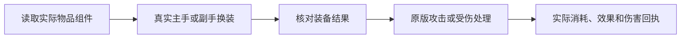

# 聊天、玩家状态与战斗交互修复（2026-10-01）

## 原生聊天展示

AI 正文恢复为带 `[AI 名称]` 前缀的系统聊天记录。一次请求持续更新同一条历史记录，数据包分片不会变成新消息；较长正文仍按原版聊天框宽度自然换行。思考开启时默认只显示最新一行的尾部，完整思考仍保留在 F2 历史。这里只显示 Provider 实际返回的思考数据。

不再通过“玩家聊天包＋补充流式包”拼接 AI 回复，移除相应客户端拦截混入。名字悬停再次显示时间，流式替换保留最初接收时间。普通玩家聊天不改动；AI 的注册玩家身份和命令寻址也不因展示方式改变。显式 `@AI` 的群聊／私聊设置继续生效，F2 等其它对话仍私有，旁观者不接收思考或请求者操作按钮。

## 状态和面板操作

- 原版玩家数据保存的实际游戏模式成为重进后的依据。创建偏好只初始化新身体；还修正 NeoForge 对自动化玩家统一回退生存模式的加载分支。服务器明确强制的游戏模式仍生效，极限模式已保存的旁观状态继续保留。自动化身份标记不用于冒充真人或绕过第三方权限策略。
- AI 状态页增加游戏模式按钮，循环切换生存、创造、冒险、旁观；增加“传送到我”。使用原生模式和传送接口，服务端继续核对管理权限、身体状态和预期模式。
- 行为面板只接收当前控制所需状态，不将完整攻击时间线和历史对象塞入有大小限制的界面回执。原始工具观察仍保留。失败回执不再被吞掉，也不会假称未知写入成功。
- 修正本地模型异步加载先于状态登记完成的竞态，避免永远显示“读取已保存权重”。
- “恢复预训练权重”先弹确认框，取消不重置；确认绑定身体、配置版本和模型版本。恢复权重不等于停止当前工作。

## 原版物品与碰撞交互

死亡保护物品先按 `DEATH_PROTECTION` 组件从普通背包装备到真实手部，再由原版玩家受伤、消耗和效果链路处理。没有直接扫描背包替代原版死亡判定，也没有对不死图腾单独硬编码回血。副手换装回执核对实际物品及组件；战斗格挡不会立即换走已装备的死亡保护物品。保留原版的伤害类型与装备条件。

攻击可见性从只看目标眼睛改为检查实际碰撞箱上的可见点，包括脚部；必要时采用真实潜行姿态。执行前核对可见命中点和实际武器距离，完整实体墙仍阻挡攻击。AI 身体和真人托管共用几何判断，托管仍通过原生客户端输入执行。

武器选择读取原生物品提供的伤害加成。真实下落时准备和选择重锤，并利用实际砸击窗口；伤害、附魔、原版基础伤害冷却折减及砸击后落地处理交给游戏。没有写入虚假的普通模式下落距离或额外伤害，也未把此改动描述成自动搭建高台的能力。

托管角色从普通背包换到主手时，现在核对真实换装结果，而不是只认可快捷栏索引；确认前保留装备操作，避免被攻击或停止移动帧覆盖。停止移动仍会保持明确要求的潜行姿态。

## 验证记录

| 实机路径 | 源码 / 隔离实例 | 结果 |
| --- | --- | --- |
| 正文分片原位更新、单行思考、首次时间保持、悬浮时间、复制事件 | `7e9de121` / `ace0c7b1` | 通过；完成前已可见，长正文完整且只有一条历史记录 |
| F2 四种增强开关真实按下/松开并保存，重置取消/确认 | 同上 | 通过；取消保留 13 条测试回放，确认清空；异步模型加载实际完成 |
| 状态页四种游戏模式循环切换、“传送到我” | 同上 | 通过；读取服务端实际模式和坐标 |
| 公开／私有 @、非 @ 默认回复、F2、处理中切换及旁观者隔离 | `7e9de121` / `ecbf14a6` | 通过；一次真实客户端及注册的服务端接收记录器，不是双真实客户端联机测试 |
| AI 本体原版图腾与同组件纸、底部空隙击杀、完全封闭墙体拒绝、重锤 | `c679d9c5` / `c42a85f9` | 通过 |
| 真人托管同一物品／潜行／空隙攻击／实体墙／重锤链路 | `c679d9c5` / `ae7eb254` | 通过，实际执行者为被托管的玩家 |
| 正常退出进程并重开同一隔离世界 | `c679d9c5` / `c42a85f9` 的 resume | 通过；创建偏好为创造，原版存档保存的冒险模式重进后仍为冒险 |

最后执行产物通过 Actions [36814188202](https://github.com/gaoshanliuni/divzero/actions/runs/36814188202)。较早的界面／隐私验证覆盖的对应实现，在最终产物中未再修改。新增离线测试验证面板投影不会序列化世界对象、完整攻击时间线或大量旧任务，并能构造受大小限制的真实界面回执。

| 身体 | 测试起始落差 | 出手时实际下落距离 | 原版实际伤害 |
| --- | --- | --- | --- |
| AI | 4 格 | 1.5926 | 7.7011 |
| AI | 9 格 | 5.6884 | 19.1481 |
| 真人托管 | 4 格 | 1.5926 | 7.7529 |
| 真人托管 | 9 格 | 5.6884 | 19.2518 |

落差是测试放置高度；出手发生在接近目标时，不能把整个起始落差冒充出手时的下落距离。目标使用原版铁傀儡，伤害来自真实事件，没有直接写入下落距离或额外伤害。这不是所有地形、附魔、武器 Mod 或 PvP 组合的胜率证明。

思考的界面测试使用明确的合成数据；公开／私有对话使用本地确定性 HTTP 协议端点。付费语言模型调用为 0，未将这些测试描述成模型质量评测。重置使用的 13 条回放是专门的测试探针，不计入战斗训练数据。

保留了初版编译的旧聊天测试接口引用错误、首次客户端启用不足、面板不可变映射错误、取消按钮测试定位错误、远站位空隙测试、模式重进错误，以及真人潜行被停止移动覆盖的失败记录。修复后仅重跑受影响路径；没有删除断言或把失败算成通过。

交付包：`DivZero-1.0.23-chat-body-combat-fixes-20261001.zip`。主 JAR SHA-256：`8ca58d0e22dae81b7a89ed566b652cd0a6cdd4af9cbd15260b7b4b59807a0e6c`；ZIP SHA-256：`a832052500e5f60a92fadec9a5506237b964940a7ee56a8475f0fa4cce5935a1`。包含 LDLib2、KubeJS、工具提示依赖，无 MCEF JAR。

网络协议升级至 **15**，客户端和服务端须同时更新。本次保留原有默认神经权重。全部测试使用隔离实例，未覆盖生产 Mod、配置或存档，未自动发布 Release。
