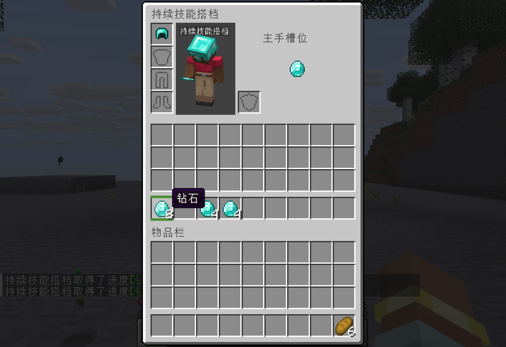
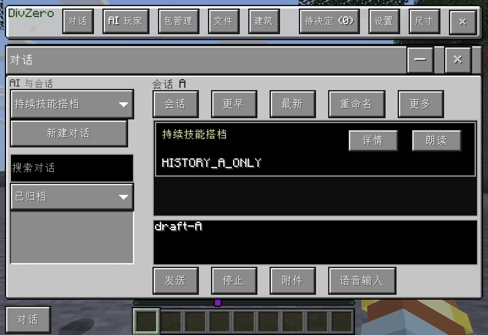

# 本地反击和界面功能补齐 · 1.0.23 候选

本轮候选的已完成实现与隔离游戏证据记录如下；未完成项在下文单独标记，模型请求为 0。安装包仅由公开 GitHub Actions 构建，网络协议保持 11，客户端与服务端应使用同版主模组。显式指定目标的 PvP 已在后续确认后启用；被玩家攻击不会自动建立 PvP 授权。

## 战斗如何改变

AI 根据敌人正在运行的攻击逻辑读取冷却、蓄力和已适配的动作限制，结合自身冷却、接近距离、退路和飞行物寻找出手机会。普通近战、弓、弩与长矛分别读取对应状态；长矛使用自身针对该目标的接触间隔，受伤动画和伤害保护仍不算硬直。

没有远程武器时可以在射击间隔疾跑接近。安全直线路径、落脚和头顶空间允许时使用原生跳冲；跳跃期间继续推进已经检查的平地路径，不再在经过的地面路点前减速或倒退。AI 身体的跳跃在原生移动阶段执行，并绑定当前移动任务；真人托管使用虚拟客户端输入。

长手敌人的后撤距离按它的实际近战范围计算。远程敌人退到交战区域外、无法继续安全接近时，会先移出火力范围重新寻找机会，不无限越界追杀或留在边界一直格挡。已插地的箭不再当作飞行威胁，仍在飞行的攻击继续参与风险判断。

速度、伤害、攻击距离、装备消耗、敌人状态与冷却均沿用原生机制。测试中的 6 格长手敌人为持有原生 `ATTACK_RANGE` 组件长柄测试武器的僵尸；实际战斗使用原生长矛 Goal、物品机制和接触间隔，没有冻结敌人或伪造攻击计时。原版劫掠兽未被冒称为该长手样本。

## 实际界面操作

F2 → AI 玩家 → **背包**，或右键 AI → **背包**，打开同一个原生容器。上半部分直接绑定 AI 的真实背包、盔甲、副手和当前主手，下半部分是当前玩家物品栏。原生点击、Shift 快移、数字键交换、右键拆分、拖拽分配与物品提示均使用 Minecraft 容器协议；装备槽沿用 AI 原本的 Slot 规则和物品组件。每次操作检查当前连接、世界、身体实例和所有者／协作者权限。打开其它界面、死亡、断线和权限撤销仍受原生容器生命周期约束。

下拉框得到保留：弹层显示在工作区窗口上方，鼠标按下选项时保留弹层焦点，松开才应用选择。固定状态、任务筛选、服务端／客户端和模型服务组使用双语标签，配置值、模型 ID 与玩家文字保持原样。

F2 的 **尺寸** 按钮可以直接设为 2、3、4；尺寸 4 使用紧凑工具条、可展开会话侧栏和固定编辑区。切换尺寸保留当前会话和草稿。文本输入管理器只在真实焦点或光标区域变化时更新，避免每帧反复注册输入区域。

## 命令、世界启用与建筑纠错

AI 本体一直是注册在 PlayerList 中的 ServerPlayer。修复的是显示名称与内部 profile 名称不一致：原生 give、tp 可以使用唯一的 AI 显示名称，包括中文名称。UUID 与身体实例不变，真实玩家 profile 名称优先，重名别名不随意选一个。

全新的未绑定世界自动建立独立作用域，即使同一个游戏目录已经有别的世界记录，也不再默认进入多身份接入向导。玩家看到一次“是否为你在这个世界中启用 DivZero”的启用／禁用按钮，启用即时生效。旧世界数据保留；已经存在但发生冲突、复制或损坏的身份不会被静默合并。

日志中的 BUILDING_ALREADY_STARTED 与 BUILDING_NOT_RECOVERABLE 来自未修改世界的施工前置校验。现在确认账本未改变后返回 REJECTED、原错误、当前版本和施工状态、已有操作 ID 与下一步指引；不再把这些错误当作结果未知而结束对话。只读／验证失败也返回工具结果。模型可以继续检查、修正并调用工具；真实写入结果未知时仍先核对，不能盲目重放。

参数解析接受完整 JSON 代码围栏、一次重复 JSON 字符串编码，以及约定为 JSON 文档的 source 对象；保留重复键、尾随内容、执行代码和含糊语法的拒绝。模型在本次建筑版本尚未验证时只返回文字，会收到对应建筑／版本的验证提醒；连续两次仍不调用工具则明确标为未验证，避免空转和虚假完成。

会话切换立即更新标题和选中标记，各自的草稿与历史内容独立保存。旧读请求不会阻塞或覆盖新选择；列表刷新保留现有按钮，因此按住期间刷新后仍能正常松开选择。同一 AI 的工作区入口保留已选会话。F2 分页栏始终可见，支持翻到旧记录后返回；专属面板也补齐分页和归档筛选。

横排文字现在使用剩余空间，避免把数量、翻页、文件操作等控件挤出窗口。AI 操作按钮在需要时换行。

## 界面入口排查

检查覆盖 50 个非测试原生界面源文件、直接及相应动态请求分发。扫描发现的 43 个字面量请求均有服务端处理，467 处按钮构建调用不被用作实测通过数量。

| 入口 | 实际处理链路与本轮结果 |
|---|---|
| 背包与装备 | 原生容器、真实库存和装备 Slot；实际点击、快移、数字键、拆分、拖拽分配及权限拒绝通过 |
| F2 与专属面板对话 | ConversationStore、焦点、草稿与历史读取；修复同 AI 重开清空、迟到读取、按住刷新、分页返回等问题；真实按钮验证通过 |
| 人设、模型、设置、权限 | 已有读写、版本检查与保存处理，核对入口及服务器分发；保留已有真实功能 |
| 文件、预览、建筑计划 | 已有文件库、原生预览、建筑计划及差异操作处理；共用行布局修复同时覆盖文件操作按钮 |
| 包管理、生成、交付、生命周期 | 已有任务、资源及交付状态处理；详情展示与会改变内容的按钮保持各自实际用途 |
| 任务、调度、事件、反馈、长期偏好 | 已有持久化读写和控制处理，核对相应分发，未发现新增空业务回调 |
| AI 动态界面、HUD、只读预览 | 已有 KubeJS/LDLib2 与受控交互；预览和绘制所用的空通知回调不作为未接业务按钮 |

其余模块本轮进行了入口与处理链路核对，实测范围沿用对应功能文档；不将代码核对说成重测了每一种外部服务或第三方 Mod。

## 原生验收

| 场景 | 观察到的实际结果 |
|---|---|
| 无弓 AI 对骷髅 | 使用攻击窗口后造成实际伤害，目标生命值降至 9.667999 |
| 无弓真人托管对骷髅 | 原生疾跑命中 1 次、伤害 6.888；记录反击窗口与后撤位置 |
| AI 对 6 格长矛 | 实际命中，目标生命值降至 13.224，并检查到脱离原生近战范围 |
| 真人托管对 6 格长矛 | 利用长矛间隔命中后实际退到约 7.06 格；保留实际受伤记录 |
| 无弓 AI 对掠夺者弩 | 实际原生跳冲 1 次、疾跑命中 1 次、伤害 6.888，随后拉开距离 |
| 无弓真人托管对掠夺者弩 | 实际原生跳冲 1 次、疾跑命中 1 次、伤害 6.888，随后拉开距离 |
| 26 个会话 | 翻到最早会话再返回、正文和草稿隔离、快速切换、按住期间刷新、文件窗口返回及专属面板选择通过 |
| 原生背包 | 16 钻石真实转移、命名头盔实际穿戴；Shift 快移、数字键交换、右键拆分、拖拽 8→4+4、总量守恒与权限拒绝通过 |
| 下拉框和尺寸 4 | 真实鼠标打开、按住、松开选择“已归档”；尺寸切换保留草稿；输入框在多次轮询中位置与焦点稳定 |
| 原生名称命令 | 用中文 AI 显示名 give 后库存增加 3 绿宝石，tp 后坐标读回一致；同 UUID、同身体实例 |
| 建筑错误继续 | 放置 25 方块；重复 apply 与错误 recover 返回已知拒绝；后续 verify 成功，未重复施工 |
| 世界作用域 | 同目录第二个新世界直接获得独立作用域，重开保持，旧记录完整保留；复制冲突仍拒绝自动接入 |
| 近身受击回归 | 真人原有墙边疾跑脱离与继续战斗场景通过 |

弓弩射程与近战范围分别处理，表中的近战范围退出不代表已离开所有远程武器射程。远程后续行动继续检查射击状态和飞行物，不保证任意敌群、装备或地形下无伤。

主要验收运行：原生背包／下拉／输入 `16f5cda8-2b80-4851-b3b9-dff8a6417c3e`，命令与建筑回执 `6909081e-df9a-4013-a226-5d3c01a50226`；真人弓手 `c9c28c17-82e7-46b9-a1f2-800422df72eb`；真人长矛 `3bc21814-f743-402b-80a1-82d33a37619a`；AI 弩手 `f8f886d1-aae4-4c2e-959f-04ec85298880`；真人弩手 `4e3feeb1-d6be-444d-bf3d-551b4b226b15`；墙边回归 `f0a54c4f-a235-4a0d-b2ae-aec14ad37c8f`。多敌人代码构建见 [Actions 36584632020](https://github.com/gaoshanliuni/divzero/actions/runs/36584632020)，原生背包／输入验收构建见 [Actions 36584252983](https://github.com/gaoshanliuni/divzero/actions/runs/36584252983)。

## 保留的失败与修复

| 暴露的问题 | 修复或验证调整 |
|---|---|
| 首次编译缺少背包哈希异常处理 | 明确返回快照版本不可用，失败构建 36566146221 保留 |
| 最初背包数据操作通过，但工具条被挤出屏幕 | 修复行内文字宽度，并加入点击坐标在屏幕内的检查，重新查看实机截图 |
| 一次测试在同一绘制帧内揭示聊天窗口并点击它后面的列表 | 将两个用户操作分开，保留原失败；增加实际按住跨刷新测试 |
| 用原版劫掠兽假设“比玩家手长” | 实际读取否定该假设，保留失败，改为明确检查范围的长柄武器样本 |
| 长矛只读到了未运行的普通近战 Goal | 补上原生 SpearUseGoal 的蓄力与接触计时，真实长矛复验通过 |
| 真人曾跳冲但迟迟未命中，追到 24 格边界只挡退 | 修复空中路径推进和边界远程重新接近策略，保持原场景重新验证 |

本批首次构建 36581920995 的回调变量和测试时间 API 编译错误保留；修复后 Actions 36582503598 通过。原生库存首张截图暴露重复背景槽位，已改为只绘制真实槽位，并重新查看尺寸 4 截图。

第三方改写的攻击逻辑仍需要对应适配；未知硬直与计时保持未知，不用受伤动画替代。

## 多敌人原生实战

测试为普通难度、真实原生生物、无附魔钻石剑与钻石盔甲、盾牌和 16 牛排；不携带远程武器。没有修改双方属性、攻击距离、冷却或伤害，没有冻结敌人。正常进食与自然恢复保留，结束时满生命不等于过程中无伤。AI 自身与真人托管分别执行同一套本地战斗逻辑。

| 场景 | 当前结果 | 运行 |
|---|---|---|
| 真人：3 僵尸 + 2 骷髅 | 五个目标实际死亡；累计受伤 6.470，剩余生命 17.79 | `29f9e33c-9289-4492-832e-42fa115fd1d6` |
| AI：3 僵尸 + 2 骷髅 | 五个目标实际死亡；累计受伤 3.570，结束时生命 20 | `ef02c0ae-b506-4476-a0c7-023153ea4eeb` |
| AI：10 僵尸 | 十个目标实际死亡；累计受伤 2.760，结束时生命 20 | `6f88d710-7b86-48ef-a892-0da267a1dbab` |
| 真人：10 僵尸 | 十个目标实际死亡；累计受伤 2.760，结束时生命 20 | `46fb79ee-3c9f-4fb7-91b6-64aa8abf26dd` |

较早的 AI 五僵尸探索场景剩余生命 19.708332，真人十僵尸探索场景剩余 11.1586；因允许额外自然刷怪，它们不与固定场景混计。一次五敌测试在开始前因遗漏主工作区域而被参数校验拒绝，未进入战斗；该失败保留，之后补齐区域。混合敌人的真人场景曾短暂丢失威胁并恢复区域巡查，之后重新发现并完成战斗；没有用只统计方块／实体数量代替实际死亡验证。

这些是指定装备、地形和原生敌人的实测，不承诺任意 Boss、第三方攻击机制或装备条件下都能获胜。显式授权的玩家 1v1 已单独通过原生伤害与授权隔离检查，不以被玩家攻击自动启动。

## Jump-tap 与 A／D 变向（追加）

近战自动策略、跑打和连击共用本地动作：真实命中后可释放疾跑、用原生短跳调整距离，落地后继续出手节奏；根据敌人原生攻击碰撞箱、短时间运动预测和飞行物选择左／右侧移。方向通常保持至少 12 Tick，遇到障碍或明显更高风险时可提前改变。跳跃使用真实起跳力度、重力和已有水平动量检查轨迹、顶空间及落点，不假定跳起免伤；水中、危险地形和不能可靠预测的飞行状态保守回避。延迟跳跃请求超过 4 Tick 失效，停止与控制权变更仍取消。

原生五僵尸测试：AI（`9185914b-53a8-4588-bd7e-0f2650ef0057`）和真人（`4ece2d8c-dd14-4339-a149-5863f890c82d`）都真实击败五个目标并存活，分别观测到 4 次实际 Jump-tap；左右两向都有实际位移。AI 左／右位移 Tick 为 30／41，真人为 36／33。实际起跳与请求次数分开记录，处于碰撞箱外的位移记录也不被冒称每次都躲过一次攻击。

追加开放平台的混合测试 `98f90265-e304-4b50-be3f-909d840b22cb` **未计为通过**：保存的原生实体状态显示一只骷髅仍在平台上，另一只落到 y=65，平台为 y=101。AI 没有为追杀跳下高台；保留进度、日志和实体坐标诊断后结束该隔离运行。后续使用有围墙的同尺寸场地复验完整战斗，避免用强制危险追落点来满足“全部击杀”条件。

后续带边界的混合五敌和十敌回归已通过，保留真实装备、食物消耗、伤害与恢复。五组同时独立对打在优化前四组达到时间上限；优化后五组均在 59–137 秒内决出胜负。单次场景对照不代表通用胜率或任意条件下无伤。

界面继续补齐、包管理内容目录、尺寸 4 布局及图形化恢复报告见 [工作区接线验收](native-workspace-integration.md)。
