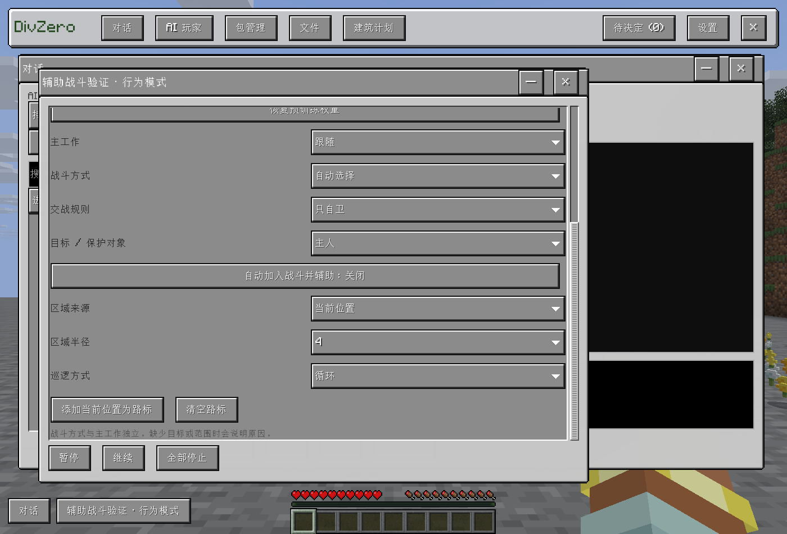

# 创建者辅助战斗

`CombatPolicy.assistCreator` 默认开启，缺失该字段的旧快照也恢复为开启。关闭状态按原有世界／身体策略保存，改工作、战斗方式和重进不会重新开启。F2 和 AI 专属面板共用编辑器，在保护对象下方点击即保存。

自由活动、跟随和战斗模式读取创建者的近期实际攻击、近期受伤来源，以及附近生物的当前原生攻击目标；不等待语言模型。AI 身体使用 `MineAgentPlayer.ownerPlayerId()`，而不是协作请求者的身份。创建者须在线、存活、同维度、距离不超过感知半径的两倍（默认 32 格）；支援目标须位于创建者的追击半径内（默认 24 格）。巡逻保留此前的受伤支援行为。

伤害事件记录成功的近战／远程攻击，最多保留 100 Tick，原生最近攻击记录作为补充。目标、断线、维度和时效在读取时重新检查；生物当前仇恨在本地错峰扫描中重查。支援不替换主工作，退出战斗后重新检查并继续工作。已不满足交战资格的旧目标不会继续黏住。

暂停、停止、不攻击规则、排除对象、队伍友军和有主宠物保护优先。玩家 PvP 仍要求明确的指定目标授权和服务器规则允许，辅助开关不自动授权攻击其他玩家。

## 验证结果

公开源码 `176abf112792b8d91a916f580c24e967d3b95105` 经 [GitHub Actions 36896011197](https://github.com/gaoshanliuni/divzero/actions/runs/36896011197) 编译、核心回归及打包检查通过。核心测试覆盖旧数据默认值、显式关闭的序列化、策略修改保留开关、严格布尔校验及模式规则。

隔离 Native 运行 `7f3a193c-aef8-4bdb-829e-4f3b81d1fe66` 通过：三个模式各验证主动攻击、仇恨锁定、实际受伤共九种场景，均记录 AI 原生有效命中，威胁移除后恢复原工作；仇恨锁定场景的创建者仍为满血。关闭、距离过远、不攻击、暂停、停止、排除和待命均未新增命中。真实指针点击完成关闭并即时保存，重开面板读回关闭状态。聊天日志确认显示新增 `/ai create name` 提示。

隔离 Native 运行 `a5376d7f-b149-48f2-bbae-c7bd59342a85` 通过：被真人攻击不自动开战；未授权玩家目标返回 `COMBAT_EXPLICIT_PVP_TARGET_REQUIRED` 且未创建技能；明确授权后对真实玩家产生原生伤害，停止有效。未测试任意第三方生物的自定义非原生仇恨实现，不将本轮结果扩展为所有 Mod 联验。

两次初始测试失败保留：距离测试曾先进入交战再移动创建者，实际测到 AI 自卫，现改为先设置约束再触发仇恨；旧 PvP 测试依赖单一 `REJECTED` 状态，现检查具体授权错误和实际未创建任务，不以统一异常包装的 `UNKNOWN` 误称已批准。

实测 JAR SHA-256：`5f59db85ab16993bd51a69cac5adac38a8080ab37d8fd907528e1aa99eb5a7a0`。测试均在独立实例，未调用付费语言模型或修改生产存档、配置和模型权重。

