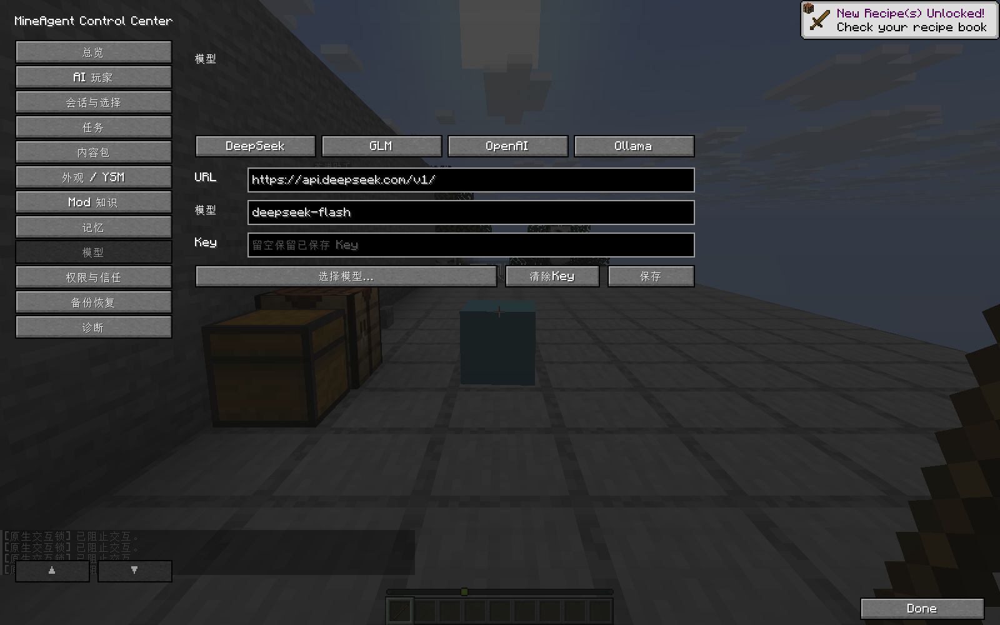
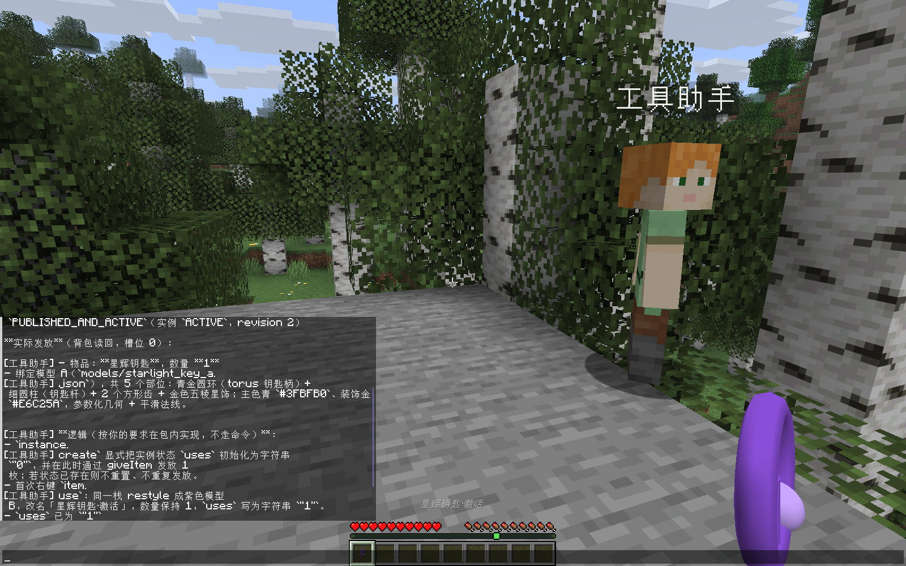
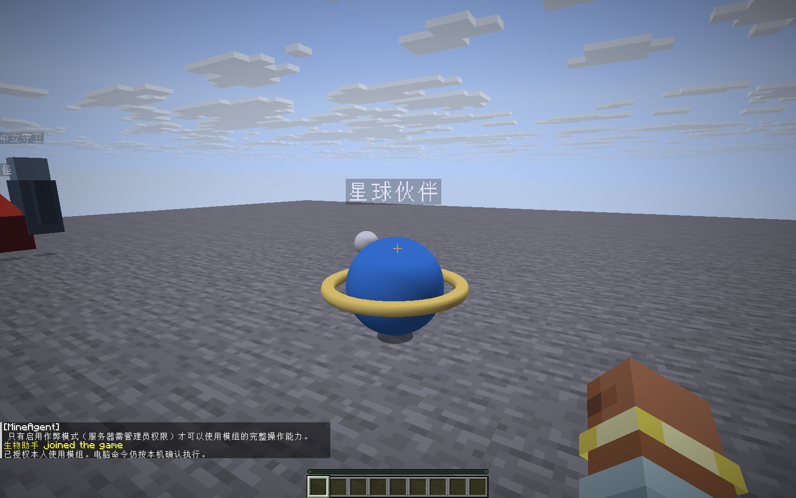
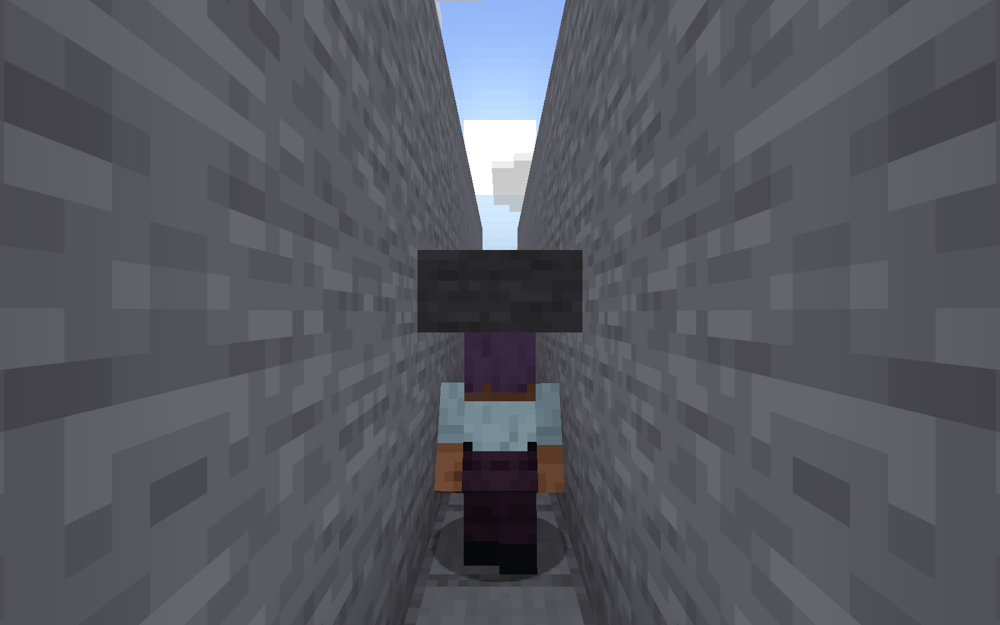
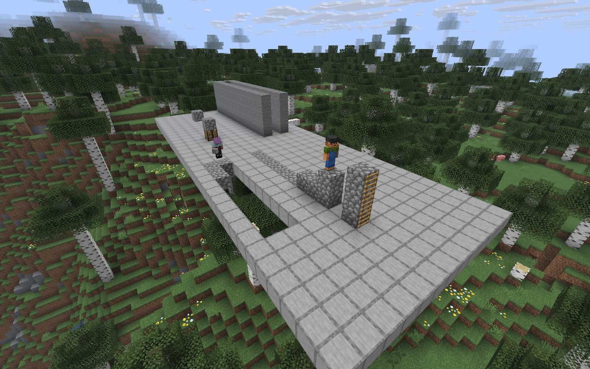
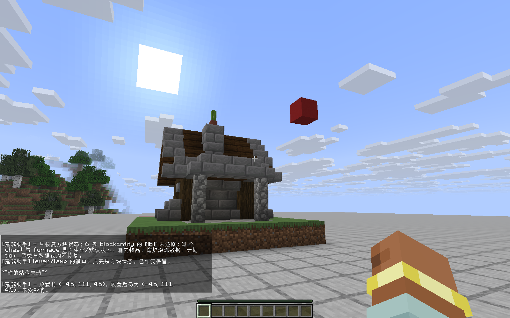
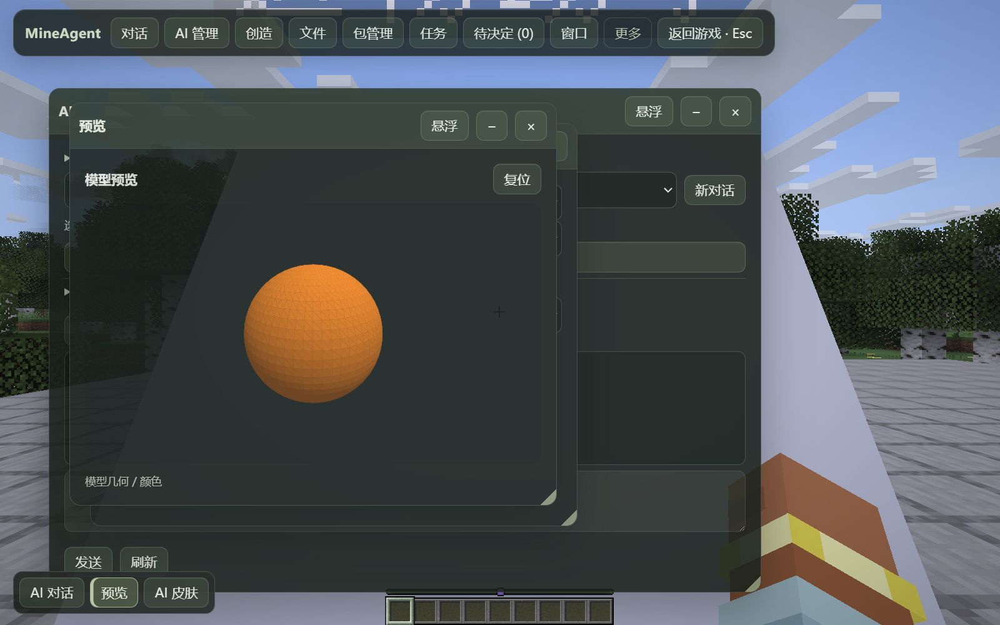
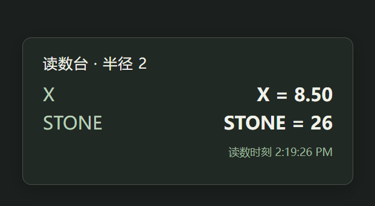

# DivZero 全部功能与使用范围

[返回首页](../README.md) · [下载版本](https://github.com/gaoshanliuni/divzero/releases) · [安装说明](BUILD_JAR.md)

本文面向玩家，汇总当前公开 `main` 的功能，提供对话示例、命令及原生／F2 操作入口。**当前为开发测试版；具体 Provider、Mod、平台及组合的验证范围见本文。** Minecraft 26.1.2、NeoForge 26.1.2.106、Java 25；**协议6**，客户端与服务端一起更新。管理操作需要开启作弊／真实管理权限，首次可用 `/ai accept` 初始化。

## 模型选择会显著影响效果

**最终效果很大程度取决于所选模型的能力。** 复杂建造、实体设计、多步骤规划与工具调用，不同模型的表现可能差异很大。追求更好的效果时，建议尝试 Claude、Grok、GPT 等系列中较新、能力更强的模型，并通过模组支持的兼容 API 接入；具体兼容性、费用与实际表现以所用服务为准。

本项目现有演示均使用价格更亲民的 **DeepSeek 4 Flash**（游戏内模型 ID：`deepseek-flash`）。演示效果不代表模组能力上限，换用更强模型通常更有利于完成复杂需求，但不保证每次生成都更好。

## 常用操作入口

优先使用直接命令，例如 `/ai create "星河"`。默认按 **Ctrl+M** 打开原生面板，按 **F2** 打开 Web 工作区；按键可在游戏设置中调整。

| 操作 | 命令／聊天 | 原生面板 | F2 界面 |
|---|---|---|---|
| 初始化本人权限 | `/ai accept` | 权限与信任 | 更多 → 配置与权限 |
| 创建 AI | `/ai create "星河"` | AI 玩家 → 创建 | AI 管理 → 创建 AI |
| AI 列表 | `/ai list` | AI 玩家 | AI 管理 |
| API URL | — | 模型 → URL／四个平台预设 | 更多 → API 设置 → URL／预设 |
| 设置／替换 Key | — | 模型 → Key → 保存 | 更多 → API 设置 → 设置 / 替换 API Key |
| 获取／选择模型 | — | 模型 → 选择模型 | 更多 → API 设置 → 模型列表 |
| 自定义模型名 | — | 模型 → 模型名称 | API 设置 → 使用自定义模型 |
| 对话 | `@AI名字 …` | 会话与选择 | 对话 |
| 默认响应 AI | `/ai default`；`/ai default off` | 命令打开选择菜单 | 可通过对话让 AI 设置 |
| 原生思考显示 | `/ai thinking see` | 会话与选择 → 聊天思考 | 对话中的显示开关 |
| 思考深度 | `/ai thinking deep` | 命令打开选择菜单 | 可通过对话让 AI 设置 |
| 删除当前对话 | `/ai chat delete` | — | 对话 → 删除对话 |

F2 的 Key 操作打开本机保密输入页；原生模型页可同页填写。API URL 和模型列表提供可选值；中文或带空格的 AI 名字可用引号包住。

## 1. 对话、模型与 AI 管理

| 功能 | 使用方式与现状 |
|---|---|
| 原生聊天 | `@AI名字` 选中 AI，Tab 自动补全；用自然语言提需求。 |
| F2 对话 | 持久对话记录、新建／切换会话、查看原文、归档／恢复与上下文详情；删除会取消该会话的在途请求和未发队列，后续建立新上下文。 |
| 流式回复 | 边生成边显示；超过原生聊天单条长度时拆分发送，完整保留内容。 |
| 打断与恢复 | 忙时默认排队，上一条结束后自动发送；可点“打断并发送”或“取消发送这条消息”。打断操作绑定对应请求。失败可“核对后继续”，先读真实状态，根据核对结果继续操作。 |
| 思考显示 | 原生显示 `[AI名字][思考]…`，`/ai thinking see` 切换原生显示，F2 对话记录保留完整内容；`/ai thinking deep` 选择深度。AI 也可调用设置能力；官方 DeepSeek 的实际深度参数已验证。 |
| Provider | DeepSeek、OpenAI 兼容 API、GLM 智谱／Z.AI、Ollama 等配置入口；GLM 凭据联验待完成。 |
| 模型选择 | 保存 Key／URL 后获取 `/v1/models`，列表选择；选择“使用自定义模型”才显示名称输入框。 |
| 本人默认响应 | `/ai default` 选择指定 AI，之后直接发送消息；`/ai default off` 关闭。按世界／当前玩家保存，作用域为当前玩家。 |
| 创建者响应权限 | 新 AI 默认只直接响应创建者；访客 @ 后向创建者显示“响应一次／始终允许／拒绝一次／始终拒绝”。F2 → AI 设置可选全部允许、全部拒绝或允许名单；游戏和电脑操作另有对应权限。 |
| 每 AI 模型 | 各 AI 可使用全局模型或单独指定当前兼容 API 的模型，配置按 AI 隔离，API URL 与 Key 共用。 |
| AI 数量与名字 | 支持持续创建；目录分页、名称分包补全，已有70名 Native 测试。硬件／区块资源仍有限。 |
| 长任务 | 对话支持持续工具调用；提供主动停止、Provider／传输边界及操作结果核对。 |
| 彩色互动消息 | AI 可设置聊天颜色，发复制、填入输入框、确认选择等可点击消息。 |

原生面板“模型”页将 URL、模型和 Key 放在同一页，顶部 DeepSeek／GLM／OpenAI／Ollama 预设可直接填入 URL，按钮统一为“保存”。真实模型验收已覆盖 DeepSeek；GLM 凭据联验和 Ollama 本地推理验证待完成。

图中 Key 输入框为空，保存后的 Key 以保密方式管理。

## 2. 人设、长期记忆与外观

- **对话设置人设**：例如“以后你是星际向导”，保存后同轮后续和新对话读取最新人设。
- **事实／偏好记忆**：AI 自主读取、保存、更新、删除；同主题内容按最新信息更新，实时事实可设置过期时间。键自动生成，玩家选择主题即可。
- **内置／玩家皮肤**：18款内置人物与体型、复制玩家皮肤。
- **PNG 热换肤**：选择本地 PNG，或让 AI 生成、导出、修改标准 UV 像素画；64×64、64×32，wide/slim。保留同一 AI 身份、名字、跟随与任务。
- **YSM**：安装兼容 YSM 和模型后选择目录内外观，热切换无需重启；卸载 Mod 本身仍需重启。PNG/YSM 的具体组合按实际模型与版本验证。

## 3. 读取与修改现有世界

| 能力 | 说明 |
|---|---|
| 玩家信息 | 手持物、背包、装备、位置、视角、生命／饥饿／经验等当前信息，以及可读取的出生／死亡点、成就、可见实体。缺失字段按实际读取结果标注。 |
| Buff | 读取、给予、修改等级／时长、移除指定效果，保留其它效果。 |
| 原版／已注册物品 | 直接修改背包／手持物的名字、附魔和组件，或给予新的已注册物品，无需先丢到地上。 |
| 方块观察／找矿 | 最大4096³坐标范围，按游标分页并可扩大搜索；读取覆盖已加载区块。 |
| 原生交互 | AI 自己先靠近、拿出真实物品、调整视角再放置／破坏／使用；挖掘有挥手和裂纹。容器读取、整叠快捷移动、原生菜单开关、拉杆等保留；Mod 特殊菜单按适配范围使用。 |
| 独立交互规则 | 放置 `block_place`、破坏 `block_break`、使用 `block_use` 分开设置；实体使用／攻击也分别设置。支持钥匙、允许名单、回调创建／修改／移除，由原生事件执行回调。 |
| 指令与 GameRule | 使用玩家真实命令权限发现／执行游戏指令，例如死亡不掉落、PVP、计分板；沿用当前 OP 等级。 |
| 完整命令输出 | 保存并分页续读，首回执提供预览，其余内容可继续读取。 |

放置规则检查真正落点；门／床等多格放置任一落点被拒绝时，原生回滚整次放置和物品数量。使用锁与普通方块物品放置独立。规则覆盖 NeoForge 玩家交互事件；红石、漏斗及直接世界写入属于各自的游戏机制。

“帮我给手里的剑附魔”“只移除速度”“打开死亡不掉落并关闭PVP”都可以直接对话提出。

## 4. 建筑与几何建造

支持线、平面、墙／壳、非矩形拉伸、坡面、Bezier 曲线、双线性曲面、圆柱、椭球、圆顶，以及镜像、旋转、阵列／路径重复、材料规则、完整 BlockState 和局部替换。

单计划包围盒最大 **2048×2048×2048**，磁盘分页、分 Tick 操作。实际仍受世界高度／边界、已加载区块、权限、磁盘及写入前状态校验约束，满体积填充性能待专项验证。部分完成按实际回执继续处理。

刷石机已在真实 DeepSeek 建造流程后验证连续三次圆石再生；生存建造需要准备相应材料。

## 5. 实时创造物品、模型与玩法

- 新物品／模型／规则由 AI 生成独立内容包。
- **13种参数化基础图形**：box、plane、disc、annulus、sphere、torus、cylinder、cone、frustum、prism、pyramid、ellipsoid、capsule；支持自由网格、平滑法线和几何验证。
- 可定义右键交互、改变同一物品模型／名字、蓄力释放、投掷、反弹、拾回、碰撞触发和计分。
- HOT 内容生成后自动启用；AI 可读内容包与实际实例状态。原生计分板支持持久去重记分。
- 篮球示例已实测蓄力投篮、偏投0分、两次命中2→4分、原件拾回。

上图是新钥匙真实发放及右键后修改同一栈的实测。图中保留测试原文；实际游玩可直接描述需求。

**边界**：基于通用热载体；FML Registry ID 注册遵循游戏加载流程。存量内容迁移与 Mod 专用拾取钩子按适配范围使用。

## 6. 实时创造生物并互动

支持**友好、中立、敌对**三类阵营，自定义几何外形、属性和多种组合行为：

| 交互方式 | 当前能力 |
|---|---|
| 村民式 | 右键打开原生交易窗口。 |
| 猪灵式 | 附近丢下物品，消耗输入并掉出交换结果。 |
| 靠近触发 | 消息、Buff、给物品、声音；可设带引信爆炸，离开范围可取消，默认不破坏方块。 |
| 僵尸式 | 敌对主动攻击，中立受击反击。 |
| 羊式 | 喂食、同物种繁殖。 |
| 马式 | 主人空手普通右键骑乘，实际控制移动。 |
| 狗式 | 跟随、停留、受令战斗、巡逻；可取消跟随。 |

生物定义可更新并持久保存，支持 idle／walk／random／hurt／attack／death／interact／ride 关键帧动画，以及平移、旋转、缩放。当前提供**整体网格动画**，模型以几何颜色为主；骨骼、分部件及外部纹理适配列入扩展范围。骑乘／交易／喂食冲突时按当前交互契约选择，详见技术范围。

## 7. AI 身体与玩家接管

- **AI自己的实体**：移动／局部寻路、转向、奔跑、潜行、选物品、丢物品、跟随、停止跟随、传送到玩家。
- **低净空通行**：按真实方块碰撞体与站立／潜行体型规划；门、栅栏门、半砖、地毯和台阶之外，也识别需要低头潜行的通道。进入前自动潜行，安全离开后恢复；更低空间会返回路线受阻。可通过对话持续开启或关闭潜行。
- **接管本人**：玩家明确提出后直接启动，无逐轮二次确认。持续观察和重新规划，左侧 HUD 显示公开决策摘要与下一路点。
- 到达目标进入待命，会话持续保留。**Esc 或明确要求停止**结束；T/F2、失焦和界面暂停输入但保留会话，死亡／断线／世界或权限变化会保护释放。
- 当前导航覆盖已加载区域的局部地面；飞行、游泳和载具按对应能力使用。本机电脑命令采用独立确认。

### 搭建可复用道路

直接说“从这里搭路到对岸，让我也能走”，AI 可使用原生搭路能力：

| 路线 | 实际做法 |
|---|---|
| 水平跨越 | 走到起点，逐块搭桥并沿新路前进。 |
| 有水平距离的高差 | 建连续台阶；坡度过陡时需分段规划。 |
| 原地向上 | 起跳、脚下放置、落地，再补可攀爬梯子；需要时补底部落脚平台。 |

方块和梯子保留在世界中，玩家和其他 AI 可复用。生存消耗 AI 背包材料，垂直还需梯子；停止或打断后保留已建部分，并回报完成进度。每轴最多2048格含端点，仅已加载区块；默认单格宽，清障与护栏可作为独立建造需求；复杂地形可分段规划。

截图来自本次隔离 Native 回归；零模型回归负责重现动作和拍摄，对话工具另有真实 DeepSeek 调用验证。实际玩家走桥、爬梯，第二 AI 复用台阶，生存材料消耗和停止保留均有对应回归。

## 8. 搜索、通用文件与建筑导入

- 搜索 MC 百科、建筑站点和公开网页，读取正文并引用来源；登录、验证码或读取失败会显示对应状态，并可转为用户上传。
- 建筑有公开直链时可下载；无法自动读取时，聊天按钮打开 F2 文件窗口，选择上传并“交给AI”后继续。
- F2 顶栏“文件”、对话“附件”：文件／文件夹、空文件／空目录、二进制、文件夹 ZIP 下载；AI 可读取、创建文件和提供下载按钮。文件按数据处理，执行操作使用对应确认流程。
- 文件传输只监听 `127.0.0.1:25510`，按 Owner／世界认证；面向本机传输。单份上传8GiB、自动直链下载64MiB，现阶段单人本机使用。

| 导入类型 | 范围 |
|---|---|
| Litematica `.litematic` | 多 region、负 Size、palette 与完整状态。 |
| Create／原版 `.nbt` | 结构蓝图，以结构数据处理。 |
| Sponge `.schem` | v1／v2／v3。 |
| `.schematic` | 原版数字ID映射；Mod 数字 ID 需相应适配。 |
| Java 世界／ZIP | Anvil 世界选区、建筑 ZIP 合集；按选区读取世界数据。 |

可选朝向、旋转和镜像。**默认保留内容**：源空气、BlockEntity／容器、选区实体及支持格式中的延迟 Tick，也可关闭。源文件保持原样，导入范围为所选建筑数据。

图中展示 177 方块的放置结果。内容保留另有箱子7钻石、命名实体及延迟 Tick 的实际回归。复杂乘客／拴绳／悬挂、Mod 跨坐标引用、超大 NBT 流式读取、Bedrock、LZ4／`.mcc` 等仍有边界；各格式按已实现字段读取。

## 9. F2、预览、悬浮窗口与实时网页

- 独立半透明窗口，可分别显示／隐藏、最小化、关闭、悬浮；每个窗口单独控制。AI 可按权限改变窗口状态。
- 一级“包管理”、文件与附件入口；较少使用的设置进入更多菜单。包管理补齐自有生物列表，物品模型和生物均可进入统一预览。
- 模型／结构预览：左拖自由旋转，右／中键平移，滚轮双向缩放，复位；使用连续视角操作。
- 大建筑可能显示范围预览，建筑颜色采用近似投影，完整材质渲染按预览类型提供。
- 生成 WebUI 可持续读取坐标、附近方块等真实信息；后台暂停、关闭释放、上下文失效停止。刷新读数直接使用本地数据订阅。

## 10. 内容包与高级运行生命周期

支持包版本查看、校验、复制、启用，以及资源／数据／客户端代码等专用流程：

- HOT：启用未激活定义，生成后可自动启用。
- 包版本：复制成独立包再启用，原包与实例保持独立。
- 资源包／数据包：真实下载、验签、重载与结果读回。
- WORLD_REOPEN：保存计划，正常重开后生效；界面标注待重开状态。
- BOOT／CLIENT 原生代码：保留专门安装／执行和每台本机的确认，分别校验服务端和本机权限。

高级运行能力通过 Web 管理入口使用。技术 revision/hash 在详情中提供，玩家通过选项操作。

## 11. 本机 Python、依赖安装与完整输出

Java直接管理固定校验的 `python-build-standalone install_only_stripped`、专用venv及Python／pip进程。AI可用Python完成本机任务、安装第三方库；使用项目专用的 Python 运行环境。

每次在**原生聊天**查看代码、确认或拒绝，运行后可停止。只对当前Windows x64单人本机Owner开放；使用本机用户权限执行。脚本具备该用户的文件系统访问权限，确认前请核对实际任务。

完整stdout/stderr保存并分页读取；超时／取消可能留下已发生的效果。未知结果先核对，再选择后续操作。实际DeepSeek已安装colorama、读取版本、启动隐藏子进程并保存结果。

## 12. 语音、媒体与适用范围

- **语音识别 ASR：最低优先级，暂缓实现。**
- TTS／媒体基础能力和可选多媒体构建保留，平台、播放源和服务组合按适配范围使用。
- 完整种子地图、任意 Mod 自动适配、全部存量内容迁移、多平台本机命令、联网服务器的本机文件协作等列入后续适配范围。

## 截图与验证范围

截图来自 Native 测试，其中潜行与道路图片为本轮新采集，模型设置为同版本功能的已验证截图；模型生成与 Native 动作分别保留验证记录，验证覆盖列出的具体场景。

多人创建者审批已用独立 ServerPlayer 身份验证，双真实客户端联验列入后续验证。事件队列 BACKPRESSURE 状态与测试断言的统一列入维护项。

[截图说明与原图校验](images/README.md) · [源码与技术说明](SOURCE_SNAPSHOT.md)
