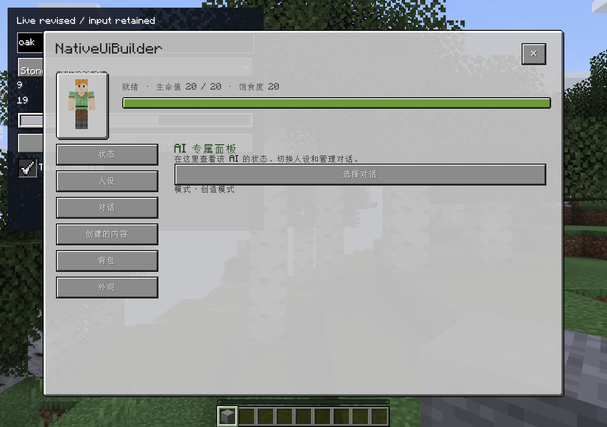
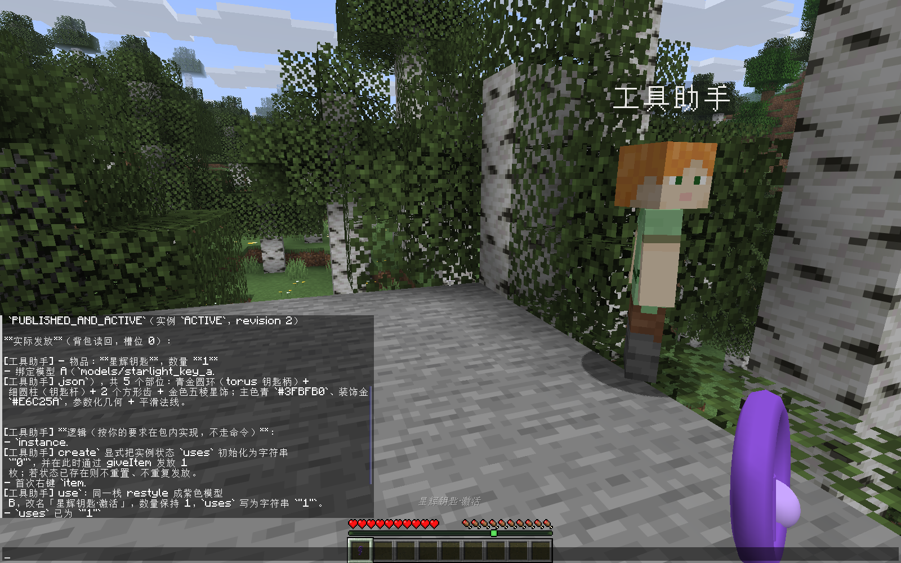
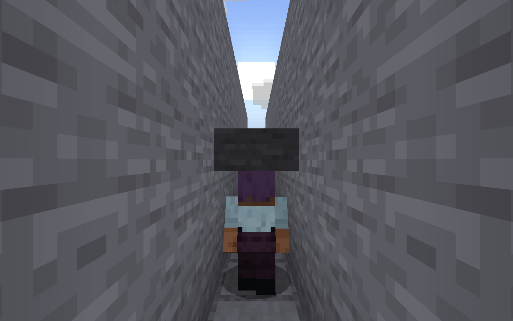
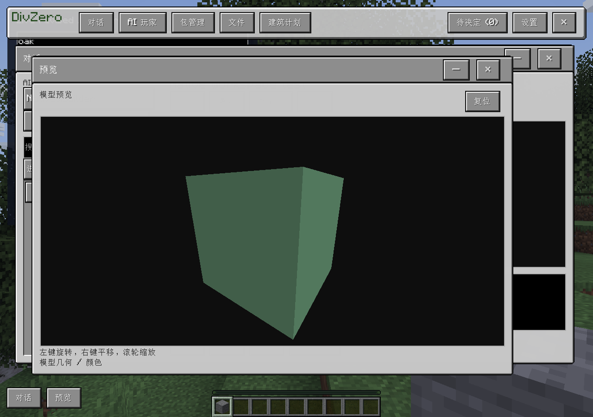
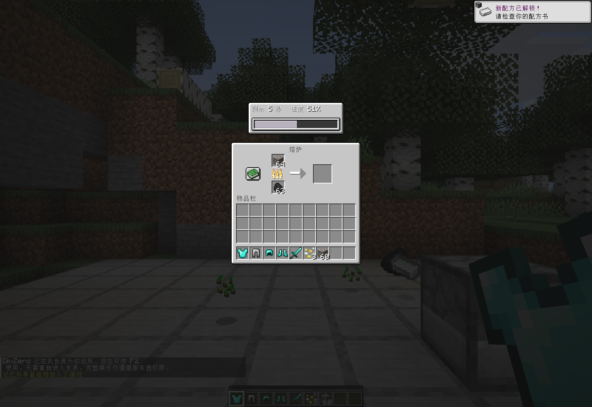

[简体中文](#chinese) · [English](#english)

# DivZero 全部功能与使用范围

[返回首页](../README.md) · [下载版本](https://github.com/gaoshanliuni/divzero/releases) · [安装说明](BUILD_JAR.md)

DivZero AI Runtime 是一个面向 Minecraft 的智能 AI 运行框架，通过自然语言、世界感知、长期记忆和动态创造，让 AI 角色真正参与游戏世界。

本文面向玩家，汇总当前公开 `main` 的功能，提供对话示例、命令及原生／F2 操作入口。**当前为开发测试版；具体 Provider、Mod、平台及组合的验证范围见本文。** Minecraft 26.1.2、NeoForge 26.1.2.106、Java 25；**源码 1.0.22 / 协议11**，最新 Release 为 1.0.21，客户端与服务端一起更新；旧版1.0.20为协议10。管理操作需要开启作弊／真实管理权限，首次在聊天中选择启用即可立即使用。

## 模型选择会显著影响效果

**最终效果很大程度取决于所选模型的能力。** 复杂建造、实体设计、多步骤规划与工具调用，不同模型的表现可能差异很大。追求更好的效果时，建议尝试 Claude、Grok、GPT 等系列中较新、能力更强的模型，并通过模组支持的兼容 API 接入；具体兼容性、费用与实际表现以所用服务为准。

本项目现有演示均使用价格更亲民的 **DeepSeek 4 Flash**（游戏内模型 ID：`deepseek-flash`）。演示效果不代表模组能力上限，换用更强模型通常更有利于完成复杂需求，但不保证每次生成都更好。

## 常用操作入口

| 操作 | 入口 |
|---|---|
| 启用当前世界 | 首次聊天中的“启用”；F2 → 设置 → 此世界启用设置可更改 |
| 创建 / 查看 AI | `/ai create "星河"`、`/ai list`；F2 → AI 玩家 |
| API URL、Key、模型 | F2 → 设置 → Provider；Key 使用本机保密输入 |
| 对话 / 默认 AI | 原生聊天 `@星河 …`；`/ai default`；F2 → 对话 |
| 思考显示 / 深度 | `/ai thinking see`、`/ai thinking deep`；F2 对话中按需展开 |
| 人设、会话、血量、背包与内容 | 右键该 AI，打开专属面板 |
| 删除 / 重命名对话 | `/ai chat delete`；F2 → 对话 → 更多 / 重命名 |

F2 与 Ctrl+M 打开同一 LDLib2 MC 工作区。右键 AI 的专属面板绑定被点击的 AI。保存 URL / Key 后可获取模型列表，也可输入自定义模型名；不要把 Key 发到聊天中。

## 1. 对话、模型与 AI 管理

| 功能 | 使用方式与现状 |
|---|---|
| 原生聊天 | `@AI名字` 选中 AI，Tab 自动补全；用自然语言提需求。 |
| F2 对话 | 持久对话记录、新建／切换会话、查看原文、归档／恢复与上下文详情；删除会取消该会话的在途请求和未发队列，后续建立新上下文。 |
| 流式回复 | 正文与 Provider 返回的思考分别原位流式更新，F2 保留完整历史。 |
| 打断与恢复 | 忙时默认排队，上一条结束后自动发送；可点“打断并发送”或“取消发送这条消息”。打断操作绑定对应请求。失败可“核对后继续”，先读真实状态，根据核对结果继续操作。 |
| 思考显示 | 原生显示 `[AI名字][思考]…`，`/ai thinking see` 切换原生显示，F2 对话记录保留完整内容；`/ai thinking deep` 选择深度。AI 也可调用设置能力；官方 DeepSeek 的实际深度参数已验证。 |
| Provider | DeepSeek、OpenAI 兼容 API、GLM 智谱／Z.AI、Ollama 等配置入口；GLM 凭据联验待完成。 |
| 模型选择 | 保存 Key／URL 后获取 `/v1/models`，列表选择；选择“使用自定义模型”才显示名称输入框。 |
| 本人默认响应 | `/ai default` 选择指定 AI，之后直接发送消息；`/ai default off` 关闭。按世界／当前玩家保存，作用域为当前玩家。 |
| 创建者响应权限 | 新 AI 默认只直接响应创建者；访客 @ 后向创建者显示“响应一次／始终允许／拒绝一次／始终拒绝”。F2 → AI 设置可选全部允许、全部拒绝或允许名单；游戏和电脑操作另有对应权限。 |
| 每 AI 模型 | 各 AI 可使用全局模型或单独指定当前兼容 API 的模型，配置按 AI 隔离，API URL 与 Key 共用。 |
| AI 数量与名字 | 支持持续创建；目录分页、名称分包补全，已有70名 Native 测试。硬件／区块资源仍有限。 |
| 长任务 | 对话支持持续工具调用；提供主动停止、Provider／传输边界及操作结果核对。 |
| 彩色互动消息 | 原生聊天和 F2 均支持确认选择、填入输入框和复制；选项保留原会话身份、到期与重复点击检查。 |

F2 → 设置 → Provider 管理 API URL、保密 Key 与模型。真实模型验收覆盖 DeepSeek；GLM 和 Ollama 按实际适配范围使用。

专属面板提供血量、背包、人设、会话与该 AI 创建内容。对话标题可由 AI 自动生成，玩家重命名后不会被自动覆盖。

### 多 AI 并行与请求隔离

不同 AI 并行、同一会话有序；每条请求独立取消和分发结果。已完成64实体、8个真实模型请求、16份同玩家几何计划的对应并发测试。数量是验收样本，不是上限；同一数据库短写事务等仍保序。

[查看多 AI 实景、复杂地形截图与验证范围](MULTI_AI_PARALLEL.md)。

## 2. 人设、长期记忆与外观

- **对话设置人设**：例如“以后你是星际向导”，保存后同轮后续和新对话读取最新人设。
- **事实／偏好记忆**：AI 自主读取、保存、更新、删除；同主题内容按最新信息更新，实时事实可设置过期时间。键自动生成，玩家选择主题即可。
- **内置／玩家皮肤**：18款内置人物与体型、复制玩家皮肤。
- **PNG 热换肤**：选择本地 PNG，或让 AI 生成、导出、修改标准 UV 像素画；64×64、64×32，wide/slim。保留同一 AI 身份、名字、跟随与任务。
- **YSM**：安装兼容 YSM 和模型后选择目录内外观，热切换无需重启；卸载 Mod 本身仍需重启。PNG/YSM 的具体组合按实际模型与版本验证。

“这里是我家”可结合发送时的位置存入事实记忆；“我喜欢钻石胸甲配铁裤子”可存入偏好，后续跨会话取用。具体自动记忆与装备取用实测见 [十项场景](NATIVE_TEN_SCENARIOS.md)。

## 3. 读取与修改现有世界

| 能力 | 说明 |
|---|---|
| 玩家信息 | 手持物、背包、装备、位置、视角、生命／饥饿／经验等当前信息，以及可读取的出生／死亡点、成就、可见实体。缺失字段按实际读取结果标注。 |
| Buff | 读取、给予、修改等级／时长、移除指定效果，保留其它效果。 |
| 原版／已注册物品 | 直接修改背包／手持物的名字、附魔和组件，或给予新的已注册物品，无需先丢到地上。 |
| 方块观察／找矿 | 最大4096³坐标范围，按游标分页并可扩大搜索；读取覆盖已加载区块。 |
| 原生交互 | AI 自己先靠近、拿出真实物品、调整视角再放置／破坏／使用；挖掘有挥手和裂纹。容器读取、整叠快捷移动、原生菜单开关、拉杆等保留；Mod 特殊菜单按适配范围使用。 |
| 独立交互规则 | 放置 `block_place`、破坏 `block_break`、使用 `block_use` 分开设置；实体使用／攻击也分别设置。支持钥匙、允许名单、回调创建／修改／移除，由原生事件执行回调。 |
| 指令与 GameRule | 使用玩家真实命令权限发现／执行游戏指令，例如死亡不掉落、PVP、计分板；沿用当前 OP 等级。 |
| 完整命令输出 | 保存并分页续读，首回执提供预览，其余内容可继续读取。 |

放置规则检查真正落点；门／床等多格放置任一落点被拒绝时，原生回滚整次放置和物品数量。使用锁与普通方块物品放置独立。规则覆盖 NeoForge 玩家交互事件；红石、漏斗及直接世界写入属于各自的游戏机制。

“帮我给手里的剑附魔”“只移除速度”“打开死亡不掉落并关闭PVP”都可以直接对话提出。

## 4. 建筑与几何建造

支持线、平面、墙／壳、非矩形拉伸、坡面、Bezier 曲线、双线性曲面、圆柱、椭球、圆顶，以及镜像、旋转、阵列／路径重复、材料规则、完整 BlockState 和局部替换。

单计划包围盒最大 **2048×2048×2048**，磁盘分页、分 Tick 操作。实际仍受世界高度／边界、已加载区块、权限、磁盘及写入前状态校验约束，满体积填充性能待专项验证。部分完成按实际回执继续处理。

刷石机已在真实 DeepSeek 建造流程后验证连续三次圆石再生；生存建造需要准备相应材料。

建筑计划以稳定构件 ID 组织地板、墙、屋顶等，支持模板、旋转、镜像与阵列，局部修改只执行差异。多边形墙支持厚度、内部孔洞和可选封顶/封底；空心结构不会隐式清空内部。步骤支持暂停、继续、冲突检查撤销/重做；实际方块验证绑定建筑、范围与版本，未验证不得报告建成。

## 5. 实时创造物品、模型与玩法

- 新物品／模型／规则由 AI 生成独立内容包。
- **13种参数化基础图形**：box、plane、disc、annulus、sphere、torus、cylinder、cone、frustum、prism、pyramid、ellipsoid、capsule；支持自由网格、平滑法线和几何验证。
- 可定义右键交互、改变同一物品模型／名字、蓄力释放、投掷、反弹、拾回、碰撞触发和计分。
- HOT 内容生成后自动启用；AI 可读内容包与实际实例状态。原生计分板支持持久去重记分。
- 篮球示例已实测蓄力投篮、偏投0分、两次命中2→4分、原件拾回。

上图是新钥匙真实发放及右键后修改同一栈的实测。图中保留测试原文；实际游玩可直接描述需求。

**边界**：基于通用热载体；FML Registry ID 注册遵循游戏加载流程。存量内容迁移与 Mod 专用拾取钩子按适配范围使用。

## 6. 实时创造生物并互动

支持**友好、中立、敌对**三类阵营，自定义几何外形、属性和多种组合行为：

| 交互方式 | 当前能力 |
|---|---|
| 村民式 | 右键打开原生交易窗口。 |
| 猪灵式 | 附近丢下物品，消耗输入并掉出交换结果。 |
| 靠近触发 | 消息、Buff、给物品、声音；可设带引信爆炸，离开范围可取消，默认不破坏方块。 |
| 僵尸式 | 敌对主动攻击，中立受击反击。 |
| 羊式 | 喂食、同物种繁殖。 |
| 马式 | 主人空手普通右键骑乘，实际控制移动。 |
| 狗式 | 跟随、停留、受令战斗、巡逻；可取消跟随。 |

生物定义可更新并持久保存，支持 idle／walk／random／hurt／attack／death／interact／ride 关键帧动画，以及平移、旋转、缩放。支持整体网格、父子刚性骨骼和局部部件动画；原生实体及局部模型替换按实际 Renderer 适配范围使用，不宣称任意模组都兼容。骑乘／交易／喂食冲突时按当前交互契约选择，详见技术范围。

## 7. AI 身体与玩家接管

- **AI自己的实体**：移动／局部寻路、转向、奔跑、潜行、选物品、丢物品、跟随、停止跟随、传送到玩家。
- **低净空通行**：按真实方块碰撞体与站立／潜行体型规划；门、栅栏门、半砖、地毯和台阶之外，也识别需要低头潜行的通道。进入前自动潜行，安全离开后恢复；更低空间会返回路线受阻。可通过对话持续开启或关闭潜行。
- **接管本人**：玩家明确提出后直接启动，无逐轮二次确认。持续观察和重新规划，左侧 HUD 显示公开决策摘要与下一路点。
- 玩家明确要求接管本人后，AI 使用原生客户端输入持续执行。进入托管释放鼠标；**T、F2、切换电脑窗口及最小化均不中断**。MC 面板提供“暂停 / 继续、退出、追加命令”，按钮松开时触发；聊天栏 / F2 的 Esc 只处理界面；**回到游戏画面后双击 Esc 结束托管**。退出恢复原失焦暂停设置，死亡、断线、世界或权限变化仍释放控制。
- **1.0.22（当前源码，尚未发行）**：托管观察相机按渲染帧平滑。原生 F5（含改绑）或面板视角按钮切换第一人称、第三人称背后/正面，保持 AI 实际瞄准、导航和动作不变。[实机结果](TAKEOVER_CAMERA.md)。
- 持续技能支持跟随、巡逻、警戒、漫步、原生战斗、农务和钓鱼；同一运行时使用 AI 身体与真人输入两个适配器。常规工作不逐株请求模型。
- 共享通行判定支持已加载区域的门、低通道、台阶、梯子与水域。

主工作、战斗方式和交战规则独立。可以说“继续种田，遇怪近战跑打，打完接着种”，或在 F2 / 右键 AI → 行为模式中只修改战斗规则。支持 AUTO、近战跑打、近战连击控距（combo / W-tap / S-tap）、远程控距、守住阵地、脱离交战；规则包含不攻击、自卫、保护对象、清理防区和指定目标。原生伤害、冷却、弹道和装备消耗保持生效。

[本地战斗验收与边界](TACTICAL_PLAYER_BEHAVIOR.md) · [实际技能、恢复与多人预约验收](PERSISTENT_PLAYER_SKILLS.md)

### 搭建可复用道路

直接说“从这里搭路到对岸，让我也能走”，AI 可使用原生搭路能力：

| 路线 | 实际做法 |
|---|---|
| 水平跨越 | 走到起点，逐块搭桥并沿新路前进。 |
| 有水平距离的高差 | 建连续台阶；坡度过陡时需分段规划。 |
| 原地向上 | 起跳、脚下放置、落地，再补可攀爬梯子；需要时补底部落脚平台。 |

方块和梯子保留在世界中，玩家和其他 AI 可复用。生存消耗 AI 背包材料，垂直还需梯子；停止或打断后保留已建部分，并回报完成进度。每轴最多2048格含端点，仅已加载区块；默认单格宽，清障与护栏可作为独立建造需求；复杂地形可分段规划。

截图来自本次隔离 Native 回归；零模型回归负责重现动作和拍摄，对话工具另有真实 DeepSeek 调用验证。实际玩家走桥、爬梯，第二 AI 复用台阶，生存材料消耗和停止保留均有对应回归。

## 8. 搜索、通用文件与建筑导入

- 搜索 MC 百科、建筑站点和公开网页，读取正文并引用来源；登录、验证码或读取失败会显示对应状态，并可转为用户上传。
- 建筑有公开直链时可下载；无法自动读取时，聊天按钮打开 F2 文件窗口，选择上传并“交给AI”后继续。
- F2 顶栏“文件”、对话“附件”：文件／文件夹、空文件／空目录、二进制、文件夹 ZIP 下载；AI 可读取、创建文件和提供下载按钮。文件按数据处理，执行操作使用对应确认流程。
- 文件传输只监听 `127.0.0.1:25510`，按 Owner／世界认证；面向本机传输。单份上传8GiB、自动直链下载64MiB，现阶段单人本机使用。

| 导入类型 | 范围 |
|---|---|
| Litematica `.litematic` | 多 region、负 Size、palette 与完整状态。 |
| Create／原版 `.nbt` | 结构蓝图，以结构数据处理。 |
| Sponge `.schem` | v1／v2／v3。 |
| `.schematic` | 原版数字ID映射；Mod 数字 ID 需相应适配。 |
| Java 世界／ZIP | Anvil 世界选区、建筑 ZIP 合集；按选区读取世界数据。 |

可选朝向、旋转和镜像。**默认保留内容**：源空气、BlockEntity／容器、选区实体及支持格式中的延迟 Tick，也可关闭。源文件保持原样，导入范围为所选建筑数据。

图中展示 177 方块的放置结果。内容保留另有箱子7钻石、命名实体及延迟 Tick 的实际回归。复杂乘客／拴绳／悬挂、Mod 跨坐标引用、超大 NBT 流式读取、Bedrock、LZ4／`.mcc` 等仍有边界；各格式按已实现字段读取。

## 9. LDLib2 工作区、预览与 AI 动态界面

- F2 / Ctrl+M 共用原生工作区，默认 MC 主题；内置功能不要求 KubeJS。窗口支持拖动、缩放、最小化与关闭，标题按钮为正方形，松开触发并有按下反馈。
- 右键 AI 打开专属面板。对话、模型、权限、文件、包管理、双语与预览统一迁移；MCEF 不再作为依赖或备用渲染。
- AI 通过 KubeJS 构建新的控件树、样式与交互；数据增量更新，结构验证成功再替换，失败保留旧界面和匹配输入。正常热更新无需退出世界、重启或全局 reload。
- LDLib2 HUD 支持独立 ID、标题、图标、分数、进度和任务状态，默认被动显示，需要点击时进入明确交互模式。
- AI 可自动打开实体、物品和建筑预览，也可发送聊天/F2按钮；原生场景可旋转、平移、缩放，现场建筑支持材质快照。
- 可附加熔炉时间、酿造台配方及预览按钮，创建桌面窗口和实体血条。LDLib2 宿主支持撤销样式；其它第三方菜单按附加控件与适配范围处理。

截图是已验收的游戏画面，商店示例只扣本地演示余额。完整边界见 [十项场景](NATIVE_TEN_SCENARIOS.md) 与 [迁移状态](NATIVE_UI_MIGRATION_STATUS.md)。

## 脚本与扩展

支持通过 **JavaScript** 和运行时内容包编写自定义交互、回调与 AI 行为。在对应权限与执行生命周期内使用模组开放的游戏 API 和对象；本机任务则使用 Java 管理的专用 Python，并逐次在原生聊天确认。

## 10. 内容包与高级运行生命周期

支持包版本查看、校验、复制、启用，以及资源／数据／客户端代码等专用流程：

- HOT：启用未激活定义，生成后可自动启用。
- 包版本：复制成独立包再启用，原包与实例保持独立。
- 资源包／数据包：真实下载、验签、重载与结果读回。
- WORLD_REOPEN：保存计划，正常重开后生效；界面标注待重开状态。
- BOOT／CLIENT 原生代码：保留专门安装／执行和每台本机的确认，分别校验服务端和本机权限。

高级运行能力通过 F2 原生包管理与设置入口使用。技术 revision/hash 在详情中提供，玩家通过选项操作。

## 11. 本机 Python、依赖安装与完整输出

Java直接管理固定校验的 `python-build-standalone install_only_stripped`、专用venv及Python／pip进程。AI可用Python完成本机任务、安装第三方库；使用项目专用的 Python 运行环境。

每次在**原生聊天**查看代码、确认或拒绝，运行后可停止。只对当前Windows x64单人本机Owner开放；使用本机用户权限执行。脚本具备该用户的文件系统访问权限，确认前请核对实际任务。

完整stdout/stderr保存并分页读取；超时／取消可能留下已发生的效果。未知结果先核对，再选择后续操作。实际DeepSeek已安装colorama、读取版本、启动隐藏子进程并保存结果。

## 12. 语音、媒体与适用范围

- **语音识别 ASR：最低优先级，暂缓实现。**
- TTS／媒体基础能力和可选多媒体构建保留，平台、播放源和服务组合按适配范围使用。
- 完整种子地图、任意 Mod 自动适配、全部存量内容迁移、多平台本机命令、联网服务器的本机文件协作等列入后续适配范围。

## 截图与验证范围

界面截图已更新为 LDLib2 实机验收画面，世界建造和生物截图保留对应历史场景；模型生成与 Native 动作分别保留验证记录，验证覆盖列出的具体场景。

多人创建者审批已用独立 ServerPlayer 身份验证，双真实客户端联验列入后续验证。事件队列 BACKPRESSURE 状态与测试断言的统一列入维护项。

## 许可证与免责声明

DivZero 使用 [Apache License 2.0](https://github.com/gaoshanliuni/divzero/blob/main/LICENSE) 开源许可。

**本项目不包含任何第三方 AI 服务密钥。** 玩家需要自行配置服务提供商、API URL、Key 和模型，并承担相关 AI 服务产生的费用。模型的可用性、能力与价格以对应服务提供商为准。

[截图说明与原图校验](images/README.md) · [源码与技术说明](SOURCE_SNAPSHOT.md)

---

# DivZero: Features and Supported Scope

[Home](../README.md#english) · [Downloads](https://github.com/gaoshanliuni/divzero/releases) · [Installation](BUILD_JAR.md)

DivZero AI Runtime is an intelligent AI framework for Minecraft. Natural language interaction, world awareness, persistent memory, and dynamic creation let AI characters actively participate in the game world.

This player-facing guide covers the current public `main`, with conversation examples, commands, and native/F2 entry points. **This is a development/test release; provider, mod, platform, and scenario coverage is described below.** Requirements: Minecraft 26.1.2, NeoForge 26.1.2.106, Java 25. **Source 1.0.22 / protocol 11**, with 1.0.21 as the latest published Release: update clients and servers together. The older 1.0.20 release uses protocol 10. Administrative actions require cheats or real administrator permissions. Click Enable in the first-entry chat prompt for immediate activation.

## Your model makes a major difference

**The final results depend heavily on the capabilities of your chosen model.** Complex construction, creature design, multi-step planning, and tool use can vary substantially between models. For better results, consider newer, more capable models from the Claude, Grok, or GPT families through an API compatible with the mod. Compatibility, pricing, and actual performance depend on the service you choose.

All existing project demos use the more budget-friendly **DeepSeek 4 Flash** (in-game model ID: `deepseek-flash`). They do not represent the mod's maximum potential. Stronger models can help with complex tasks, but do not guarantee a better result on every attempt.

## Common controls

| Action | Entry |
|---|---|
| Enable this world | Click Enable in the first-entry chat prompt; change it in F2 → Settings → World activation |
| Create / list AIs | `/ai create "Nova"`, `/ai list`; F2 → AI Players |
| API URL, key and model | F2 → Settings → Provider; keys use local confidential input |
| Chat / default AI | `@Nova …`, `/ai default`; F2 → Chat |
| Thinking display / depth | `/ai thinking see`, `/ai thinking deep`; expand thinking in F2 |
| Personality, conversations, health, inventory and creations | Right-click the relevant AI for its own panel |
| Delete / rename a conversation | `/ai chat delete`; F2 → Chat → More / Rename |

F2 and Ctrl+M open the same LDLib2 MC workspace. Right-clicking an AI opens a panel bound to that AI. Fetch models after saving the URL/key, or enter a custom model ID. Never post API keys in chat.

## 1. Conversations, models, and AI management

| Feature | How it works |
|---|---|
| Native chat | Mention `@AIName`, use Tab completion, and describe what you want in natural language. |
| F2 chat | Persistent history, new/switch conversations, original text, archive/restore, and context details. Deleting a conversation cancels its in-flight request and unsent queue, then starts fresh context. |
| Streaming replies | Native reply and provider-returned thinking messages update in place while streaming; F2 retains full history. |
| Interrupt and resume | New messages queue by default and send after the previous message finishes. Choose “Interrupt and Send” or cancel a queued message. Interrupts target the relevant operation. “Verify and Continue” checks actual state before deciding how to proceed after a failure. |
| Thinking display | Native chat shows `[AIName][Thinking]…`. Use `/ai thinking see` to toggle it and `/ai thinking deep` to choose depth. F2 keeps the full returned thinking text. The AI can also change these settings; official DeepSeek depth parameters have been verified. |
| Providers | Configuration entries for DeepSeek, OpenAI-compatible APIs, GLM via Zhipu/Z.AI, and Ollama. Live GLM credential testing is pending. |
| Model selection | Saving the URL/key enables fetching `/v1/models`. Select a returned model, or choose “Use Custom Model” to show a name field. |
| Personal default response | `/ai default` selects your responding AI; `/ai default off` disables it. Stored per world and current player, not globally for everyone. |
| Creator response permissions | New AIs respond directly only to their creator. Other players' mentions prompt allow once / always allow / deny once / always deny. F2 supports allow-all, deny-all, and allow lists. Game and computer actions have separate permissions. |
| Per-AI model | Each AI can inherit the global model or use its own model from the current compatible API. API URL and key are shared. |
| AI count and names | Continued creation, paginated directories, and chunked name completion. Native testing has covered 70 AIs; hardware and chunk resources remain finite. |
| Long tasks | Continued tool calls, active stopping, provider/transport boundaries, and verification of actual operation results. |
| Colored interactive messages | AIs can send colored messages with copy, fill-chat, and confirmation actions. |

F2 → Settings → Provider manages the API URL, confidential key and model. Live tests cover DeepSeek; GLM and Ollama depend on actual compatibility.

Right-click an AI for health, inventory, personality, conversations and its creations. AI-generated conversation titles respect player renaming.

### Parallel AIs and request isolation

Different AIs run concurrently while each conversation stays ordered, with per-request cancellation and independent result delivery. See the [native screenshots, 64-entity / eight-model-request / 16-plan samples, and scope](MULTI_AI_PARALLEL.md#english). These sample sizes are not product limits.

## 2. Personality, long-term memory, and appearance

- **Set personality through chat:** for example, “Be my space guide from now on.” Updated personality is read later in the same turn and in new conversations.
- **Facts and preferences:** the AI can read, save, update, and delete memories. Newer information replaces older information on the same topic, and time-sensitive facts can expire. Keys are generated automatically; players select topics.
- **Built-in / player skins:** 18 built-in character/body variants, plus copying player skins.
- **Hot-swappable PNG skins:** import a local PNG or ask the AI to generate, export, or edit standard-UV pixel art. Supports 64×64 and 64×32, wide/slim. The same AI identity, name, following state, and task are preserved.
- **YSM:** with a compatible YSM installation and model, select appearances from its model directory without restarting. Removing the mod itself still requires a restart. Specific PNG/YSM combinations depend on the actual versions and models.

The AI can remember “this place is my home” using the location captured when the message was sent, or recall a preferred equipment combination in later conversations. See [ten scenarios](NATIVE_TEN_SCENARIOS.md) for automatic memory and equipment tests.

## 3. Reading and modifying the existing world

| Capability | Details |
|---|---|
| Player information | Held items, inventory, equipment, position, view, health, hunger, experience, and available spawn/death points, advancements, and visible entities. Missing fields are reported according to what can actually be read. |
| Status effects | Read, apply, change level/duration, or remove a specific effect while preserving the others. |
| Vanilla / registered items | Edit names, enchantments, and components directly in the inventory or held stack, or give a new registered item. No need to drop it first. |
| Block observation / ore search | Coordinate regions up to 4096³, cursor-based paging, and expandable searches within loaded chunks. |
| Native interaction | The AI approaches, visibly holds the actual item, aims, then places/breaks/uses the block. Mining has arm swings and cracks. Container reads, full-stack transfers, native menu controls, levers, and similar actions are supported; specialized mod menus depend on adapters. |
| Separate interaction rules | Configure `block_place`, `block_break`, and `block_use` separately, plus entity use and attack. Supports keys, allow lists, and creating/updating/removing callbacks executed through native events. |
| Commands and game rules | Discover and execute game commands using the player's actual command permissions, including keep-inventory, PvP, and scoreboards. Existing OP levels are respected. |
| Full command output | Output is saved and paginated. The initial result is a preview; remaining output can be read afterward. |

Placement rules check the actual destination. If any position in a multi-block placement such as a door or bed is denied, the native operation and item count roll back together. Use locks and normal block placement are independent. Rules cover NeoForge player interaction events; redstone, hoppers, and direct world writes follow their own mechanisms.

Try “Enchant the sword in my hand,” “Remove only Speed,” or “Enable keep-inventory and disable PvP.”

A bounded bulldozer supports continuous clearing with protection checks and explicit start/stop. Image search can supply scoped block-texture overrides with restoration; vanilla stone was tested, not every third-party material or renderer.

## 4. Building and world geometry

Supports lines, planes, walls/shells, non-rectangular extrusion, ramps, Bezier curves, bilinear surfaces, cylinders, ellipsoids, and domes, plus mirroring, rotation, arrays/path repetition, material rules, full BlockState values, and local replacement.

A plan's bounding box may be up to **2048×2048×2048**, using disk paging and work spread across ticks. World height/borders, loaded chunks, permissions, disk space, and pre-write state checks still apply. Filling the entire maximum volume has not been performance-tested. Partial completion is handled using actual execution results.

A cobblestone generator built through the live DeepSeek workflow was verified to regenerate cobblestone three times. Survival construction requires the corresponding materials.

Building plans use stable component IDs for floors, walls and roofs, with templates, rotation, mirroring and arrays. Local edits apply differences; hollow walls do not implicitly clear interiors. Pause/resume and conflict-aware undo/redo preserve steps. Actual block checks bind completion to the building, scope and version.

## 5. Creating items, models, and gameplay at runtime

- The AI generates separate content packages for new items, models, and rules.
- **13 parametric primitives:** box, plane, disc, annulus, sphere, torus, cylinder, cone, frustum, prism, pyramid, ellipsoid, and capsule, plus free-form meshes, smooth normals, and geometry validation.
- Define right-click behavior, restyle/rename the same item, charge and release, throw, bounce, recover items, trigger collisions, and award points.
- Generated HOT content is enabled automatically. The AI can inspect packages and actual instance state. Native scoreboard scoring supports persistent deduplication.
- The basketball scenario covers charged throws, zero points for a miss, two hits scoring 2 → 4, and recovery of the original ball.

This screenshot shows the item being given and the same stack changing after a right-click. It retains the original test text; in normal play, just describe what you want.

**Scope:** runtime items use a generic hot-loadable carrier. FML Registry ID registration still follows the game's loading lifecycle. Migration of existing content and mod-specific pickup hooks depend on adapters.

## 6. Creating and interacting with creatures

Choose **friendly, neutral, or hostile** creatures with custom geometry, attributes, and combinations of behaviors:

| Interaction style | Capability |
|---|---|
| Villager-like | Right-click opens a native trade window. |
| Piglin-like | Drop items nearby; inputs are consumed and exchange results are dropped. |
| Proximity trigger | Messages, effects, items, and sounds; optional fuse-based explosions that can cancel when the player moves away. Block destruction is off by default. |
| Zombie-like | Hostile creatures attack proactively; neutral creatures retaliate when hit. |
| Sheep-like | Feeding and same-species breeding. |
| Horse-like | The owner mounts with a normal empty-handed right-click and can control movement. |
| Dog-like | Follow, stay, commanded combat, and patrol; following can be canceled. |

Creature definitions can be updated and persisted. Keyframe animations include idle, walk, random, hurt, attack, death, interact, and ride, with translation, rotation, and scale. Whole-mesh, hierarchical rigid-bone and part animations are supported. Native entities and local model replacements depend on the actual renderer adapter; this does not imply universal mod compatibility. Overlapping riding/trading/feeding behavior follows the current interaction contract.

## 7. AI movement and player takeover

- **The AI's own entity:** movement/local pathfinding, turning, sprinting, sneaking, selecting/dropping items, following/stopping, and teleporting to the player.
- **Low-clearance navigation:** planning uses actual block collision shapes and standing/crouching dimensions. In addition to doors, fence gates, slabs, carpets, and stairs, it recognizes passages requiring crouching. The AI crouches before entering and stands up when safe; lower spaces return a blocked route. Chat can enable or disable persistent sneaking.
- **Take over your player:** starts when you explicitly request it, without reconfirming every planning round. The AI observes and replans continuously. A left-side HUD shows a public action summary and the next waypoint.
- Explicitly requested player takeover uses native client input and releases the mouse cursor. **T, F2, switching windows and minimizing do not interrupt it.** The MC panel provides Pause/Continue, Exit and Add command, triggered on release. **Double-tap Esc in the game surface to exit; Esc in chat/F2 only handles the open UI.** Exiting restores your original focus-pause setting; death, disconnects, world and permission changes still release control.
- **1.0.22 (current source, not yet released)** interpolates the observation camera per render frame. Vanilla F5, including remapped bindings, and the panel cycle first person, third-person back and front without changing AI aim, navigation or actions. [In-game results](TAKEOVER_CAMERA.md).
- Persistent follow, patrol, guard, wander, combat, farming and fishing share one runtime with separate AI-body and real-player input adapters. Routine work runs locally.
- Shared traversal handles doors, low passages, steps, ladders and water in loaded areas.

Work, combat style and engagement rules are independent. Use “keep farming, kite monsters in melee, then continue farming”, or change combat rules in F2 / the AI profile → Behavior. Tactics include auto, melee hit-and-run, combo spacing with native sprint resets, ranged kiting, holding position and disengaging; native cooldowns, damage, projectiles and inventory costs still apply.

[Local tactics tests and limits](TACTICAL_PLAYER_BEHAVIOR.md) · [Skill, recovery and reservation tests](PERSISTENT_PLAYER_SKILLS.md)

### Build reusable routes

Say “Build a route from here to the other side that I can use too” to invoke native path construction:

| Route | Behavior |
|---|---|
| Horizontal crossing | Walk to the start, place bridge blocks one by one, and move along the new route. |
| Height changes with horizontal distance | Build continuous steps; steep slopes may need multiple segments. |
| Straight upward | Jump, place beneath the AI, land, and add climbable ladders, with a bottom landing platform if needed. |

Blocks and ladders remain in the world for players and other AIs. Survival consumes the AI's inventory materials; vertical routes also require ladders. Stopping or interrupting preserves built sections and reports progress. Each axis supports up to 2048 blocks including endpoints, in loaded chunks only. Routes are one block wide by default; clearing obstacles or adding railings can be separate requests. Complex terrain may need segmented plans.

These images come from isolated native regression runs. Zero-model replays reproduce actions and capture screenshots; separate live DeepSeek calls verify conversational tool use. Player bridge traversal, ladder climbing, step reuse by a second AI, survival material consumption, and preserving partially built routes have corresponding checks.

## 8. Web search, general files, and building imports

- Search MC encyclopedias, building sites, and public webpages, read their text, and cite sources. Login requirements, CAPTCHAs, or read failures are reported, with manual upload as a fallback.
- Download buildings with public direct links. If automatic access fails, a chat button opens F2 Files; upload/select a file and hand it to the AI to continue.
- F2 Files and Chat Attachments support files/folders, empty files/directories, binary files, and folder ZIP downloads. The AI can read/create files and provide download buttons. Files are treated as data; execution requires the corresponding confirmation.
- Transfers listen only on `127.0.0.1:25510`, authenticated by owner/world, for local use. Uploads support up to 8 GiB per file; automatic direct downloads up to 64 MiB. Currently intended for local single-player use.

| Import format | Support |
|---|---|
| Litematica `.litematic` | Multiple regions, negative sizes, palettes, and full block states. |
| Create / vanilla `.nbt` | Structure blueprints processed as structure data. |
| Sponge `.schem` | Versions 1, 2, and 3. |
| `.schematic` | Vanilla numeric ID mapping; mod numeric IDs need corresponding adapters. |
| Java worlds / ZIP | Anvil world selections and building ZIP collections, read within the selected area. |

Choose facing direction, rotation, and mirroring. **Preserve contents is the default:** source air, block entities/containers, selected entities, and scheduled ticks from supported formats. Preservation can be disabled. Source files are not modified; only selected building data is imported.

This image shows placement of 177 blocks. Separate preservation checks cover a container holding seven diamonds, a named entity, and scheduled ticks. Complex passengers/leashes/hanging entities, mod-specific cross-coordinate references, streaming very large NBT, Bedrock, LZ4, and `.mcc` still have limitations. Each format is read according to its implemented fields.

## 9. LDLib2 workspace, previews and AI-created interfaces

- F2 / Ctrl+M share the native MC-themed workspace; built-in features do not require KubeJS. Windows support dragging, resizing, minimizing and closing. Square title buttons trigger on release with pressed feedback.
- Right-click an AI for its dedicated panel. Chat, models, permissions, files, packages, languages and previews use the same UI system, without a browser renderer fallback.
- AI-created KubeJS widget trees, styles and interactions update live. Data changes are incremental; structural candidates replace the old view only after validation. Failed updates preserve the view and matching input, without routine world restarts or global reloads.
- LDLib2 HUDs have independent IDs and can combine titles, icons, scores, progress and task state. They are passive unless explicitly put into interaction mode.
- The AI can open entity/item/building previews or send chat/F2 buttons. Native scenes support rotation, panning and zoom; world snapshots include building textures.
- Attach furnace timing or brewing recipes with preview buttons, create desktop windows and entity health panels. Reversible restyling supports LDLib2 hosts; other mod screens depend on attachment/adapter support.

These are actual tested game captures. The shop example changes only a local demonstration balance. See [ten scenarios](NATIVE_TEN_SCENARIOS.md) and [migration status](NATIVE_UI_MIGRATION_STATUS.md) for scope.

## Scripts and extensions

Use **JavaScript** and runtime content packages to define custom interactions, callbacks, and AI behavior. Access the game's exposed APIs and objects within the relevant permissions and execution lifecycle. Local computer tasks use a dedicated Python runtime managed by Java, with per-request confirmation in native chat.

## 10. Content packages and advanced lifecycles

View, validate, copy, and enable package versions, with dedicated resource/data/client-code workflows:

- **HOT:** enable inactive definitions; generated content can enable automatically.
- **Package versions:** copy to an independent package before enabling; original packages and instances stay independent.
- **Resource/data packs:** actual downloads, signature checks, reloads, and result readback.
- **WORLD_REOPEN:** save a plan for the next normal world reopening; the UI marks it as pending.
- **BOOT/CLIENT native code:** dedicated installation/execution and per-machine confirmation remain in place, with separate server and local permission checks.

Advanced runtime capabilities are available through native F2 package management and settings. Technical revision/hash values are in the details; normal player actions use selectable options.

## 11. Local Python, dependency installation, and full output

Java directly manages a checksum-pinned `python-build-standalone install_only_stripped` distribution, a dedicated virtual environment, and Python/pip processes. The AI can perform local Python tasks and install third-party libraries in that dedicated environment.

Review the code and **approve or reject each request in native chat**; running tasks can be stopped. Currently available only to the local owner in Windows x64 single-player, using the local user's permissions. Scripts have that user's filesystem access, so check what the task will do before approving.

Complete stdout/stderr is saved and paginated. Timeouts or cancellations may leave effects that already occurred; uncertain outcomes are checked before continuing. Live DeepSeek tests have installed colorama, read its version, launched a hidden child process, and saved results.

## 12. Voice, media, and broader scope

- **Speech recognition (ASR): lowest priority; implementation is deferred.**
- TTS/media foundations and optional media builds remain available; platforms, sources, and service combinations depend on adapters.
- Full seed-based maps, arbitrary mod adaptation, migration of all existing content, multi-platform local commands, and multiplayer local-file collaboration remain future adaptation areas.

## Screenshots and verification scope

UI screenshots now show tested LDLib2 game captures; world construction and creature images retain their historical scenario context. Model generation and native actions have separate records covering the specific listed scenarios.

Creator approval was checked using separate ServerPlayer identities. Testing with two real clients remains pending. Aligning event-queue BACKPRESSURE states and test assertions remains a maintenance item.

## License and Disclaimer

DivZero is open source under the [Apache License 2.0](https://github.com/gaoshanliuni/divzero/blob/main/LICENSE).

**No third-party AI service keys are included.** Configure your own provider, API URL, key, and model. You are responsible for any charges from your chosen AI service. Model availability, capabilities, and pricing are determined by the provider.

[Screenshot notes and original checksums](images/README.md) · [Source and technical notes](SOURCE_SNAPSHOT.md)
