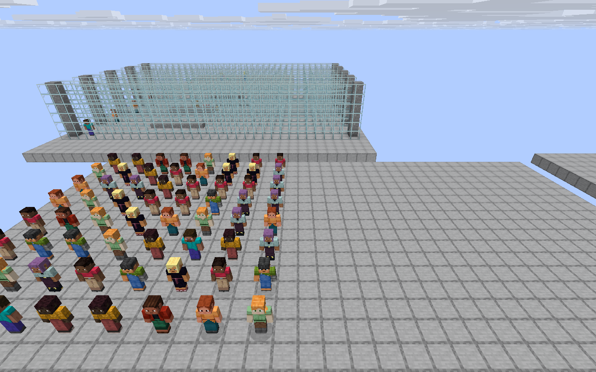
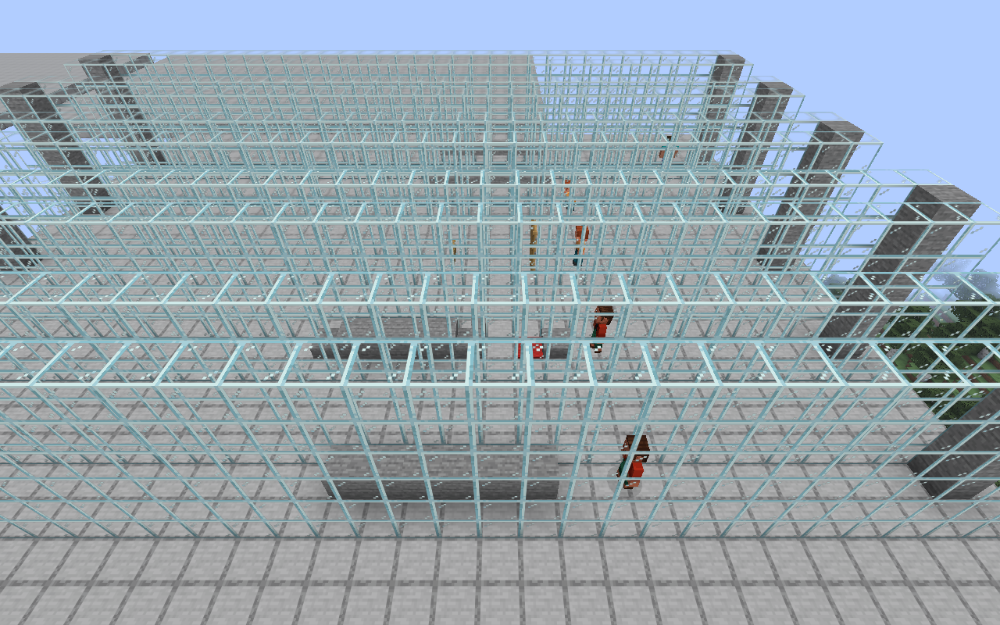

[简体中文](#chinese) · [English](#english)

# 多 AI 并行与复杂地形实景

[返回首页](../README.md) · [全部功能](FEATURES.md) · [下载版本](https://github.com/gaoshanliuni/divzero/releases)

## 多个 AI 同时行动，各自处理任务

DivZero 支持**不同 AI 并行、同一会话有序**：多个 AI 可以同时移动、处理各自的对话和执行独立任务，不必等另一个 AI 的整轮任务结束。同一会话的后续消息默认排队，避免上下文和结果错乱；取消操作绑定指定请求，不会停止其他 AI。

上图来自 **64 个 AI 实体同场**的 Native 测试。实体并行与模型 API 并发分别验证，不能把“64 个实体”理解成“64 个模型请求同时运行”。

| 已验证的场景 | 实际结果 |
|---|---|
| 64 个 AI 同时移动 | 取消其中 1 个，其余 63 个抵达目标；客户端同时观察到 64 个 AI。 |
| 多 AI 分别放置方块 | 修复后 63 次放置全部成功，方块、操作回执与持久化变更日志均为 63/63。 |
| 同一玩家的多个建造任务 | 16 份独立几何计划并行生成并应用，共放置 128 个金块。 |
| 真实模型请求并发 | 官方 `deepseek-flash` 的 8 个请求时间区间重叠；取消 1 个，其余 7 个会话完成，结果没有串到其他 AI。 |
| 同一会话排队 | 第一条处理完成后再处理第二条，顺序与结果归属正确。 |

可以分别给多个已创建的 AI 分配工作，例如 `@星河 去门口等我`、`@小木 跟着我`，再继续与其中一个聊天。它们仍遵循各自的权限、世界状态和操作生命周期。

## 多 AI 分别通过复杂地形

上图的并行走廊用于分别检查真实碰撞形状与姿态，不是让 AI 直接穿过方块：

- **普通高低差**：上下台阶时不无故潜行。
- **半砖、楼梯、地毯**：按实际脚底高度通行。
- **门和栅栏门**：靠近并执行原生开门交互后通过。
- **1.5 格低净空**：站立无法通过时自动潜行，离开后恢复站立。
- **更低、无法通过的通道**：报告无法到达，不穿墙。

四类可通场景均完成往返；低净空通道往返各记录 111 个潜行 Tick。每个 AI 独立寻路，互不共用一条固定路线。

## 验证范围

两张图片为用户提供的原始 Minecraft 截图，未修改画面。画面来自 1.0.6 隔离 Native 场景；其中发现的并发日志问题在 **1.0.7** 修复，并以新世界、新操作复验，未重放已经落地的旧操作。实体移动、地形及批量放置使用确定性 Native 动作测试；模型并发、身体读取、回复、取消和排队另有真实 DeepSeek 测试，不用本地 mock 代替。

**64 / 8 / 16 是本轮测试样本，不是功能数量上限。** 独立任务不设人工固定并发上限，但同一数据库的短写事务、同一会话和同一本机 Python 环境仍按一致性要求保序。硬件、区块和 Provider 资源有限；本机测试出现约 188 ms 的瞬时 Tick 峰值，不承诺任意规模都稳定 20 TPS。详见[源码与技术说明](SOURCE_SNAPSHOT.md#native-acceptance-closure--107)。

---

# Parallel AIs and complex terrain in game

[Home](../README.md#english) · [All features](FEATURES.md#english) · [Downloads](https://github.com/gaoshanliuni/divzero/releases)

## Different AIs run concurrently; each conversation stays ordered

Multiple AIs can move, handle their own conversations, and execute independent tasks at the same time. Follow-up messages in one conversation queue by default. Cancelling one request does not stop the other AIs or mix their results.

This scene contains **64 AI entities**. Entity concurrency and model API concurrency were tested separately: it does not imply 64 simultaneous model requests.

| Verified sample | Result |
|---|---|
| 64 moving AI entities | One navigation was cancelled; the other 63 arrived. The client observed all 64 entities simultaneously. |
| Independent block placement | After the fix, 63/63 blocks, successful receipts, and durable world-change records matched. |
| Multiple plans owned by one player | 16 distinct geometry plans were produced concurrently and applied, placing 128 gold blocks. |
| Real model concurrency | Eight official `deepseek-flash` request intervals overlapped. One was cancelled; the other seven conversations completed without cross-AI result routing. |
| Ordered follow-up | The second message in the same conversation ran after the first. |

## Independent routes across complex terrain

The corridors test ordinary height changes without unnecessary crouching; slabs, stairs and carpets at their actual floor heights; native opening of doors and fence gates; crouching through 1.5-block clearance; and rejecting lower, impassable passages rather than clipping through blocks. All four traversable cases completed both directions. The low passage recorded 111 crouching ticks in each direction.

## Scope of verification

These are the user's original, unedited Minecraft screenshots from the isolated 1.0.6 Native run. The concurrent journal defect found in that run was fixed in **1.0.7** and rechecked using a new world and new operations, without replaying old mutations. Deterministic Native actions exercise entity movement, terrain, and bulk placement; separate real DeepSeek calls verify model concurrency, body reads, responses, cancellation, and queue ordering.

**64 / 8 / 16 are test sample sizes, not product limits.** Independent tasks have no fixed application concurrency cap, while short writes to one database, messages in one conversation, and operations in one local Python environment preserve consistency. Hardware and Provider resources are finite: the test observed a transient server-tick peak around 188 ms, not a stable-20-TPS guarantee at arbitrary scale. See the [technical notes](SOURCE_SNAPSHOT.md#native-acceptance-closure--107).
