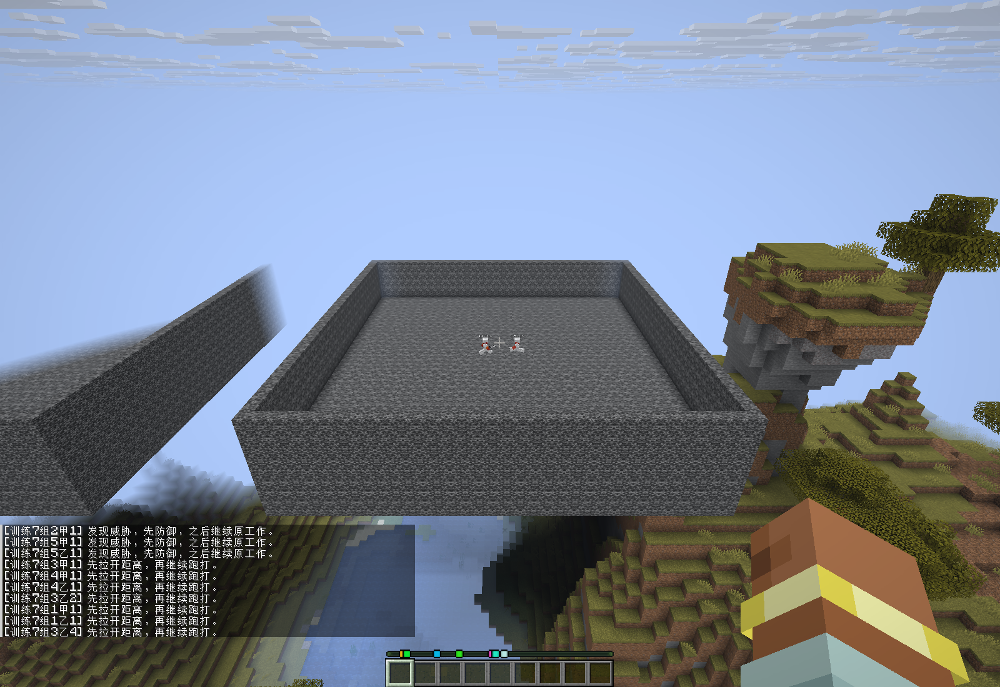

# 神经网络自对战与多技能反应

2026-10-01 续批：训练对手改为神经网络，旧规则控制器仅保留历史诊断入口。空地场景按玩家确认使用正常跳跃、高台跃下和下落攻击，不赋予参战角色创造飞行。

## 场地与参战身份

- 在隔离世界预先生成全部场地区块及邻近区块，再清理场地完整上空；保留明确设计的高台、台阶和土坑。
- 开战前检查每个身体的实际维度、坐标、碰撞与脚下支撑。两边技能准备完毕后才统一开战。
- 训练角色战败后不执行普通 AI 的 20 Tick 自动复活，避免出现在世界出生点。击倒后仍观察 80 Tick，随后移除本场测试角色。
- 下一轮清理掉落物、旧投掷物及其他非玩家残留实体。战斗中不把参战角色传送回场；越界或身体被替换会使该批次失败。
- 队伍交战授权仅存在于显式启用的隔离测试进程，绑定主人、身体引用、场地和队伍；不为正常玩家创建额外 PvP 授权。
- 多人队伍使用原生计分板队伍关闭友伤，并在开战前检查同组 `canHarmPlayer`。早期只做目标权限分组的多人记录没有证明横扫友伤隔离，后续重训会排除这些多人记录并重新采样。

场内完整上空已清理，参战身体按实际坐标校验；外围原始地形位于对战范围之外。观察相机悬停在场外，参战角色使用生存模式。

## 对战与模型

每批两轮，每轮五组同时进行，交换条件，单批共用十分钟期限。单轮最多三分钟；超时、双杀和无效场地分别记录，不能计为胜利。训练数据收集通过不等于每个模式都获胜。

| 场景 | 第一方向 | 交换方向 |
| --- | --- | --- |
| 近战 | 神经权重 A 对 B | 相同装备再次对战 |
| 武器差异 | 近战主武器对弓 | 弓对近战主武器 |
| 人数差异 | 1v3 或 1v5 | 3v1 或 5v1 |
| 空地差异 | 正常起跳、高台开局对地面 | 地面对高台开局 |
| 受困差异 | 土坑内对自由行动 | 自由行动对土坑内 |

双方使用当前 Java 执行器及各自神经权重，Boost 关闭，保留真实装备、消耗、攻击冷却和伤害。远程角色也携带普通脱困工具；具体使用的动作以原生回执为准。

`scripts/local-policy/model_pool.py` 校验模型形状、有限数值、文件 SHA-256 和数值权重差异。仅改标签或版本号不能冒充不同权重。训练时开启学习，独立评测冻结权重。

`finetune.py` 默认尝试 8,000 次迭代，保留验证效果最好的候选，不要求最后一次更新一定被采用。按整场对局划分训练与留出集，同场双方不能分到两边；继续训练时保留此前留出对局，已训练过的旧对局不能重新包装成独立留出集。验证损失和基准偏移通过后才生成候选，实际对战验证仍是单独步骤。

## 已完成的实际批次

| 批次 | 控制器与权重 | 数据与结果 |
| --- | --- | --- |
| `ba8ac44c` | 两边均为神经网络；原生实战微调 v2 对合成预训练 v1 | 完整十场、24 份角色轨迹、810 条样本；无超时。暴露近战等待寻路、空地和受困差异，保留全部胜负。 |
| `86abc142` | 第一代自对战候选 v3 对原生 v2 | 完整十场，包含 1v5／5v1；28 份轨迹、254 条样本。加入短步接近后近战可实际命中弓手；人数劣势仍有失利。 |
| `b7d17b21` | 第二代自对战候选 v4 对 v3 | 完整十场、169 条样本、无超时；进行了 6,334 次身体身份核对，未发生战败后身体替换。 |
| `6de4c281` | v3 对 v4，使用原生队伍友伤隔离 | 完整十场；包含 1v5／5v1、正确站位、稳定身体身份和原生队伍检查。 |

上述短对局尚未触发成功的局内权重更新（每个角色样本未满足相应训练／验证条件）；离线训练确实使用了保存的原生轨迹，不能把数据收集与权重更新混为一谈。

- 第一代自对战候选：8,000 次迭代尝试，保留第 7,800 次的权重；留出误差 `0.013414 → 0.012319`，基准偏移 `0.000337`，模型 SHA-256 `64bd50d5ea44ff57c399f273e3818e95d43054418bdbf8d609948f0da23e4c61`。
- 合并二十场继续训练：保留原有留出集，共 52 份角色轨迹、277 条留出样本；8,000 次尝试中第 80 次最好，误差 `0.013896 → 0.013806`。候选 SHA-256 `891a6f3a877026d44dd299fd92749066e4a8f3dc2253845a9d2bb99670328cbd`。尚未因此直接替换内置默认模型。
- 一次仅继续拟合旧历史数据的 8,000 次尝试没有通过改善检查，已拒绝，未发布为新权重。

四批共四十场采样完成后，排除六场早期未验证原生友伤隔离的多人记录，用 **34 场、75 份非空角色轨迹** 从原有默认权重重新训练。原始有效样本 1,248 条，其中 128 条来自完整留出对局；训练部分水平旋转增强后为 4,480 条。12,000 次迭代尝试中第 10,560 次最好，留出误差 `0.039300 → 0.032314`，基准偏移 `0.000320`。候选 SHA-256 为 `cc79992cc7d1e860bc92bf3e450761ab2dd6e5ca5d3c5aa806a072ed387e497d`。

## 冻结评测与默认模型决定

候选与已有默认神经模型进行独立冻结评测，逐个核对结束权重与输入模型相同、训练样本数为 0。

| 场景 | 候选胜场 / 场次（源码 `12929730`） |
| --- | --- |
| 相同近战装备 | 2 / 4 |
| 近战／远程双向 | 2 / 4 |
| 空地双向 | 2 / 4 |
| 1vN／Nv1 | 2 / 4 |
| 受困／自由双向 | 1 / 4 |

完整两批 `784a1f9f`、`094ce612` 合计 **9 / 20**，没有超时，尚未证明候选优于现有神经模型。保留现有默认 v2 权重，候选保持实验状态；不会用损失下降冒称战斗胜率提升。

随后从失利数据定位到近身逃离等待广域搜索的问题，加入经过碰撞、边缘与后续空间检查的短程疾跑出口。源码 `552f70a8` 的独立十场 `9ede03aa` 中候选 **5 / 10**；这是不同执行器版本，不能和前二十场拼成单一胜率。两名处于 1v5 劣势的角色记录到 28／38 Tick 实际疾跑、约 4–5 格逃离距离，仍然战败；不声称已经能普遍击败五名同装备神经对手。

## 施法与快速反应

唤魔者适配读取正在运行的原生目标逻辑，包括原始蓄势计数、目标更新节奏、下一次施法时刻及施法剩余时间。释放前的方向仍可能随目标变化，因此标为预测；已释放尖牙则按实际实体包围盒及攻击倒计时处理，施法者死亡不会清除这些威胁。

恼鬼读取实际冲锋状态和接触攻击包围盒，运动预测保留其原生无重力与穿墙能力。玩家对手增加服务端实际朝向、视线方向与速度；朝向只形成一个可能的转向分支，不取代已观测动量，也不声称知道下一次按键。

- AI 本体唤魔者验证 `a59819c3` 通过：观察 32 个尖牙、3 个恼鬼及重叠威胁；32 个释放样本的计时误差为 0 Tick，AI 最终生命值 `19.95 / 20`。
- 首次唤魔者测试 `53316cf2` 使用超出现有上限的感知半径，技能请求被拒绝。已修正测试输入，并在工具契约中返回 `combat.awareness` 的明确范围。
- 真人托管尝试 `d30ff340` 无效：测试分支跳过客户端初始化，真人技能被取消，原有 AI 介入战斗。记录保留为失败；已修正初始化顺序并增加实际参战身份、命中和原生击杀归属检查，需重新验证。
- 真人托管重验 `8c94f7fc` 通过：实际被托管玩家完成命中及原生击杀，最终生命值 `19.95 / 20`；96 个尖牙释放样本计时误差为 0 Tick，覆盖尖牙与恼鬼同时推进。独立 AI 未作为战斗参与者。

近战短距离接近不再等待整个区域搜索完成；每一步仍检查地形、悬崖、范围和未来攻击风险。已释放投掷物逐 Tick 更新；蓄好远程武器的弹道检查优先于可延后的退路计算。多人邻近威胁统计也纳入获准交战的玩家实体。

## 当前边界

四批采样、三批冻结评测及真人托管施法验证已完成。弓、弩、三叉戟、雪球、鸡蛋和喷溅药水的真实发射／效果在 AI 本体（`ec5f6d17`）与真人托管（`5ce2786f`）分别回归通过；短程撤离后的真人近身逃离（`2fc75af6`）及平台多人走位（`fefd8702`）也已通过。当前结果不能表述为所有人数劣势、装备、模组生物或真人 PvP 都能取胜。旧规则十场十胜是此前历史基线，不是神经网络自对战的胜率。

最新执行代码通过 Actions `36763519742`，公开源码 `552f70a8`，主模组 SHA-256 `cc562625294ed7505cde772523ab7ccc264c26afe2f2984cae65f5b23707b226`。默认权重保持原有 `21b32e84…`，局内学习仍默认开启并保留手动关闭偏好。

该最终代码的唤魔者多技能回归也分别通过：AI 本体 `2587cb5e`、玩家身体接管 `b4b3b747`，均检查实际参战身份与击杀归属。安装附件为 `DivZero-1.0.23-neural-selfplay-20261001.zip`，SHA-256 `328299e399a8a242a50e6c6f2ed7f9083189920b0ed0c22e24c3eb839e31b553`，包含 DivZero 与 LDLib2／KubeJS／工具提示依赖。实验权重与两种执行器版本的评测结果单独放在研究附件，不自动加载为默认权重。

全部新测试使用隔离世界和公开 Actions 编译产物，付费语言模型调用为 0；生产存档、配置和 Mod 安装未修改，也未自动创建 Release。

## 2026-10-01 通用并发攻击时间线（实施中）

将唤魔者獠牙改为通用攻击时间线的一个数据来源。释放后的飞行物、地面打击、持续药水区域、爆炸/咆哮与锁定目标的光束拥有独立攻击 ID、原始来源、命中区域和未来 Tick。多个来源及同一来源的多个攻击同时保留；来源死亡不清除仍存在的攻击实体。特殊 Mod 可通过 `NativeAttackTimeline.Adapter` 提供实际区域和时间，未知运动明确标记为估计。

闪避按角色真实包围盒与攻击扫掠路径做连续相对碰撞计算，核对整段路线和到达后停留；普通实体导航仍检查平台、落差和后续出口。锁定光束必须断开视线，横移到旧光束之外不算躲过。AI 本体与真人托管共用本地循环；攻击是否可执行仍由原 PvP/权限规则决定。玩家双手远程/动能武器独立读取，原生攻击蓄力只代表伤害恢复，不能当作禁止提前挥击。

本增量待 GitHub Actions 编译及隔离原生 `multi_attack` 联验。新的候选代码不等于全部攻击已适配；未来输入、Mod 私有伤害判定和未知弹道不会被宣称为可精确读取。无全知闪避、无额外无敌帧或移动速度。
