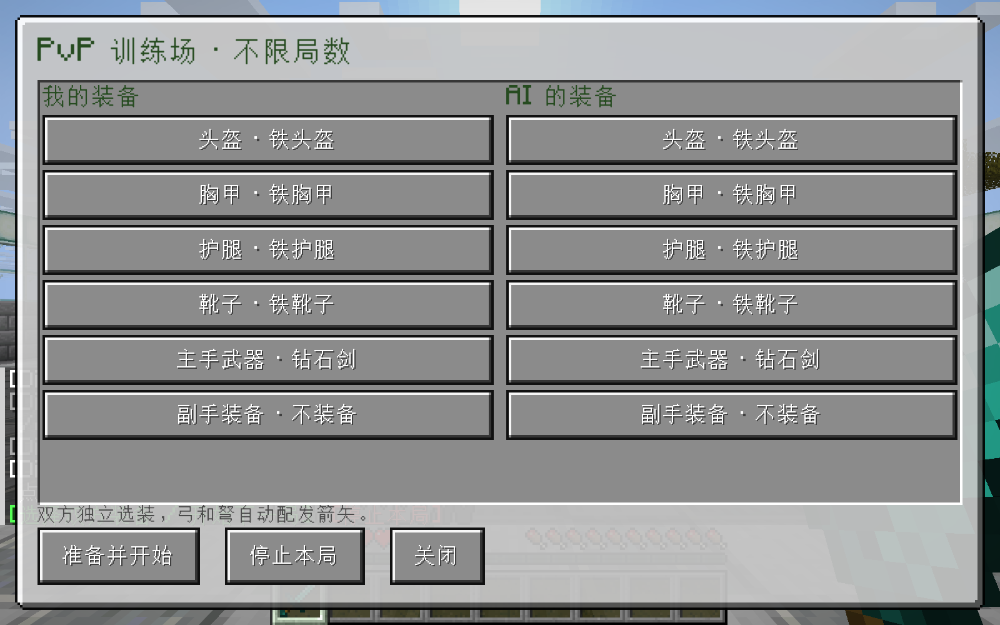

# PvP 训练地图

这是使用 DivZero 本地神经网络战斗控制器的单人训练地图，依赖对应版本的 DivZero 和 LDLib2。玩家自行操作身体，AI 使用真实装备、攻击冷却、碰撞及伤害；默认不启用 Boost。

## 游玩

进入地图后打开 MC 主题的装备面板。左右两栏分别设置玩家和 AI 的头盔、胸甲、护腿、靴子、主手及副手；每个部位可以独立选择或留空。物品选择使用带图标的滚动列表。弓和弩自动获得 256 支箭，按原版消耗。点击「准备并开始」，五秒倒计时后交战。

不限局数，每局仍最多三分钟。一方死亡立即结束；超时为平局。「停止本局」取消本局，不计胜负。死亡后使用原生重生，再选择下一局；装备只在开局前更改。

聊天入口：`/ai duel equip` 打开装备面板，`/ai duel ready` 开始，`/ai duel stop` 停止，`/ai duel status` 显示入口。普通世界不会显示这个地图界面。地图自带 `data/divzero-pvp-map.json` 标记，载入单人地图时自动识别，不需要给普通游戏增加 JVM 参数。

## 计分 HUD

右侧 LDLib2 HUD 不占鼠标，统计以玩家为视角：

- 总局数：已结束的胜、负、平局之和；取消的局不计入。
- 当前胜率：玩家获胜数 / 已结束总局数。
- 平均击杀时间：仅对玩家击杀 AI 的获胜局取平均。
- 平均被击杀时间：仅对玩家死亡的失败局取平均。
- 尚无对应记录时，平均时间显示「—」。

**每次进入世界均恢复钻石剑、铁套，并把累计统计清零。** 同一次游玩中的重生和下一局保留选择及统计。装备和显示统计不写入持久配置；对战原始记录另行归档，供后续训练分析，不会在重新进入时回填到 HUD。

## 地图与数据

竞技场为平整石质场地，边界使用石砖、玻璃和海晶灯。原生出生位置落在有支撑的地面上；竞技场方块受保护。地图准备和装备操作仅接受当前单人存档拥有者，不为局域网访客提升权限。

每局独立保存场次、双方装备、模型散列、实际命中/伤害和动作结果，不把无限局数变成无限增长的内存列表。五场真人训练导入与地图记录有独立来源标记；自动测试记录不可作为真人训练数据。

最初五场真人记录得到 76 条样本。针对这批小样本，训练器增加前 20 步的候选检查，避免错过初期的有效更新；保留原有误差及参考模型偏移门槛。以完整第五场为留出集，选中的候选误差从 0.00246037 降至 0.00227142。此指标不等于战斗胜率；地图继续使用已经完成真人对练的原模型，候选单独保存。

验证结果：Actions 36829640776 构建及测试通过。原生测试通过真实按下/松开点击，分别选择玩家钻石胸甲与 AI 铁剑，并核对双方实际槽位、有效 PvP 命中、死亡停止和 HUD 累计。UI 尺寸 4 的六个部位完整可见。无地图启动参数重进同一世界，确认默认装备及统计清零；从清理后的交付 ZIP 解压到全新目录，选装与对战链再次通过。所有自动测试数据标记为 FIXTURE_ONLY，不计入真人成绩。

