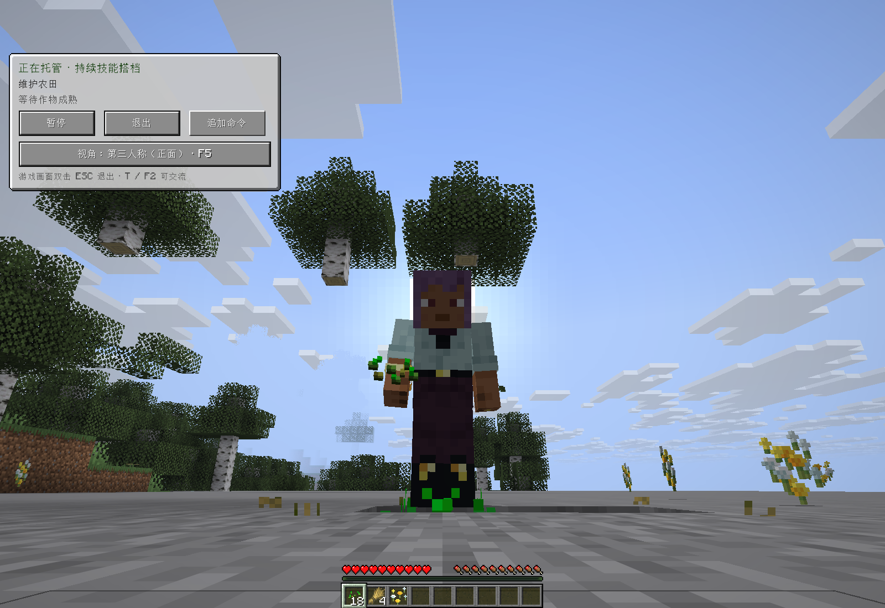

# 托管观察相机 · 1.0.22

托管时使用原生 F5，或点击面板的“视角”按钮，依次切换第一人称、第三人称背后和第三人称正面。按钮显示当前视角及已配置的快捷键。观察方式只影响客户端显示，不改变 AI 身体的实际瞄准和移动输入；退出托管保留玩家选择的原生视角。

## 卡顿原因与修复

原生 `LocalPlayer.getViewYRot/getViewXRot` 直接读取当前角度，适合按渲染帧更新的鼠标输入。托管在每个游戏 Tick 更新朝向，直接显示会形成约 20 Hz 的阶梯式转向。仅限制每 Tick 转向次数不能消除这种显示跳动。

新相机独立保存前后两个已完成 Tick 的朝向，按渲染帧的 partial tick 插值，跨越 ±180° 时沿短弧转动。只在 NeoForge 相机事件里应用显示角度，不改写 LocalPlayer 朝向，也不改变真实命中、冷却或导航。第三人称的正反面、相机距离和墙体碰撞继续由原版处理。新会话、玩家或世界变化、死亡和大幅位置跳变会重置相机历史；暂停和待命会收敛至实际朝向。

原生 F5 之前被托管的物理输入过滤拦截。现在按当前原版绑定放行，面板按钮使用同样的原版视角循环和渲染更新。支持改绑，不将观察按键发送给 AI 或服务器。

## 验证结果

[Actions 36561595989](https://github.com/gaoshanliuni/divzero/actions/runs/36561595989) 通过编译、已包含测试和打包检查。相机单元测试覆盖帧间角度、重复采样、双向 ±180° 环绕、待命和重置。第一次构建的 26.1 相机访问器名称错误已修复，失败记录保留在 [36561235374](https://github.com/gaoshanliuni/divzero/actions/runs/36561235374)。

隔离原生客户端运行 `b9dc91a6-611a-43f0-8795-f81c534eb0f5` 已通过，未调用模型：

| 场景 | 实际结果 |
|---|---|
| 巡逻中的渲染帧 | 592 个相机事件对应 592 帧；139 次同一 Tick 内身体角度不变但相机角度连续变化；167 帧显示中间插值角度 |
| 原生 F5 | 经过真实 KeyboardHandler，背后 → 正面 → 第一人称循环与实际画面一致 |
| 原版改绑 | 改为 F6 后仍可切换，之后恢复 F5 |
| 面板按钮 | 按下保持原视角，松开切换；身体 yaw/pitch 和移动输入均未改变 |
| 任务执行 | 三个巡逻路点完成；正面第三人称下完成真实收获、补种和拾取 |
| 控制回归 | 聊天、F2、失焦继续工作；暂停阻止动作、恢复继续；界面 Esc 不退出、游戏画面双击退出、旧请求作废、暂停中死亡终止均通过 |

三个原生视角的截图已检查，当前面板如下。验证针对上述场景，不声称提高服务器 Tick 速度或解决硬件帧率下降。

本改动不需要模型请求。网络协议保持 11，生产实例不自动安装或修改。
