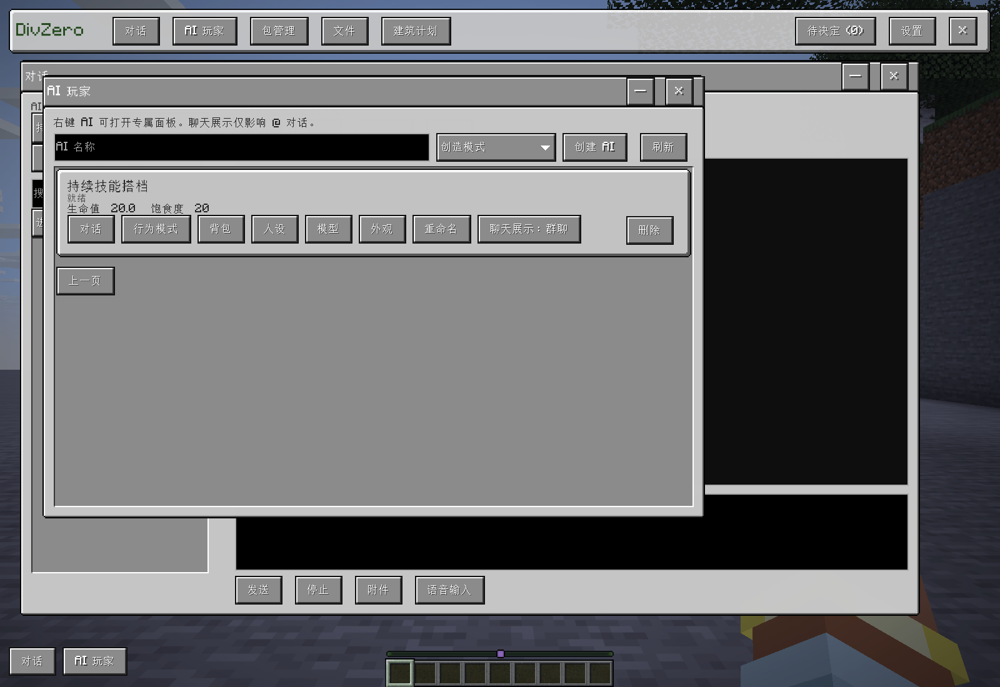

# F2 界面功能接线检查

本页记录 2026-09-30 的补齐范围与实际验收，不把“存在按钮”或“已通过编译”当作功能完成。

## 已修复的断点

- `NativeWorkspaceScreen` 原先只分发 AI、包管理和权限，其他 `PanelSection` 全部落到设置页。现在对全部 16 个枚举值逐项分发，取消兜底误跳转。
- 建筑页接通构件计划以及几何／导入施工计划。计划列表显示真实服务端记录，“开始施工、停止剩余写入、撤销、重做、验证”使用原有权限和版本检查。新增“让 AI 设计”，明确提交需求后创建真实对话，只规划并保存，不擅自施工。
- 记忆页直接管理主聊天实际召回的 `DialogueMemoryStore`，包括事实、偏好和带有效期的观察。人工编辑使用版本比较，不能覆盖 AI 已更新的同主题记忆。旧共享事实和私人笔记保留，聊天只按相关性召回共享事实及当前玩家自己的笔记；管理员权限不扩大模型的私人记忆召回范围。旧 SKILL 笔记明确标为未经验证。
- 媒体页接通真实创建、绑定位置、播放、暂停和从头播放。读取解码／传输状态及失败原因，不能用持久化的播放意图冒充播放成功。暂停保存当前播放位置并保留末帧；迟到的旧版本画面不能重新启动播放。媒体状态分包同步，较旧的条目不因前 20 条截断而消失。
- 备份页接通真实局部快照、差异预览、恢复、修改历史、撤销和重做。恢复绑定当前玩家的预览，逐格比较方块状态与方块实体数据；发现后来修改时拒绝或报告部分执行。扫描和写入按 Tick 分批执行，数据库保存放在 I/O 线程。旧 `restore` 包不能绕过预览检查。
- Mod 知识页接通 Worker 的实际索引；诊断页读取实时资源用量与审计记录，继续要求服务端权限。设置页通过管理功能选择框进入这些页面，避免尺寸 4 下堆满按钮。
- 删除已退役验收启动器中复制浏览器依赖、解压核心及浏览器启动参数的执行流程，保留仍使用的历史测试规则与独立历史证据。

## 原功能入口对应关系

| 入口 | 当前实现 |
| --- | --- |
| 总览、会话 | F2 对话工作区与持久化对话服务 |
| AI 玩家 | AI 管理、人设、模型、真实背包、行为模式、外观 |
| 任务 | 实际任务历史、任务控制、定时任务和事件订阅 |
| 创造器 | 内容生成与改版请求 |
| 代码工作区 | 服务端草稿、编辑、保存、历史、构建及现有授权执行入口 |
| 内容包 | 版本、依赖、生命周期、投递和反馈 |
| 外观 | 选中 AI 的原生外观／YSM 页 |
| 媒体 | 媒体记录、原生画面／音频传输与播放控制 |
| 计分板 | 统一界面与 HUD 管理 |
| Mod 知识 | 实际 Mod 索引与原生 API 查询入口 |
| 记忆 | AI 对话记忆、共享事实／旧笔记、个人长期偏好 |
| 模型、权限 | 真实配置、模型目录、密钥与权限管理 |
| 备份恢复 | 当前世界快照和带冲突检查的恢复历史 |
| 诊断 | 实时用量和服务端审计 |

## 本轮游戏证据

全部使用 `build/` 下的隔离实例，没有改生产存档或配置。

| 运行 | 已核对的结果 |
| --- | --- |
| `0b7ff3b4-7903-4ef2-a5e1-b392d90f2504` | 构件计划由工具保存但未应用；通过可见按钮开始施工、撤销、重做、验证，并从实际世界核对方块与对应版本 |
| `9ea10fa1-01cf-40be-9727-c7b440ca16dc` | 几何计划通过 F2 可见列表与应用按钮施工，实际目标方块为石头 |
| `c76488b6-4865-4ecd-b7e7-dba5286b41a0` | 可见记忆编辑器保存“家”，独立读取聊天召回确认使用该值；可见快照／恢复／撤销／重做链；预览后玩家更改的钻石块未被旧预览覆盖；媒体创建与绑定落库；实时诊断和撤权拒绝 |

构件和几何运行使用 public `e6b2829`；模块运行使用 public `2e06bbc`，主 JAR SHA-256 为 `5eaa5fd6be255a8fe31a90706b187ce3bc45f739484658cc204f1509483b3d06`。这些运行均为零模型调用。

保留的失败：`b84b99af-612e-40b2-ab2f-184c09953766` 揭示 AI 列表未返回时“新增记忆”提前可点，修复后模块运行通过。`bd5ce30f-c5be-4fc6-83f4-32fb1977a51e` 的建筑按钮已发送真实 DeepSeek 请求，但测试查询错误传入空 ID 后主动关闭世界；一次模型请求完成、第二次中止为未知结果，不能算建筑规划验收通过。没有重放未知请求。Actions `36673582363` 的媒体测试异常签名编译失败也保留。

## 后续验证与新增修复

- `277d2fc2-d0a4-492c-92fb-1db484433570`：真实按钮提交建筑规划，DeepSeek 完成 4 次 high-thinking 请求，保存 `ui_design_acceptance` 版本 1，状态为 PLANNED、activeRevision 为 0，没有自动施工。累计输入 44962、输出 8327 词元，缓存命中 39680 输入词元。
- `cbddbfb0-ecf8-48be-84b6-6cd512f30f7e`：含媒体工具的 public `52d9b54` 通过真实图片播放。可见按钮创建、绑定、播放后，Worker 解码并将画面传到原生客户端纹理；暂停保留末帧，新增 24 条媒体后分包同步仍保留先前画面。零模型调用。
- `f95833e3-f9b9-402e-b762-2ba4c6825d69`：Mod 知识页面通过可见重新索引按钮读出实际 4 个 Mod，包含 LDLib2 的 1826 个类。零模型调用。
- `2e6bebd7-a611-448b-b6fc-18e99be901f7`：尺寸 4 下记忆、恢复冲突、撤销、重做、媒体记录、诊断和权限拒绝的交互通过。截图发现新窗口标题被工具栏遮挡，随后修正首次布局的位置约束。
- `7efbf846-c174-4a45-8258-675cc7867255`：先打开包管理，再向真实存储创建物品定义、自定义生物、原生生物模板、实体行为修改和交互修改，五类内容自动出现在已打开的目录；按包内物品名“水晶剑”搜索能找到对应包。零模型调用。
- `7c4da1ae-ae62-4688-ad91-7a44ab69afad`：尺寸 4 下标识居中、尺寸入口移入设置、选择框不碰撞相邻按钮、设置内容可滚动且底栏可见、恢复报告显示真实方块名且不显示 JSON。截图复查发现嵌套卡片对比度不足，随后改为 MC 浅色面板并进一步统一文字垂直居中，等待最后画面复验。

包管理现在统一显示内容包及其中的物品、自定义生物、原生生物定义、实体行为／外观修改、方块交互修改和本玩家的方块贴图。数据仍来自原有真实存储，保持所有者、世界、版本及操作权限检查；不会伪造包或把读取目录当作重新应用内容。普通详情改为图形化说明与重命名，源码入口明确放在高级编辑中。

首个媒体实播运行 `f001528a-a534-4c4a-8ceb-e81b6d583a53` 保留为失败证据：标准构建不含媒体工具。随后含媒体构建 `36674404983` 又发现原 FFmpeg 日构建地址已失效；现在固定到校验过的 8.1.3 构建，并按清单缓存依赖。Actions `36675107625` 通过完整媒体构建，JAR SHA-256 `8c6aefc2d62f14cc1fd2f20d261deda727a3c78e9ba3683d31f807ff19daf89b`。媒体工具仅适用于 Windows x64；标准构建不能冒称已具备解码能力。

另保留 `516c13ff-c19b-43df-abdf-d1d6c4fd3d58` 的恢复操作等待超时。已修复备份预览的后台只读刷新会阻止立即提交恢复的问题，最新界面复验结果见下文。上述验证不表示早先完整产品规格中的其他未完项已经完成。

## 最新界面复验

public `480f0c6` / Actions `36682941583` 的隔离运行 `741d9d76-70a1-46cf-805d-025994e5fd55` 通过尺寸 4 布局及图形化报告检查，截图已复查；恢复卡片改为可读的 MC 浅色面板。`42f492af-91ae-4461-afe1-d15c699fe9b2` 再次通过实际恢复、冲突保留、撤销、重做及其他模块的完整按钮流程，之前的后台刷新竞争路径也得到覆盖。

`f73b5939-4323-44f2-8c02-14c6bca01362` 的尺度菜单测试失败时游戏窗口已失焦，按钮按既定规则取消了点击；测试现在只在窗口实际获得焦点时提交点击，首次仅请求激活自己的测试窗口，产品的失焦规则不变。

更新后的 public `4229f36` 再以 `21f9d4f3-067b-4e62-8f39-0fe267d53061` 通过同一内容目录验证，图文中的目录截图已替换为尺寸入口迁移后的新布局。

会话与背包综合回归 `15870941-eac5-4a91-8779-24badc51113a`（public `48cd619` / Actions `36686561756`）通过会话切换、分页、下拉松开选择、设置内的尺寸入口、输入法及焦点稳定、真实库存／盔甲、Shift／数字键／拆分／拖拽、原生命令补全和建筑验证。失败的 `abfeec6a-34f6-4306-9561-d0d152953a83` 与 `f794023b-cd63-4d8a-bee9-bd5da2be35c1` 保留：数字键测试改为等待实际原生槽位悬停，并使用原生窗口坐标发送鼠标移动回调，未修改库存业务逻辑来绕过检查。

## 最终测试包

GitHub Actions `36687303201` 对 public `dd9a2fe42677ab26feddcdcb08f42587c0e13282` 的含媒体构建通过，包内 9 项 SHA256SUMS 全部核对一致。主 JAR SHA-256：`806a693a7a1e9d12c8e1206d4b407b3117a42bc66512c698202c78ce6189c9a9`；附件 ZIP SHA-256：`c0e945f077f8885ab6d3694e0f2423aeff22fec4c463b4313d2b1a6a6d0c361b`。

这份相同二进制又通过 `7e7deb34-45a8-42f1-8d8f-ecb7f9ed9748` 的尺寸 4 布局／自定义输入提示／图形报告检查，以及 `3f82eae8-09f3-4b67-8bb6-8fcc11c61fbb` 的内容目录实时刷新与物品名搜索检查。最终截图已复查并同步。后续证据文档提交不改变此已验证二进制。

测试包包含主模组、LDLib2、KubeJS 和 Better Advanced Tooltips，未包含 MCEF、JCEF 或 WebGUI。未安装到生产目录，未自动创建 Release。

## 2026-10-01 对话焦点过期修复

`STALE_CONVERSATION_FOCUS` 的根因为原生 F2 窗口复用同一个 `contextId`：切换到另一会话、重新选择当前会话或返回原会话时，已释放的 ID 会触发服务端防陈旧请求保护。修复为每次选择/释放更新 ID，回执同时核对窗口、选择代次、AI、会话与请求时的 ID，旧回执不会重新绑定音频或覆盖新会话。重新打开已建立工作区连接的 F2 也会显式重新建立焦点。

普通聊天关联、朗读和语音输入等待当前焦点确认；打开期间定期续期，明确过期时只自动更新焦点一次，不重发消息、语音任务或世界写入。失败提示转换为易读的双语提示，保留草稿。服务端原有拒绝旧焦点与忽略旧关闭请求的保护保留。

公开执行源码 `fc58c46a` 已通过 Actions [36770310053](https://github.com/gaoshanliuni/divzero/actions/runs/36770310053)。隔离 `conversation_focus` 原生回归 `94493422-63bf-413c-a840-d6d7cfcf5462` 通过：真实 LDLib2 按钮完成 A→B→A、快速连续选择、关闭重开与普通聊天关联，逐项读取服务端焦点和关联状态；再模拟焦点失效，确认更换新 ID 后恢复、旧请求继续被拒绝，历史与未发送草稿保持不变。测试记录 5 个不同选择 ID，付费模型调用为 0。朗读/语音输入的焦点等待链已接入，未调用付费 TTS/ASR 做音频质量验收。

首次 Actions `36769688923`、`36770016119` 暴露新增隔离验收代码未处理的持久化受检异常，已修复并保留失败记录；未改为忽略异常，也未削弱服务端旧焦点保护。

修复附件 `DivZero-1.0.23-conversation-focus-fix-20261001.zip` 含主模组及 LDLib2 / KubeJS / 工具提示依赖。ZIP SHA-256：`95029705b2228c3fb6029fb0fed55c4933c749c34df87bc1c0615e151a8333d3`；主模组 SHA-256：`0860e2bc0cddea1d2b671e9257d65646868f3c9f89c25b99cff03b7631f59b88`。仅交付测试包，生产安装和存档未修改，未自动创建 Release。

## 2026-10-01 本机 Python 上下文与回执

用户截图对应的本地回执为安装库请求在环境准备阶段返回 `HOST_CONTEXT_CHANGED`，对话同期结束为 `CONVERSATION_CONTEXT_CHANGED`。历史回执未保存具体取消来源，不能据此断言是窗口切换、死亡或退出世界。排查另外确认 Python 执行/安装工具仍被游戏维度约束，在原对话允许继续的情况下也会取消本机任务。

本机 Python 工具现按同一世界会话、本机账号、连接和授权校验，不再绑定游戏维度；模型工具调度、持久化意图提交后的复核及持续执行检查采用相同语义。原有逐条脚本哈希确认、真实玩家会话变化、断线、服务器关闭和权限撤销的保护保留。

回执新增操作 ID、阶段、请求命令是否启动、执行状态及首个取消原因；准备环境时被取消与进程启动后中止明确区分。拒绝重复操作仍保留原结果未知语义，不冒称尚未执行。原生聊天显示下载、校验、解压、创建环境、实际执行阶段及可读结果，技术错误可悬停查看。未自动重发原安装命令或脚本。

最终执行源码 `d8421d47` 通过 Actions [36775374857](https://github.com/gaoshanliuni/divzero/actions/runs/36775374857)。隔离原生 `host_context` 回归 `29cdf62c-1014-47cb-aa10-570162188baa` 通过。测试使用经过哈希校验的固定 Python 发行包缓存，真实执行解压、校验、虚拟环境与 pip 初始化、客户端确认和 Python 进程；不访问生产环境，不调用付费模型。此次未把缓存测试表述为 GitHub 下载连通性或 PyPI 第三方库安装验收。

首次隔离回归 `2592a26a` 在创建环境时失败，底层 pip 明确报告 Windows 长路径未启用。这是隔离实例路径较长时发现的另一个兼容问题，不能据此替代历史截图的取消原因。已采用 Windows 扩展路径处理 Python 可执行文件、环境、脚本和 pip 输出路径，并将 venv 创建与 ensurepip 初始化分开记录；不修改系统注册表。原失败和候选环境保留，修复后需新操作、新实例复验。

第二次长路径回归 `a48dc19a` 确认 JVM 启动后的 Python 路径仍可能被规范化，单纯给启动参数加扩展路径不充分。现由固定的运行入口同步处理 Python 自身的解释器、环境与模块查找路径，再执行原模块或已确认的脚本文件；脚本内容、SHA-256 确认与隔离启动参数保持不变。初始化失败时返回最多 4096 字符的真实 bootstrap 输出，供 AI 和聊天悬停详情定位原因。

最终原生结果：

| 场景 | 实际回执与检查 |
| --- | --- |
| 两次点击同一确认，执行期间打开 F2/聊天框并切换到下界 | `EXECUTED / COMPLETED`，输出 `HOST_CONTEXT_OK`，文件计数只有一次 |
| 真实 Python 进程启动后点击停止 | `CANCELLED / STARTED`，原因 `HOST_USER_CANCELLED`，未生成结束标记 |
| 未批准的请求在原任务停止后取消 | `REJECTED / NOT_STARTED`，原因 `HOST_CONVERSATION_CANCELLED`，未生成目标文件 |

修复附件 `DivZero-1.0.23-host-context-fix-20261001.zip` 包含此前会话焦点与并发攻击修复，以及 LDLib2 / KubeJS / 工具提示依赖。ZIP SHA-256：`2dc738a0e551e8ce60b712848eb9d67f6ab87d0167f65767baddeaa6465310b1`；主模组 SHA-256：`b4133c368d31810561791953641f9d376c613901cbec6821db0663aed45a8aa4`。生产安装、配置与存档未修改；未自动创建 Release。

## 2026-10-01 玩家身份、面板与死亡恢复修复

本批使用原生 `GameProfile` 保存 AI 名称，UUID、所有者、权限代际不因改名而变化；移除旧的命令别名补丁。Vanilla `PlayerList`、实体参数和资料参数读取同一名称。中文裸名称在共用实体参数解析器处理，不为 give/tp 等命令分别维护映射。玩家资料的网络协议限长为 16 个 UTF-16 单元，不接受空格、引号、选择器前缀及控制字符；历史不兼容名称保留数据并要求重命名，不截断或删除。旧记分身份迁移保留分数、显示、数字格式与锁状态；目标名称已有分数时不覆盖。独立 UUID 不等于伪造 Mojang 认证，依赖第三方私有客户端握手或账户服务的指令仍需对应支持。

AI 回复通过原生 `PlayerChatMessage`、`ChatType.CHAT` 和客户端玩家聊天处理链发送，保留真实 AI UUID、原版过滤、Mod 聊天事件和未签名标记。私有对话仍只投递给原接收者。流式分片在客户端合并成一条原生玩家聊天记录，保留富文本按钮；服务器运行错误、权限和队列通知仍属于系统通知。网络协议为 **13**，客户端与服务端需要一起更新。

F2 文本编辑处理系统剪贴板及实际按键修饰符，提供全选、复制、剪切、粘贴和消息复制入口。状态页读取当前身体的原生游戏模式，显示护甲、吸收生命、经验、氧气与状态效果的等级和剩余时间；坐标仅向有管理权限的玩家提供。已保存人设可独立重命名，通过版本校验保留正文及当前已应用人设。

行为选择修改后串行自动保存，连续修改合并到最终选择，不再需要“切换主工作”或“只改战斗规则”。仅编辑战斗规则保留当前工作 ID 与进度；指定攻击对象必须显式选择。保存期间的停止操作不会被丢弃，也不会由旧保存回调重新启动任务。

默认自动重生，可在专属状态页关闭或手动重生。正常死亡保留模式、交战规则及任务进度，重生后重建执行器，取消旧攻击和导航控制；跟随主人时寻找主人附近实际可站立位置，再传送并恢复跟随。显式暂停/停止、权限失效以及绑定其他维度的区域不会被盲目恢复；已经执行但结果未知的世界写入仍需核对。

实际以 AI 为攻击目标且正在追击的生物可触发本地防御，无需先受伤；仍保留玩家 PvP 许可、不攻击规则和友军排除。已经在合法攻击范围内时优先检查冷却、视线与武器并出手；撤离路线不再是攻击的必需前置条件。遮挡目标先检查可攻击站位，通过共用导航接近；无站位或实际寻路失败时暂缓该目标，世界、位置、视线变化后重检。已释放的弹体与范围伤害不因目标暂缓而忽略。

最终执行源码 `bcbd9e6a` 通过 Actions [36789782484](https://github.com/gaoshanliuni/divzero/actions/runs/36789782484)，包含生产编译与纳入的自动测试。隔离原生 `player_feedback` 回归 `8970f971-6ed3-4258-807f-4f0ef23e5742` 完成以下实际检查：

| 范围 | 实际检查 |
| --- | --- |
| 玩家身份与命令 | 中文资料名执行 give、tp、gamemode、effect、tag、execute、team、scoreboard；改名后 UUID、库存、队伍和分数保留，客户端收到新玩家资料 |
| 第三方玩家命令 | KubeJS `stages add 中文伙伴 feedback_native` 实际写入，并从对应 AI 的 KubeJS 阶段对象读回 |
| 原版玩家聊天 | 原生 PLAYER 消息源，两段内容合并成一条，复制选项点击事件保留 |
| 状态与人设 | 冒险模式和效果数据读回；真实面板显示生存模式、迅捷与自动重生控件；保存的人设重命名后正文与版本保持正确 |
| 行为自动保存 | 快速选择跟随、近战跑打、保护主人，自动保存最终组合，无需应用按钮 |
| 死亡恢复 | 实际死亡后绑定新的 ServerPlayer 对象，恢复同一工作 ID、保护规则与一次跟随传送；关闭自动重生后保持死亡；手动重生生成新身体 |
| 断开连接 | 运行原版玩家连接的 disconnect 链，确认从原生 PlayerList 移除。未开放局域网的单人实例没有直接验收 `/kick` 命令；不把它冒称专用服务器测试 |

战斗分别通过 AI 身体回归 `7aba722a-e683-4741-8451-7e4462d6d7b6` 与真人托管回归 `18e5bcfb-8a2e-4796-99a0-e8613d00576c`：AI 在首次受伤前响应实际追击目标；两条执行路径均暂缓封闭目标，之后对近身可达目标产生真实命中和伤害。该结果验证本次回归，不是任意装备、地形或全部第三方 Mod 的胜率保证。

**系统剪贴板仍未完成端到端实测。** 当前自动化进程访问 Windows `OpenClipboard` 返回错误 5（拒绝访问），没有观察到成功的外部剪贴板写入。隔离回归明确记录 `PASS_WITH_SYSTEM_CLIPBOARD_UNVERIFIED`：通过受控剪贴板接口对真实 LDLib2 TextArea/TextField 检查中文、多行、选择、复制、剪切、粘贴、输入法回调及拒绝访问时保留选区。这些检查不能代替系统剪贴板验收，未绕过操作系统限制。

失败证据保留：早期 Actions 的 Mixin 类型转换与测试 API 错误已修复；原生聊天分片被序列化折叠为字符串、封闭目标搜索无法及时退出的问题经修复后复验。测试还纠正了两个不符合原版行为的假设：重生更换身体对象但保留实体编号；未公开的单人世界不提供可用的 kick 命令。未删除失败、冒称模型质量验收或修改生产环境。付费模型调用为 **0**。

交付附件 `DivZero-1.0.23-player-feedback-fix-20261001.zip` 包含主模组、LDLib2、KubeJS 和工具提示依赖，没有 MCEF JAR。ZIP SHA-256：`e96be9c795c99a38ecc890de538a1bd61afb3b034d6bd62c3361ebc470cbba04`；主 JAR SHA-256：`67a12d90fbbfd87f7a84f929f891e1c85d7040cea8f3f594aaaa0029b5d3377f`。生产 mods/config/saves 未修改，未自动创建 Release。

## 2026-10-01 工具失败反馈与同轮继续

针对截图中的 `AGENT_TOOL_OUTCOME_UNKNOWN`、`CONVERSATION_MODEL_FAILED` 反复停止，本次将工具失败转为同一调用的结构化结果，保留原 `tool_call_id`、操作 ID、具体原因和执行状态，再继续当前模型循环。参数错误包含字段、期望值；JSON 解析错误保留行列；异步异常保留去除包装后的根因。没有将失败改写成成功，也没有用新的玩家消息重新提交原任务。

原生聊天中的“核对后继续”固定续写按钮及其注入段落已移除。通用错误分类器不再附加模板化的继续指令。工具错误通过 `tool` 结果反馈；模型流中断只能使用协议支持的数据消息，因此只传来源明确的失败事实、已有部分输出及本响应未派发工具的状态，不追加“请先……然后继续……”等指令。建筑完成检查同样返回具体未验证版本的数据，而不是固定续写段落。

| 失败类型 | 当前处理 |
| --- | --- |
| 参数、字段或工具名错误 | 返回具体诊断；未执行的调用标为 `NOT_STARTED`，允许模型修正后提交新调用 |
| Minecraft 命令语法不完整 | 使用原版解析器的消息与光标位置，明确尚未执行；不伪装成结果未知 |
| 异步工具异常 | 保留真实异常原因、阶段和操作 ID，写入回执后交回模型，不直接结束对话 |
| 写入结果未知 | 模型继续读状态或处理其他步骤；相同未知写入被拦截，直到有确认未执行的证据，不盲目重放 |
| 相同参数和失败反复出现 | 拦截重复的写调用并返回原因，其他读取、修正及停止入口仍可使用；不因此强行结束模型输出 |
| 服务繁忙、可恢复网络中断 | 有界等待重试；已有文本不清空，部分响应的未完成工具调用不会被执行 |
| 模型工具输出格式不合契约 | 返回具体字段、类型或传输上限错误，继续请求修正；不执行半截调用 |
| 认证、无效请求等不可恢复错误 | 保留服务返回的实际原因和字段，不再只留下泛化错误码供玩家反复点击 |

原生命令回调失败、回调超时、上下文变化及内容生成取消现分别提供诊断。已执行但回执保存失败仍为未知，不以“自动重试”重放世界写入。权限、明确停止、连接/身份变化、候选版本和正在运行版本的边界继续有效。

最终执行源码 `b1d9251b` 通过 Actions [36795448893](https://github.com/gaoshanliuni/divzero/actions/runs/36795448893)。隔离原生回归 `1f1d0dbc-ac3f-4b7b-b83e-da73ff3901cf` 为 **PASS**：同一操作共 10 次主模型协议请求，持久化聊天保持一条玩家消息和一条 AI 回复，固定续写提示词注入为 0。

实际链路包含：错误参数类型反馈具体字段；原版命令语法错误反馈光标位置及 `NOT_STARTED`；下一次修正调用真实放置金块；通过不可打开的隔离建筑数据库触发真实异步 SQLite 异常，根因进入工具回执并可读回；同一未知写入改换 JSON 字段顺序仍不重放；错误工具名作为失败结果返回；HTTP 503 后保持原请求内容等待重试；中途关闭 SSE 后保留前文和部分输出，只追加故障事实，最终继续输出完成。验收同时检查原操作 ID、消息数量和实际世界方块。

早期验收脚本将后台生成聊天标题的独立请求纳入主对话提示词断言，产生误报；对应主对话的持久化记录已完成并保留原文。脚本改为区分是否携带工具定义的请求后重新通过，失败记录保留。没有放松主对话“无额外续写指令”的断言。

测试使用只绑定 `127.0.0.1` 的确定性协议端点，不代表真实大模型的修正质量测试；付费模型调用为 **0**。生产存档、配置和 API Key 未用于测试。历史泛化回执已经丢失的原始异常不能根据截图补造，本修复保证新失败保留并反馈真实诊断。

附件 `DivZero-1.0.23-tool-recovery-fix-20261001.zip` 包含本修复及此前玩家身份、原版聊天、面板、死亡恢复修复，并附 LDLib2、KubeJS 与工具提示依赖。ZIP SHA-256：`c76c20def21485c2829445dce10c744e2246caa3f35e24ddf48f60c7216d8f31`；主模组 SHA-256：`a3471b8d2bff44e38e4f65a157aaa35931db9f0f95c929d6b141e90466486a42`。网络协议仍为 13；未修改生产安装，未自动创建 Release。

## 2026-10-01 AI 卡片聊天展示

F2 的 AI 玩家卡片将删除按钮固定在右侧，原操作行在重命名之后显示“聊天展示：群聊 / 私聊”，点击直接切换并保存。默认窗口容纳同一行操作，小尺寸下左侧操作换行，删除仍独立靠右；保持 LDLib2 MC 主题。

新建 AI 默认群聊。已有 AI 没有该设置时保持原先的私聊，新配置按世界和 AI ID 保存，重生、重命名不重置。创建者或具备现有管理权限的玩家可修改，服务端检查版本，陈旧界面不能覆盖新设置。

群聊只作用于原版聊天栏中显式识别为 `@AI` 的请求：提问交给原版玩家聊天链发送，AI 正文发送给发起者和本次回复开始时在线的其他玩家。私聊提问及回复仅发起者可见。F2、普通默认回复、命令入口及按钮后续请求继续走私有路线；普通玩家聊天沿用原版规则。

每条请求在提交时记录展示模式，排队或处理过程中切换设置不会公开已有私聊。聊天记录的读取权限没有扩大。旁观者接收的流式数据不包含思考文本、私有会话字段或发起者的打断控件；公开选项只展示文字，确认等操作仍由原请求者处理。

网络协议升级为 **14**，客户端与服务端需同时更新。执行源码 `d63a7d28` 已通过 Actions [36799695821](https://github.com/gaoshanliuni/divzero/actions/runs/36799695821)。原生尺寸 2 回归 `a12dd240-b8bb-4ebf-a387-ed1226727312` 与尺寸 4 回归 `192f1d12-ac33-43a0-9c68-7422b1974ac2` 均通过，验证真实按钮保存、删除位置、公开/私有 @、无 @ 默认回复、F2 消息、处理中切换模式、非管理者拒绝及旁观显示。

接收范围由已注册的服务端观察玩家记录；旁观流式显示另由真实原生客户端验证。测试使用本地确定性模型协议端点，付费模型调用为 0；未运行两个真实客户端的完整联机组合。初版布局将新按钮挤到下一行，已据实际截图收紧间距并复验；验收代码中的受检异常编译失败记录保留。

交付附件 `DivZero-1.0.23-mention-display-20261001.zip`，ZIP SHA-256：`bc1c85ac49fd26fa3c7e1a5e93c55ebeb27a75a1261f8a1abcc41fa572d40fa0`；主模组 SHA-256：`f7aadba2a2ba3dfa471c6b932f0858f99318338ba2bfc1c691d42c446edcc04f`。生产安装未修改，未自动创建 Release。

## 2026-10-01 聊天展示回退与状态操作修复

当前 AI 输出恢复 `[AI 名称]` 系统聊天展示，正文原位更新一条记录、思考默认单行尾部、名字悬浮时间恢复。本文前面“原生 PLAYER 消息源”描述保留为历史记录，不代表当前显示方式；AI 身体仍使用原版玩家执行链路。群聊／私聊入口和权限保持。

状态页增加游戏模式循环切换与“传送到我”，重进以保存的实际模式为准；行为开关采用精简状态回执，恢复预训练权重要求二次确认。网络协议现在是 **15**，双端一起更新。实际 UI、物品、空隙攻击、重锤及真人托管证据见 [本轮修复记录](CHAT_PLAYER_COMBAT_REPAIR.md)。
